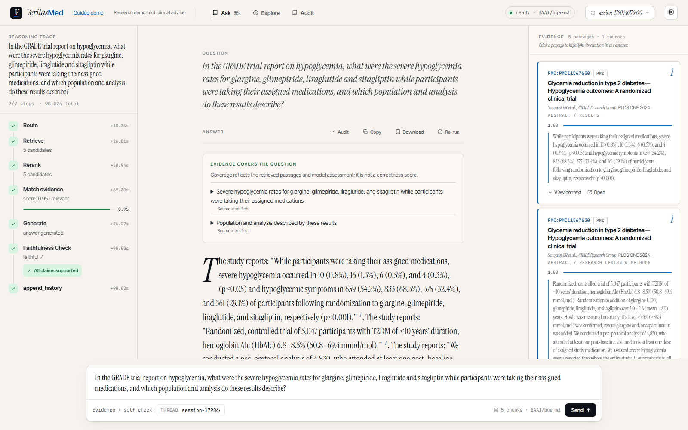
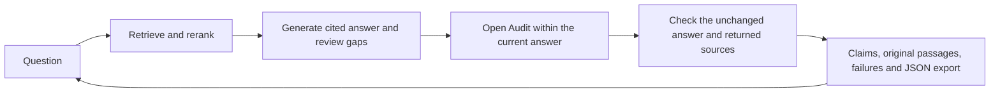

# VeritasMed

**Ask a medical-literature question. Inspect each claim. Follow it back to the source.**

VeritasMed is a React + FastAPI + LangGraph research showcase with literature retrieval,
cited answers and claim auditing within the question-and-answer workspace. The panel exposes exact answer/source
passages, unsupported statements, unresolved quotations and unchecked text. It is not a
clinically validated assistant.

**v0.7.1 — Ask first, with claim auditing inside the answer workspace.**

The experiments do not establish an advantage for the more structured workflow. Direct remains
the audit default; Atomic and MiniCheck are explicit research options. [Results and limits](docs/releases/v0.7.0.md).

Python 3.12 · Node.js 22.12+ · Apache-2.0 code · [Research source attribution](docs/research-sources.md)



*Recorded GRADE medical Ask session: question, actual Agent answer and original abstract passages.
In v0.7.1, the answer's Audit button opens its claim review in the same workspace.
This single-paper demonstration is not a reliability score.*

## Product entry: Ask → answer → Audit → continue asking

**Ask is the main application**, at **http://127.0.0.1:5173**. It includes literature questions,
retrieved sources, answer auditing, Explore and the research pages. The answer's **Audit** button
opens the audit inside the current Ask workspace; **Back to answer** returns without discarding
the answer or its audit. The question input remains available. Opening the audit makes no model
call; **Run audit** explicitly starts checking the current answer and its complete source passages.

Use the [full medical setup](#run-the-full-medical-ask--audit-flow) for this experience. The lighter
**5174** service below is an optional audit/research workspace: it does not run the retrieval Agent.
Its **Ask ↗** link returns to the full app. Independent evaluation of the checker is a research
requirement, not a reason to replace the conversational product with evaluation screens.

These navigation and inline-audit corrections ship in [v0.7.1](docs/releases/v0.7.1.md). The immutable
v0.7.0 tag retains its original separate audit route. [Product direction](docs/decisions/2026-09-27-conversation-first-product.md).

This restores the answer-review workflow; it does not yet implement persistent chat history or
contextual follow-ups. Ask currently processes each question independently. Those capabilities
and targeted audit improvements are the [v0.8 plan](docs/plans/v0.8-conversation-and-audit.md).

## Optional lightweight demo: real medical audit, no API key

Install [uv](https://docs.astral.sh/uv/) and Node.js 22.12+, then get the current app:

```sh
git clone --branch v0.7.1 https://github.com/lijingshan-6/medrag-agent.git
cd medrag-agent
uv venv --python 3.12
uv pip install -r requirements-audit.txt
uv pip install --no-deps -e .
```

Alternatively, download the [v0.7.1 source ZIP](https://github.com/lijingshan-6/medrag-agent/archive/refs/tags/v0.7.1.zip).
The fixed [v0.7.0 source milestone](https://github.com/lijingshan-6/medrag-agent/tree/v0.7.0) preserves
the published research artifacts. Activate the environment:

| Shell | Command |
|---|---|
| Windows PowerShell | `.\.venv\Scripts\Activate.ps1` |
| macOS / Linux | `source .venv/bin/activate` |

```sh
python scripts/run_audit_demo.py
```

Open **http://127.0.0.1:5174/audit**. The launcher installs frontend dependencies if needed;
ports **8001 and 5174** must be free. Ctrl+C stops both services. If PowerShell blocks activation,
use `.\.venv\Scripts\python.exe scripts/run_audit_demo.py` directly.

The medical record and its source texts are bundled. After dependency installation, replay
needs **no model key, GPU, Qdrant or dataset download**. Click a claim, select **Locate in full
source**, open the paper, and export the audit JSON. The page clearly identifies saved inference.

[Medical walkthrough and actual output](docs/medical-demo.md) · [Audit methods and input limits](docs/audit-demo.md)

The [v0.7 walkthrough](docs/research-demo.md) adds **Atomic facts · experimental** and three
GRADE inputs: the unchanged real Agent answer, deliberately swapped arm values, and deliberately
removed result evidence. The controls are explicitly labelled constructions. Inspect parent text,
individual facts, qualifications, source passages and separate checker results; unresolved items
stay visible. MiniCheck results are saved GPU inference, so replay does not download its weights.

Optional: download the pinned public RAGTruth texts to replay nonmedical development
experiments too, then reload the page:

```sh
python scripts/verification/answer_benchmark.py download
```

## Run a new audit

Copy `.env.example` to `.env` and configure a compatible gateway. All current research roles
use **Flash**; there is no automatic Pro fallback:

```dotenv
LLM_BACKEND=openhub
OPENHUB_BASE_URL=https://www.cun.ai/v1
OPENHUB_API_KEY=your-gateway-key
OPENHUB_MODEL=DeepSeek-V4.1-Flash
OPENHUB_REASONING_EFFORT=high
OPENHUB_MAX_TOKENS=32768
LLM_TIMEOUT_SECONDS=240
```

Keep real keys in the ignored local `.env`. Availability and model names depend on your provider.
In **Audit your own answer**, enter an answer and its sources, then choose **Run new audit**.
This sends those texts to the configured endpoint. The audit service does not save submissions;
use **Export audit JSON** to retain a result. Do not submit personal health information.

**Direct Flash remains the default.** Atomic facts, Split, Context + meta and Exact quotes v2 are experimental
alternatives. Their existence does not establish better semantic accuracy. Unique text binding
proves where a quote occurs; it cannot prove a judgment is correct.

## Compare three research workflows

Open **http://127.0.0.1:5174/research** in the same lightweight service. Three seeded development
examples replay **Read all documents**, **Autonomous tools** and **Structured workflow** with
their actual answers, tool traces, citations and usage. The final result table uses a separate
40-query comparison, not the three showcase examples. Export all traces or transfer an unchanged
answer and its candidate sources into Audit; transfer alone makes no model call.

The task is narrowly defined: does a **named paper** support a claim, within eight fixed candidate
abstracts? The autonomous and structured methods share search/read/verify tools and a six-model-call
limit, including calls inside verification. The autonomous method uses an application-level JSON
action protocol. This experiment does not establish an advantage for the full medical Ask graph.

[Workflow walkthrough](docs/research-demo.md) · [Research reproduction](docs/research-reproduction.md) ·
[Scope decision](docs/decisions/2026-09-26-v07-research-scope.md)

## Run the full medical Ask → Audit flow

The complete retrieval stack needs several GB of dependencies and BGE model downloads.
From the root, install it into the same Python 3.12 environment (or a fresh one):

```sh
uv pip sync requirements.lock --torch-backend cpu
uv pip install --no-deps -e .
python scripts/run_demo.py --medical
```

Keep the Flash configuration above and the environment activated. Open **http://127.0.0.1:5173**
and select the GRADE question. This runs BGE-M3 retrieval, reranking and the actual LangGraph
Agent over the paper's five original abstract sections. After the answer appears, click its
**Audit** button to inspect the unchanged answer and all returned passages in the same workspace,
then click **Run audit**. **Back to answer** preserves that audit during the current answer;
asking a new question starts a fresh answer and audit context. The audit does not automatically
rewrite the answer. Independent saved-input experiments remain available in **Audit lab**.

The launcher uses `.demo-runtime/medical-qdrant` and the separate `medrag_medical_demo` collection;
it does not replace the research index. Later starts can use
`python scripts/run_demo.py --medical --skip-index`. Ports **8000 and 5173** must be free.
The first request includes model loading and may be much slower than later requests.

The source is Seaquist et al. (2024),
[GRADE hypoglycemia outcomes](https://doi.org/10.1371/journal.pone.0309907), under **CC0**.
The [publisher XML, provenance and extraction recipe](data/demo/medical/README.md) are included.
Only its abstract is indexed; this is not a whole-literature review or full-text clinical assessment.

The earlier three-summary fixture remains available with `python scripts/run_demo.py`.
For a browser-only authored UI example: `cd frontend`, `npm ci`, `npm run dev`, then open
`http://127.0.0.1:5173/?demo=1`. Guided answers and animated steps are written fixtures,
not actual inference. [Legacy demo guide](docs/demo.md)

## What this version delivers

- **Literature Ask:** dense/sparse retrieval, reranking, requested-study matching, source-bound
  answer components, citations, explicit gaps and bounded answer repair from v0.4.
- **Answer audit within Ask:** claim extraction and supported / contradicted / insufficient
  judgments against supplied text, with answer/source navigation and original-paper links.
- **Experimental atomic audit:** parent sentences, individual original fragments, model-interpreted
  qualification slots, explicit parsing doubts and separately recorded checker disagreements.
- **Visible failure boundaries:** missing/ambiguous quotes, request failures, uncovered text and
  extracted-claim limits stay visible. No uncalibrated confidence percentage in the audit panel.
- **Inspectable records:** actual model outputs, source fingerprints, invocation metadata,
  unchanged Ask transfers, saved replay and JSON export.
- **Research with retained failures:** public annotated data, controlled diagnostics, ablations,
  repeat runs and concrete-error review. Reports include negative findings.
- **Comparable tool workflows:** shared bounded tools, a direct-reading baseline, actual traces,
  externally labelled task results and all planned cases in the denominator.



[Actual Agent workflow](docs/agent-workflow.md) · [Research route](docs/verification-roadmap.md)

## What we measured

The completed fixed-claim study uses **339 pairs from 247 connected source groups** in SciFact's
public development set. Inputs, methods and thresholds were frozen before this evaluation;
this is not the dataset's private test or a clinical validation.

| Fixed verifier | Completed | Correct binary decisions | Non-support accepted | Supported recalled |
|---|---|---|---|---|
| Flash | 339/339 | 291/339 | 6/201 | 96/138 |
| MiniCheck-Flan-T5-Large | 339/339 | 279/339 | 14/201 | 92/138 |

MiniCheck's false-acceptance rate minus Flash's was **+3.98 percentage points**, with a paired
source-group 95% interval of **+0.49 to +8.11**. The support-recall difference was −2.90 points
with an interval of −12.16 to +6.02. Its faster local scoring did not establish a better verifier.
The independently chosen calibration policy had **no eligible acceptance threshold**. Final
scores are not used to choose a replacement threshold or a displayed confidence percentage.

For 36 natural development answers, Direct / Split / Atomic fully completed **34/36, 35/36 and
11/36** answers. Atomic exposes useful structure, but also ambiguous fragments, uncertain splits
and qualifier omissions. Repeated calls changed whether an answer received an alarm on 2/12
sources for Direct and 4/12 for Atomic. Error-span overlap is not semantic verification accuracy.
**Direct remains the default.**

The separate frozen **40-query workflow comparison** found:

| Workflow | Completed | Correct accepted binary decisions | Non-support accepted | Supported recalled | Model calls / query |
|---|---|---|---|---|---|
| Read all documents | 40/40 | 35/40 | 2/19 | 18/21 | 1.0 |
| Autonomous tools | 40/40 | 35/40 | 2/19 | 18/21 | 3.4 |
| Structured workflow | 36/40 | 31/40 | 2/19 | 15/21 | 2.0 |

**The structured verification step did not improve this comparison.** It retained four original
answers for review: three correctly supported claims, and one genuine contradicted/insufficient
disagreement that was already correct under the binary score. Its draft score was 35/40. It used
fewer reported tokens than direct reading, but took longer and retained fewer correct supports.
The first development run exposed a broken action protocol; all its records remain available,
and the repaired autonomous baseline was frozen before these final questions were run.

[Audit reliability report](docs/verification-v0.6-report.md) ·
[Workflow results and all 40 cases](docs/verification-v0.7-report.md)

Earlier v0.5 observations remain available for context:

| Historical development experiment | Observation | Interpretation |
|---|---|---|
| SciFact pilot, 30 fixed pairs | 25/30 label agreement | Small public-label adaptation pilot |
| 48 constructed diagnostics, three variants | All 48/48; structured calls used more tokens | No demonstrated gain; not expert gold |
| RAGTruth pilot, 24 answers | Direct / Split overlapped 14/15 errors; warnings on 9/12 and 7/12 unmarked answers | Span hits coexist with substantial disagreements |
| Context experiment, 126 calls | 123 complete; broader spans raised some hit metrics | No established semantic verification gain |
| Quote-v2 experiment, 36 calls | Both whole-answer methods hit 3/5 errors; fixed binary targets 8/8, including four easy controls | Binding improved; whole-answer judgments still vary |

Tasks and denominators differ; do not pool these into an accuracy percentage. The 33-error
specific-issue review is **AI development review**, not independent expert validation.
The 60 reserved RAGTruth test source groups remain unused. No calibrated reliability, clinical
evidence grading or advantage over a strong model with the same autonomous tools is claimed.

[Historical v0.5 interpretation](docs/releases/v0.5.0.md) · [Quote-v2 results](docs/verification-v0.5-specific-errors.md)

The historical **v0.4** medical answer evaluation achieved development 15/15, declared repeats
10/10 and first held-out test **31/35** under its own contract. Those 35 questions are now exposed;
the scores do not measure this new audit panel. Four failures and AI-review limitations
remain in the [v0.4 report](docs/agent-v0.4-flash-report.md).

## Practical limits and repository map

Services bind to loopback. The web API has no public-user authentication or multi-tenant
isolation; keep it as a local showcase. Full Ask checkpoints can retain questions and answers.
The Ask request deadline is 300 seconds; a synchronous model call already in flight may
finish after Stop. Responses can omit qualifiers or misinterpret a source despite a green check.

Windows is the local demonstration platform. GitHub Actions runs the existing Ubuntu checks;
Docker and macOS/Linux browser use have not been exercised on the release host. Research
corpora, weights, local indexes and credentials are excluded. The tiny medical XML snapshot is
an explicit CC0 exception. Small SciFact excerpts, bundled candidate abstracts and actual source/tool
responses are also retained for inspection; they keep their [upstream licenses](docs/research-sources.md).

| Path | Purpose |
|---|---|
| `src/medrag/agent/` | Question-answer graph, evidence binding and model backends |
| `src/medrag/verification/` | Independent fixed-evidence and whole-answer auditors |
| `src/medrag/api/`, `frontend/` | API and interactive audit/Ask interface |
| `data/demo/medical/` | Original source, actual Ask stream and exported audit |
| `data/demo/reliability/`, `data/demo/research/` | Saved atomic medical audits and shared-tool comparisons |
| `data/verification/` | Frozen audit experiments and offline reports |
| `data/benchmark/veritasmed_v1_1/` | Historical medical benchmark and saved reviews |
| `docs/` | Startup, research limits, plans and release notes |

Existing offline checks: `python -m pytest -q`, `ruff check src/`, `npm --prefix frontend test`,
`npm --prefix frontend run build`. They make no paid model calls. Live tests require `--run-live`.

[Documentation index](docs/README.md) · [Medical demo](docs/medical-demo.md) ·
[v0.7.1 patch](docs/releases/v0.7.1.md) · [v0.8 plan](docs/plans/v0.8-conversation-and-audit.md) · [Changelog](CHANGELOG.md) · [License](LICENSE)
