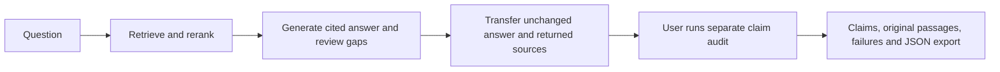

# VeritasMed

**Ask a medical-literature question. Inspect each claim. Follow it back to the source.**

VeritasMed is a React + FastAPI + LangGraph research showcase with literature retrieval,
cited answers and a separate claim audit panel. The panel exposes exact answer/source
passages, unsupported statements, unresolved quotations and unchecked text. It is not a
clinically validated assistant.

**[v0.5.0 · Traceable text audits](docs/releases/v0.5.0.md)** · Python 3.12 · Node.js 22.12+ · Apache-2.0


*Actual saved inference: an Agent answer about the GRADE hypoglycemia trial, audited against
the original article abstract. This is a single-paper demonstration, not a reliability score.*

## Start here: real medical audit, no API key

Install [uv](https://docs.astral.sh/uv/) and Node.js 22.12+, then get the fixed milestone:

```sh
git clone --branch v0.5.0 https://github.com/lijingshan-6/medrag-agent.git
cd medrag-agent
uv venv --python 3.12
uv pip install -r requirements-audit.txt
uv pip install --no-deps -e .
```

Alternatively, download the [source ZIP](https://github.com/lijingshan-6/medrag-agent/archive/refs/tags/v0.5.0.zip)
and install from its extracted root. Activate the environment:

| Shell | Command |
|---|---|
| Windows PowerShell | `.\.venv\Scripts\Activate.ps1` |
| macOS / Linux | `source .venv/bin/activate` |

```sh
python scripts/run_audit_demo.py
```

Open **http://127.0.0.1:5174/audit**. The launcher installs frontend dependencies if needed;
ports **8001 and 5174** must be free. Ctrl+C stops both services. If PowerShell blocks activation,
use `.\.venv\Scripts\python.exe scripts/run_audit_demo.py` directly.

The medical record and its source texts are bundled. After dependency installation, replay
needs **no model key, GPU, Qdrant or dataset download**. Click a claim, select **Locate in full
source**, open the paper, and export the audit JSON. The page clearly identifies saved inference.

[Medical walkthrough and actual output](docs/medical-demo.md) · [Audit methods and input limits](docs/audit-demo.md)

Optional: download the pinned public RAGTruth texts to replay nonmedical development
experiments too, then reload the page:

```sh
python scripts/verification/answer_benchmark.py download
```

## Run a new audit

Copy `.env.example` to `.env` and configure a compatible gateway. All current research roles
use **Flash**; there is no automatic Pro fallback:

```dotenv
LLM_BACKEND=openhub
OPENHUB_BASE_URL=https://www.cun.ai/v1
OPENHUB_API_KEY=your-gateway-key
OPENHUB_MODEL=DeepSeek-V4.1-Flash
OPENHUB_REASONING_EFFORT=high
OPENHUB_MAX_TOKENS=32768
LLM_TIMEOUT_SECONDS=240
```

Keep real keys in the ignored local `.env`. Availability and model names depend on your provider.
In **Audit your own answer**, enter an answer and its sources, then choose **Run new audit**.
This sends those texts to the configured endpoint. The audit service does not save submissions;
use **Export audit JSON** to retain a result. Do not submit personal health information.

**Direct Flash remains the default.** Split, Context + meta and Exact quotes v2 are experimental
alternatives. Their existence does not establish better semantic accuracy. Unique text binding
proves where a quote occurs; it cannot prove a judgment is correct.

## Run the full medical Ask → Audit flow

The complete retrieval stack needs several GB of dependencies and BGE model downloads.
From the root, install it into the same Python 3.12 environment (or a fresh one):

```sh
uv pip sync requirements.lock --torch-backend cpu
uv pip install --no-deps -e .
python scripts/run_demo.py --medical
```

Keep the Flash configuration above and the environment activated. Open **http://127.0.0.1:5173**
and select the GRADE question. This runs BGE-M3 retrieval, reranking and the actual LangGraph
Agent over the paper's five original abstract sections. After the answer appears, click its
**Audit** button, review the unchanged answer and all returned passages, then run the audit.
The new audit is a separate action and does not automatically rewrite the answer.

The launcher uses `.demo-runtime/medical-qdrant` and the separate `medrag_medical_demo` collection;
it does not replace the research index. Later starts can use
`python scripts/run_demo.py --medical --skip-index`. Ports **8000 and 5173** must be free.
The first request includes model loading and may be much slower than later requests.

The source is Seaquist et al. (2024),
[GRADE hypoglycemia outcomes](https://doi.org/10.1371/journal.pone.0309907), under **CC0**.
The [publisher XML, provenance and extraction recipe](data/demo/medical/README.md) are included.
Only its abstract is indexed; this is not a whole-literature review or full-text clinical assessment.

The earlier three-summary fixture remains available with `python scripts/run_demo.py`.
For a browser-only authored UI example: `cd frontend`, `npm ci`, `npm run dev`, then open
`http://127.0.0.1:5173/?demo=1`. Guided answers and animated steps are written fixtures,
not actual inference. [Legacy demo guide](docs/demo.md)

## What this version delivers

- **Literature Ask:** dense/sparse retrieval, reranking, requested-study matching, source-bound
  answer components, citations, explicit gaps and bounded answer repair from v0.4.
- **Separate answer audit:** claim extraction and supported / contradicted / insufficient
  judgments against supplied text, with answer/source navigation and original-paper links.
- **Visible failure boundaries:** missing/ambiguous quotes, request failures, uncovered text and
  extracted-claim limits stay visible. No uncalibrated confidence percentage in the audit panel.
- **Inspectable records:** actual model outputs, source fingerprints, invocation metadata,
  unchanged Ask transfers, saved replay and JSON export.
- **Research with retained failures:** public annotated data, controlled diagnostics, ablations,
  repeat runs and concrete-error review. Reports include negative findings.



[Actual Agent workflow](docs/agent-workflow.md) · [Research route](docs/verification-roadmap.md)

## What we measured

| Development experiment | Observation | Interpretation |
|---|---|---|
| SciFact pilot, 30 fixed pairs | 25/30 label agreement | Small public-label adaptation pilot |
| 48 constructed diagnostics, three variants | All 48/48; structured calls used more tokens | No demonstrated gain; not expert gold |
| RAGTruth pilot, 24 answers | Direct / Split overlapped 14/15 errors; warnings on 9/12 and 7/12 unmarked answers | Span hits coexist with substantial disagreements |
| Context experiment, 126 calls | 123 complete; broader spans raised some hit metrics | No established semantic verification gain |
| Quote-v2 experiment, 36 calls | Both whole-answer methods hit 3/5 errors; fixed binary targets 8/8, including four easy controls | Binding improved; whole-answer judgments still vary |

Tasks and denominators differ; do not pool these into an accuracy percentage. The 33-error
specific-issue review is **AI development review**, not independent expert validation.
The 60 reserved RAGTruth test source groups remain unused. No calibrated reliability, clinical
evidence grading or advantage over a strong model with the same autonomous tools is claimed.

[Release interpretation and reports](docs/releases/v0.5.0.md) · [Quote-v2 results](docs/verification-v0.5-specific-errors.md)

The historical **v0.4** medical answer evaluation achieved development 15/15, declared repeats
10/10 and first held-out test **31/35** under its own contract. Those 35 questions are now exposed;
the scores do not measure this new audit panel. Four failures and AI-review limitations
remain in the [v0.4 report](docs/agent-v0.4-flash-report.md).

## Practical limits and repository map

Services bind to loopback. The web API has no public-user authentication or multi-tenant
isolation; keep it as a local showcase. Full Ask checkpoints can retain questions and answers.
The Ask request deadline is 300 seconds; a synchronous model call already in flight may
finish after Stop. Responses can omit qualifiers or misinterpret a source despite a green check.

Windows is the local demonstration platform. GitHub Actions runs the existing Ubuntu checks;
Docker and macOS/Linux browser use have not been exercised on the release host. Research
corpora, weights, local indexes and credentials are excluded. The tiny medical XML snapshot is
an explicit CC0 exception; other third-party materials retain their terms.

| Path | Purpose |
|---|---|
| `src/medrag/agent/` | Question-answer graph, evidence binding and model backends |
| `src/medrag/verification/` | Independent fixed-evidence and whole-answer auditors |
| `src/medrag/api/`, `frontend/` | API and interactive audit/Ask interface |
| `data/demo/medical/` | Original source, actual Ask stream and exported audit |
| `data/verification/` | Frozen audit experiments and offline reports |
| `data/benchmark/veritasmed_v1_1/` | Historical medical benchmark and saved reviews |
| `docs/` | Startup, research limits, plans and release notes |

Existing offline checks: `python -m pytest -q`, `ruff check src/`, `npm --prefix frontend test`,
`npm --prefix frontend run build`. They make no paid model calls. Live tests require `--run-live`.

[Documentation index](docs/README.md) · [Medical demo](docs/medical-demo.md) ·
[v0.5 release](docs/releases/v0.5.0.md) · [Changelog](CHANGELOG.md) · [License](LICENSE)
