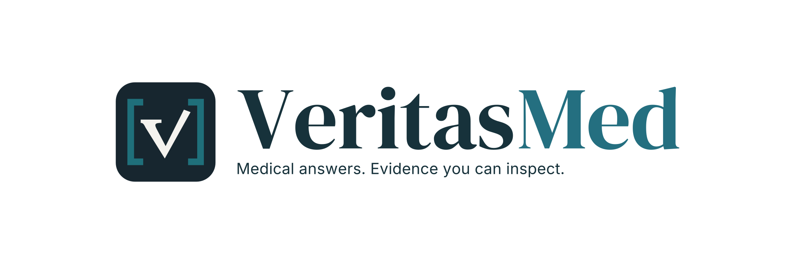
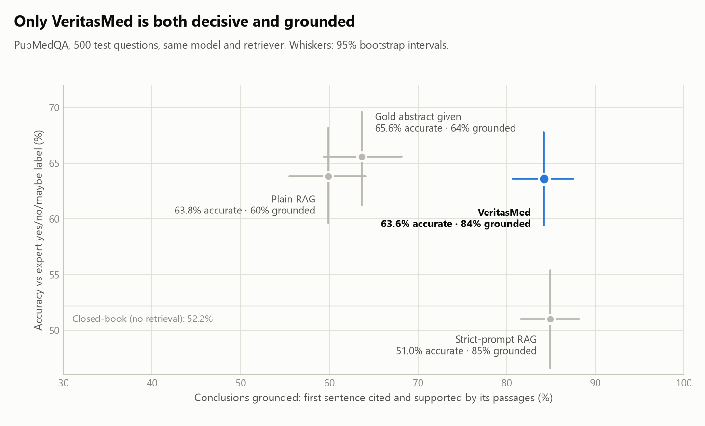

<div align="center">

<picture>
  <source media="(prefers-color-scheme: dark)" srcset="docs/assets/brand/reference/veritasmed-reference-logo-dark.svg">
  
</picture>

**可核查的医学问答：结论受证据约束，每句话都能被审计。**

[](https://github.com/lijingshan-6/VeritasMed/actions/workflows/ci.yml)
[](https://lijingshan-6.github.io/VeritasMed/)
[](LICENSE)


[**在线演示**](https://lijingshan-6.github.io/VeritasMed/) · [**实验报告**](docs/experiment-a.zh-CN.md) · [工作原理](docs/how-it-works.zh-CN.md) · [研究记录](docs/research.zh-CN.md) · [English](README.md)

</div>


## 为什么做这个

在医学回答里，读者真正据以行动的是那句结论。在 PubMedQA 的 500 道题上，普通的检索增强（RAG）模型复述事实没有问题，但它的 yes/no 结论有 **40%** 没有引用、或不被所引原文支持；即使直接把正确的摘要交给它，也有 **36%**。问题不在检索，而在模型下的结论超出了原文所说的内容。

VeritasMed 把结论和每条陈述都绑定到原文句子，用平实的语言在旁边作答，把缺失的证据明确报告为缺口，并且一键就能把每句话与来源逐条核对。

## 结果

<picture>
  <source media="(prefers-color-scheme: dark)" srcset="docs/assets/experiment-a/tradeoff-dark.png">
  
</picture>

所有方法使用同一模型、同一语料和同一检索器；覆盖 PubMedQA 官方测试集全部 500 题。

| | 准确率 | 结论有引用且被支持 | 每题成本 | 中位耗时 |
|---|---|---|---|---|
| 普通 RAG | 63.8% | 60% | $0.001 | 10 秒 |
| 强提示词 RAG | 51.0% | 85% | $0.002 | 13 秒 |
| **VeritasMed** | **63.6%** | **84%** | $0.011 | 59 秒 |

- **结论有据，同时不放弃下结论。** 强提示词只能靠大量回答"maybe"来让结论有据，准确率因此跌到闭卷水平（52.2%）。
- **审计能抓到错误。** 191 处植入的实质性错误中检出 187 处（97.9%），误标正确句子 2.0%；在普通 RAG 的真实回答中，它能抓到大模型裁判放过的"说过头"。
- **如实说明它不是什么。** 它的准确率并不比普通 RAG 高，每题多花约 1 美分、多约 50 秒；有一项早期结论因自动裁判没有通过校准而被撤回。

完整的设计、统计、人工复核与局限见 [**实验 A 报告**](docs/experiment-a.zh-CN.md)。

## 功能

- **先给结论，结论绑定证据。** 问题的每个部分都绑定到检索论文中的某个句子；原文没有的结果明确报告为证据缺口，不靠猜测补齐。
- **自检与修复。** 回复前先评估证据，证据不足就改写检索，并复核自己的草稿；改写和重写各最多两次。
- **一键逐条审计。** 每条陈述都与原文精确引文核对；无法定位的引文、未核查的文字，以及"把不显著说成没有区别"都会标出，不会被隐藏。
- **对话可以保存。** 追问、答案版本和审计都保存在浏览器中，可作为一个文件导出。

## 快速开始

回放模式在浏览器中运行录制好的对话（9 个真实回答、12 次审计），不需要模型、API 密钥、Python 或 GPU。直接打开[在线演示](https://lijingshan-6.github.io/VeritasMed/)，或用 Node.js 22.12+ 在本地运行：

```sh
git clone https://github.com/lijingshan-6/VeritasMed.git
cd VeritasMed/frontend && npm ci && npm run replay
```

打开 http://127.0.0.1:5173，选择一段对话，再打开 **Claim check**。

<details>
<summary><b>问你自己的问题（在线模式）</b></summary>

在线模式检索仓库自带的三篇论文（15 段原始摘要，CC0 / CC BY 许可）。需要 Python 3.12 与完整依赖（数 GB，CPU 即可，推荐使用 [uv](https://docs.astral.sh/uv/)）和一个 OpenAI 兼容的 Flash 端点：

```sh
uv venv --python 3.12      # 然后激活 .venv
uv pip sync requirements.lock --torch-backend cpu
uv pip install --no-deps -e .
cp .env.example .env        # 然后填写 OPENHUB_API_KEY（端点或模型不同时一并修改）
python scripts/run_demo.py  # 之后启动可加 --skip-index
```

回答也可以用本地模型生成（`LLM_BACKEND=ollama`、`OLLAMA_MODEL=qwen3.5:9b`），审计始终使用 Flash 端点。

</details>

## 工作原理


1. **理解追问**：结合最多六轮选中的历史对话。旧回答只用于理解"它""这些结果"指什么，不作为证据。
2. **检索**：BGE-M3 稠密与稀疏检索，融合后重排；先确认问题点名的是哪篇论文，再挑选段落。
3. **规划回答**：把问题的每个部分绑定到检索文本的句子编号；程序检查每条引文确实存在，且来自正确的论文。
4. **生成与检查**：用平实语言作答，每条陈述旁边展示绑定的原文句子；模型复核支持关系、完整性和证据边界，并要求定向修复。

更多：[工作原理](docs/how-it-works.zh-CN.md) · [Agent 图](src/medrag/agent/graph.py) · [审计代码](src/medrag/verification/)。

<details>
<summary><b>更早的实验</b></summary>

| 问题 | 结果 | 决定 |
|---|---|---|
| Agent 能否依据正确证据回答？ | 冻结后只跑一次的保留集：**31/35** 严格通过（v0.2 开发集为 5/15） | 采用当前回答流程 |
| 模型作为陈述核查器有多可靠？ | 在 339 对 SciFact 数据上，Flash 错误接受 **6/201** 条无依据陈述，MiniCheck 为 14/201 | Flash 作为核查器 |
| 规定的工具流程能否胜过直接阅读论文？ | 31/40，而直接阅读和自主调用工具都是 35/40 | 保留更简单的流程 |
| 细粒度（原子化）审计能否保住限定条件？ | 保住更多条件（101/104 对 91/104），但完成的审计更少（26/48 对 47/48） | 默认 Direct |
| 逐字粘贴原文，还是用平实语言？ | 逐字版得分更高，只因引文必然通过引用裁判；它的回答是一串引文 | 平实语言，原文附在旁边 |

详见 [研究记录](docs/research.zh-CN.md)。

</details>

## 局限

- 这是研究演示，不是临床建议。标签来自公开数据集和 AI 辅助复核，没有临床专家参与。
- PubMedQA 是单篇论文的 yes/no 题，跨研究的证据综合尚未评测。
- 自带索引只有三篇论文，在线模式无法回答任意医学问题。
- 绿色勾号表示模型判断引用的文本支持该陈述，不是校准过的概率；审计也不评价研究质量，不裁决论文间的冲突。
- 网页 API 没有身份认证，仅供本地使用；历史保存在浏览器存储中。

<details>
<summary><b>仓库结构与检查</b></summary>

| 路径 | 内容 |
|---|---|
| `src/medrag/agent/` | LangGraph 回答图、证据绑定、追问解析、模型工厂 |
| `src/medrag/verification/` | Direct 与 Atomic v2 审计、精确引文绑定、数值与显著性检查 |
| `src/medrag/retrieval/`、`index/` | 混合检索、重排、Qdrant 索引 |
| `src/medrag/api/` | FastAPI 应用：Ask WebSocket、审计、原文段落、录制对话 |
| `src/medrag/mcp_server/` | 可选的本地 MCP 工具（检索、问答、评估） |
| `frontend/` | React 应用；`npm run replay` 无需后端 |
| `data/demo/conversations/` | 三篇来源论文、语料与录制的对话 |
| `experiments/pubmedqa/` | 实验 A：脚本、预注册文件与全部原始输出 |
| `docs/assets/brand/` | Logo 全套（浅色、深色、单色、紧凑版、图标、头像；SVG 与 PNG）、字体与生成脚本 |

检查命令（都不调用模型）：`python -m pytest -q`、`ruff check src/`、`npm --prefix frontend test`、`npm --prefix frontend run build`。

更早的研究数据归档在 [commit 81a1519](https://github.com/lijingshan-6/VeritasMed/tree/81a1519)。另见 [变更记录](CHANGELOG.md) 与 [来源归属](data/demo/conversations/README.md)。

</details>

## 许可

代码采用 [Apache-2.0](LICENSE)。数据集、论文和模型权重保留各自的许可，见 [来源归属](data/demo/conversations/README.md) 与 [实验报告](docs/experiment-a.zh-CN.md#1-实验设置)。
