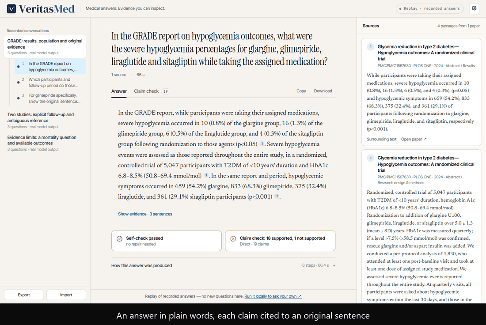
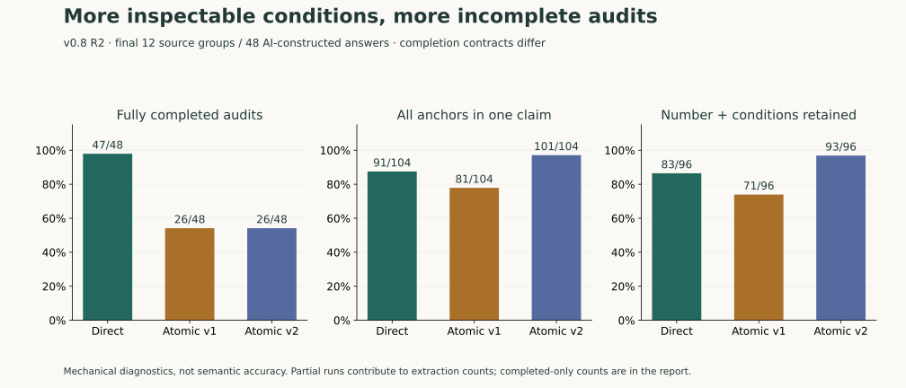

# VeritasMed

[English](README.md) | **简体中文**

**提出医学文献问题。检查每条陈述。沿着引文回到原文。**

基于 React + FastAPI + LangGraph 的研究展示项目：把对话式 Ask、原始文献段落和逐条
claim 审计放在同一个答案内。**v0.8 是产品可检查、研究证据可追溯的里程碑，尚不是经临床
验证的助手。**

Python 3.12 · Node.js 22.12+ · 代码 Apache-2.0 · [来源归属](docs/research-sources.md)

[五分钟图解](docs/showcase.md) · [系统与节点图解](docs/system-guide.md) · [使用 Ask](docs/conversation-guide.md) ·
[研究发现](docs/research-overview.md) · [文档目录](docs/README.md)

## 先看产品



[操作录像（MP4）](docs/assets/showcase/walkthrough.mp4) ·
[逐条 claim 与原文](docs/showcase.md)

录像于 2026-09-30 从实际应用录制，回放已保存的医学 Ask 与 Flash 审计输出。
录制没有新推理，原有部分完成状态保持可见。

- 保存多轮对话、答案版本、附带审计并完整导出。
- 从 claim 定位到未经改写的回答片段和所给来源的确切原文。
- 同时查看数值条件、未解决提取、未检查文字与模型判断。
- 用实际输出、工具轨迹和外部标签比较受限研究流程。
- 通过有源码依据的文档图解，了解节点输入、规则、分支与真实修复失败。

**Ask 是产品入口，Audit 在回答内打开，Research 是辅助实验。**
Direct / Flash 保持默认。Atomic v2 是检查限定条件的实验方法，复核负担较大。
绿色标签和检索分数都不是经过校准的可信度。

## 系统怎样工作


完整 Ask 图解析指代、检索新证据、重排、评估、起草、检查，并有限次改写查询和重新生成。
旧答案提供上下文，不作证据。用户打开的 Audit 独立检查原答案及所给来源，目前不会自动
修复答案。

[Agent 工作流图](docs/assets/showcase/agent-workflow.svg) ·
[claim 与来源关系图](docs/assets/showcase/claim-evidence.svg) ·
[当前代码地图](docs/architecture.md) · [详细工作流](docs/agent-workflow.md)

详细图解见 [系统与节点](docs/system-guide.md)：从模块职责走到节点内部，
再对照一次仍带未解决问题结束的真实执行。

## 研究说明了什么

研究回答三个不同问题，其分数不能合并。

| 问题 | 保存的观察 | 当前决定 |
|---|---|---|
| 给定 claim 和来源，核查效果如何？ | SciFact 公开 dev：Flash 错误接受 6/201 非支持、召回 96/138 支持；MiniCheck 为 14/201 和 92/138 | 保留 Flash；校准没有合格接受阈值 |
| 规定工具流程有帮助吗？ | 40 个指定论文问题：全读 / 自主 / 结构化的正确接受为 35/40、35/40、31/40 | 本实验没有证明流程优势 |
| Atomic v2 能保留条件吗？ | 48 个最终构造回答：更多锚点同项保留，但完整审计仅 26/48，Direct 为 47/48 | Direct 默认，v2 保留实验选项 |

[四张研究图、解释与不确定性](docs/showcase.md) ·
[研究总览](docs/research-overview.md) · [重算保存结果](docs/research-reproduction.md)

三篇论文的产品回放是演示，不是测试集。保留真实拒答、漏澄清、多余缺口警报和漏答死亡率
子问题。[记录案例与来源许可](data/demo/conversations/README.md)

## 从 Ask 开始：真实对话回放，无需密钥

安装 [uv](https://docs.astral.sh/uv/) 和 Node.js 22.12+：

```sh
git clone https://github.com/lijingshan-6/medrag-agent.git
cd medrag-agent
uv venv --python 3.12
uv pip install -r requirements-audit.txt
uv pip install --no-deps -e .
```

以下使用 main，包括发布后的文档整理。固定版本也可下载
[v0.8.0 源码 ZIP](https://github.com/lijingshan-6/medrag-agent/archive/refs/tags/v0.8.0.zip)。
激活环境：

| Shell | 命令 |
|---|---|
| Windows PowerShell | `.\.venv\Scripts\Activate.ps1` |
| macOS / Linux | `source .venv/bin/activate` |

```sh
python scripts/run_showcase.py
```

打开 **http://127.0.0.1:5173/**。启动器按需安装前端依赖，**8000、5173** 端口需空闲。
Ctrl+C 停止两个服务。PowerShell 阻止激活时，直接用
`.\.venv\Scripts\python.exe scripts/run_showcase.py`。

选择 **SAVED INFERENCE** 对话。三篇真实医学论文支持三段各三问的实际对话。
选择轮次，查看完整答案和来源，点击 **Audit**，切换 **Saved runs**。
**Back to answer** 保留对话。导出/导入保存问题、版本、来源快照、轨迹和全部附带审计。

依赖安装后，回放**不需模型密钥、GPU、Qdrant 或下载数据集**。它读取实际保存输出，
包含拒答、部分答案和未完成判断，不接受新问题或调用模型。问自己的问题用下方完整配置。

[对话指南](docs/conversation-guide.md) ·
[原论文、许可与固定问题](data/demo/conversations/README.md) ·
[v0.8 结果与限制](docs/reports/verification-v0.8-report.md)

## 可选的独立审计与研究工作区

```sh
python scripts/run_audit_demo.py
```

打开 **http://127.0.0.1:5174/audit**（API **8001**）。此工作区回放早期 GRADE 审计、
构造错误对照、MiniCheck 诊断和受控研究比较，配置 Flash 后也可运行新审计。
**5173** 的 Ask 仍是主产品，Audit lab / Research 为辅助工具，不替代对话。

[审计指南](docs/audit-demo.md) · [历史研究演示](docs/research-demo.md)

可选：下载固定版本 RAGTruth 文本，查看非医学开发回放：

```sh
python scripts/verification/answer_benchmark.py download
```

## 运行新审计

将 `.env.example` 复制成 `.env`，配置兼容网关。当前全部研究角色使用 **Flash**，
没有自动 Pro fallback：

```dotenv
LLM_BACKEND=openhub
OPENHUB_BASE_URL=https://www.cun.ai/v1
OPENHUB_API_KEY=your-gateway-key
OPENHUB_MODEL=DeepSeek-V4.1-Flash
OPENHUB_REASONING_EFFORT=high
OPENHUB_MAX_TOKENS=32768
LLM_TIMEOUT_SECONDS=240
```

真实密钥只放已忽略的本地 `.env`。可用性和模型名依供应商而定。
在 **Audit your own answer** 输入答案与来源，选择 **Run new audit**，文本会发送到配置
端点。审计服务不保存提交，用 **Export audit JSON** 留存结果。不要提交个人健康信息。

**Direct Flash 保持默认。** Atomic v1/v2、Split、Context + meta、Exact quotes v2 为实验
选项，不能仅凭存在就认为语义准确率更高。唯一文本绑定证明引文在哪里，不证明判断正确。

## 比较三种研究流程

在同一轻量服务打开 **http://127.0.0.1:5174/research**。三个按种子预选的开发案例回放
**Read all documents**、**Autonomous tools**、**Structured workflow** 的真实答案、
工具轨迹、引用和用量。最终成绩使用另一次 40 问比较，不是这三个演示。
可导出全部轨迹，或把未经改写的答案与候选来源转入 Audit；转入本身不调用模型。

任务限定为：在八篇固定候选摘要内，**已指定论文**是否支持一条 claim？自主和结构化方法
共用 search/read/verify，以及包含 verify 内调用的六次模型上限。自主方法使用应用层
JSON action 协议。本实验不证明完整医学 Ask 图有优势。

[研究演示](docs/research-demo.md) · [复现](docs/research-reproduction.md) ·
[范围决定（原始记录）](docs/decisions/2026-09-26-v07-research-scope.md)

## 运行完整医学 Ask → Audit

完整检索依赖有数 GB，并需下载 BGE 模型。在仓库根目录的同一个 Python 3.12 环境
（或新环境）安装：

```sh
uv pip sync requirements.lock --torch-backend cpu
uv pip install --no-deps -e .
python scripts/run_demo.py --conversations
```

先停止回放启动器，保留上方 Flash 配置，打开 **http://127.0.0.1:5173/**。
这会运行 BGE-M3 检索、重排和真实 LangGraph Agent，语料为**三篇论文的 15 段原始摘要**。
可问新问题或使用 [演示协议](data/demo/conversations/protocol.json)中的固定问题。

追问时保持 **Use selected history** 开启。解析器最多使用六个完整历史轮次理解指代，
每个答案重新检索证据。选择旧轮次可从那里继续。**Re-run** 追加答案版本，**Run audit**
为那个精确版本追加独立审计。刷新恢复浏览器历史，新问题保留旧答案。

启动器用 `.demo-runtime/conversation-qdrant` 和 `medrag_conversation_demo`，与研究索引
分开。之后可用 `python scripts/run_demo.py --conversations --skip-index`。
首问包含本地模型加载，可能较慢。只有摘要入库，这个小集合不能支持任意医学问题。

旧单篇 GRADE 演示仍可用 `python scripts/run_demo.py --medical`。
[来源清单与重建说明](data/demo/conversations/README.md)保留归属、文本规范化与 XML 快照。

旧三摘要示例仍可用 `python scripts/run_demo.py`。纯浏览器编写示例用 `cd frontend`、
`npm ci`、`npm run dev`，再开 `http://127.0.0.1:5173/?demo=1`。
Guided 答案和步骤动画是编写示例，不是真实推理。[运行配置](docs/configuration.md)

## 实际测量



[配对不确定性与完整研究图解](docs/showcase.md)。

v0.8 分开报告机械定位、构造限定语诊断与自然开发答案。离线父句绑定在 167 次保存审计中
恢复 82 个事实位置，零定位退步，没有新增语义判断。来源盘点后，新公开标签不足以做新
语义泛化比较。Direct 保持默认。

全部 **348 次预定 R2 审计**已保存，含 577 次模型调用。最终 12 来源组 / 48 构造回答：

| 方法 | 完整完成审计 | 全锚点同项出现的目标 | 数字与目标条件保留 |
|---|---|---|---|
| Direct | 47/48 | 91/104 | 83/96 |
| Atomic v1 | 26/48 | 81/104 | 71/96 |
| Atomic v2 | 26/48 | 101/104 | 93/96 |

它们是 AI 构造输入上的机械诊断，**不是语义准确率**。v2 增加条件的可检查性，也增加
复核负担；同项共现与数字保留差的来源组区间包含零。另一个 12 答案自然开发样本中，
Direct / v2 完成 12/12、3/12，警报同样重叠 8/12 个标错片段。
完成合同不同，位置重叠不证明发现具体错误。

见 [v0.8 报告](docs/reports/verification-v0.8-report.md)、
[定位结果](docs/reports/verification-v0.8-localization.md)与
[来源盘点](docs/reports/verification-v0.8-exposure.md)。

<details>
<summary>保留的 v0.4–v0.7 测量及各自评估合同</summary>

以下为原有 **v0.6/v0.7** 研究结果，不是 v0.8 重测。
固定 claim 研究用 SciFact 公开 dev 的 **247 个连通来源组 / 339 对**。
输入、方法和阈值在评估前冻结，不是该数据集私有 test，也不是临床验证。

| 固定核查器 | 完成 | 二分类正确 | 非支持被接受 | 支持召回 |
|---|---|---|---|---|
| Flash | 339/339 | 291/339 | 6/201 | 96/138 |
| MiniCheck-Flan-T5-Large | 339/339 | 279/339 | 14/201 | 92/138 |

MiniCheck 错误接受率减 Flash 为 **+3.98 个百分点**，来源组配对 95% 区间 **+0.49 至 +8.11**。
支持召回差 −2.90 点，区间 −12.16 至 +6.02。更快本地评分没有证明更好的核查器。
独立选择的校准策略**没有合格接受阈值**。不借最终成绩重选阈值或显示可信度百分比。

36 个自然开发回答中，Direct / Split / Atomic 完整完成 **34/36、35/36、11/36**。
Atomic 呈现有用结构，也有歧义片段、拆分不确定和限定语漏项。
重复调用在 Direct 的 2/12、Atomic 的 4/12 来源改变警报有无。错误片段重叠不是语义
核查准确率。**Direct 仍默认。**

另一次冻结 **40 问流程比较**：

| 流程 | 完成 | 正确接受二分类 | 非支持被接受 | 支持召回 | 模型调用 / 问 |
|---|---|---|---|---|---|
| 全读文献 | 40/40 | 35/40 | 2/19 | 18/21 | 1.0 |
| 自主工具 | 40/40 | 35/40 | 2/19 | 18/21 | 3.4 |
| 结构化流程 | 36/40 | 31/40 | 2/19 | 15/21 | 2.0 |

**本比较的结构化核查步骤没有带来改善。** 四个原答保留待复核：三个正确支持，一个真实
contradicted/insufficient 分歧（原答在二分类已经正确）。草稿得分 35/40。
已报告 token 比全读少，但延迟更长、正确支持保留更少。
首次开发暴露动作协议缺陷，全部记录保留；修复自主基线后才冻结和运行最终题。

[审计可靠性报告](docs/reports/verification-v0.6-report.md) ·
[流程结果与 40 案例](docs/reports/verification-v0.7-report.md)

早期 v0.5 观察保留作背景：

| 历史开发实验 | 观察 | 解释 |
|---|---|---|
| SciFact 试跑，30 固定对 | 25/30 标签一致 | 小规模公开标签适配 |
| 48 构造诊断，三变体 | 均 48/48；结构化调用更多 token | 未证明收益，不是专家 gold |
| RAGTruth 试跑，24 回答 | Direct / Split 重叠 14/15 错误；无标错答案警报 9/12、7/12 | 命中位置仍有实质判断分歧 |
| Context 实验，126 调用 | 123 完成；扩大范围提升部分命中 | 没有已建立的语义核查收益 |
| Quote-v2 实验，36 调用 | 两种整答方法均命中 3/5 错误；固定二分类目标 8/8，含四个简单对照 | 绑定改善，整答判断仍变动 |

任务与分母不同，不能汇总为准确率。33 错误具体问题复核是 **AI 开发复核**，非独立专家
验证。60 个保留 RAGTruth test 来源未使用。不声称校准可靠性、临床证据分级或胜过使用
同样工具的强模型自主流程。

[历史 v0.5 解释](docs/releases/v0.5.0.md) ·
[Quote-v2 结果](docs/reports/verification-v0.5-specific-errors.md)

历史 **v0.4** 医学回答评估在自身合同下开发 15/15、预定重复 10/10、首次保留题 **31/35**。
35 道题如今已曝光，成绩不测量新的审计面板。四次失败与 AI 复核限制保留在
[v0.4 报告](docs/reports/agent-v0.4-flash-report.md)。

</details>

## 实用限制与仓库地图

服务绑定 loopback。网页 API 无公开用户鉴权或多租户隔离，保持本地展示使用。
完整 Ask checkpoint 可能保存问题与答案。Ask 期限 300 秒；Stop 后，已运行的同步模型
调用可能继续至结束。即使绿色检查，回复仍可能漏限定语或误读来源。

Windows 是本地演示平台，GitHub Actions 执行既有 Ubuntu 检查。
发布主机未实测 Docker 或 macOS/Linux 浏览器。研究语料、权重、本地索引和密钥不提交。
随附医学 XML 保留 CC0 / CC BY 归属。少量 SciFact 摘录、候选摘要和实际来源/工具返回
也供检查，遵循各自 [上游许可](docs/research-sources.md)。

| 路径 | 用途 |
|---|---|
| `src/medrag/agent/` | 问答图、证据绑定和模型后端 |
| `src/medrag/verification/` | 独立固定证据与整答核查器 |
| `src/medrag/api/`, `frontend/` | API 与 Ask/审计界面 |
| `data/demo/conversations/` | 三论文语料、固定问题、原始流与完整对话导出 |
| `data/demo/medical/` | 原始来源、真实 Ask 流与导出审计 |
| `data/demo/reliability/`, `data/demo/research/` | 保存的原子审计与共享工具比较 |
| `data/verification/` | 冻结审计实验与离线报告 |
| `data/benchmark/veritasmed_v1_1/` | 历史医学题集与保存复核 |
| `docs/` | 中文指南、研究边界、计划和版本说明 |
| `docs/en/` | 当前维护文档的英文配对版本 |

已有离线检查：`python -m pytest -q`、`ruff check src/`、`npm --prefix frontend test`、
`npm --prefix frontend run build`，不调用付费模型。在线测试需 `--run-live`。

[文档目录](docs/README.md) · [医学演示](docs/medical-demo.md) ·
[v0.8 发布说明（原文英文）](docs/releases/v0.8.0.md) ·
[下一步：v0.9 问题覆盖](docs/plans/v0.9-question-coverage.md) ·
[变更记录（原文）](CHANGELOG.md) · [许可](LICENSE)
