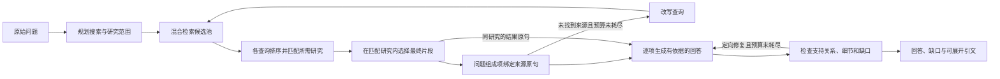

# 医学 Ask 工作流（v0.8 上下文，沿用 v0.4 回答图）

[English](en/agent-workflow.md) | **简体中文**

[工作流图与操作图解](showcase.md)。

本页说明 v0.8 保留的完整检索与回答图。`/research` 比较使用另外一个受限的、已指定论文的
共享工具流程，不测量整个 Ask 图。见 [Research 演示](research-demo.md)和
[范围决定](decisions/2026-09-26-v07-research-scope.md)。

**Ask → Audit** 在当前回答内打开审计。浏览器传递未经改写的回答和全部返回的来源文本，
用户再运行 Direct Flash 或实验方法。新审计不进入图内的修复循环。回答/来源的精确绑定、
未解决引文、未覆盖文字和 JSON 导出见 [审计指南](audit-demo.md)；
[医学演示](medical-demo.md)保存了使用原始论文文本的操作记录。

v0.8 在浏览器保存对话、逐轮答案版本和审计。进入图之前，API 解析用户明确选择的历史：
最多六个完整轮次、12,000 个 Unicode 字符。当前问题保留原文；只有成功解析的追问才附加
指代上下文。需要澄清的回复不进入检索。实际解析结果、所用轮次 ID、省略数量和解析器用量
随答案保存。歧义仍可能漏检，两篇论文的演示保留了一次这样的失败。

每次调用为解析后的问题重新检索文献；之前的助手回答不是来源证据。每次使用新的 checkpoint
身份。浏览器 API、Ollama runner `scripts/benchmark/run_agent.py` 和 OpenHub runner
`scripts/benchmark/compare_agent_models.py` 调用同一个图。历史 benchmark runner 不测量
新的浏览器/API 对话解析器。Guided 模式是标明身份的浏览器示例，不执行此图。

历史、导入导出、无密钥回放与完整 Ask 配置见 [对话指南](conversation-guide.md)。

可选 MCP `ask_agent` 同样每次创建新 checkpoint；其 `thread_id` 是调用方标签，不是浏览器
对话记忆，也不运行有界历史解析器。旧 `/api/history/{thread_id}` 已弃用，它读取原始
checkpoint，而浏览器历史保存在 IndexedDB。见 [代码地图](architecture.md)。

自 2026-09-23 起研究基线为 Flash，目前通过用户的兼容网关调用 `DeepSeek-V4.1-Flash`。
见 [模型决定](decisions/2026-09-23-flash-research-baseline.md)。下文说明当前实现及其限制。

## 关键节点内部

模型构造、生成和核查；程序解析原句位置、限制来源身份并执行窄规则。每个节点可能包含
多次调用，字符绑定与模型判断也不是同一种可靠性证据。[完整节点图与真实三轮修复失败](system-guide.md)
把节点状态、分支条件及实际事件放在一起解释。

## 问题、来源和回答提纲

路由器只根据用户问题，提出最多三个完整的、对应具体研究的检索问题和研究范围。
它们只是检索辅助，回答要求仍由原始问题控制。用户同时问方法与结果时，两者都保留。
检索包含原问题与最新改写，最多四个不同查询，每查询 12 个候选。各查询先排序再匹配来源；
匹配器看各组成项查询排名前四的不同研究，单研究问题则看它们的并集。
显式字母数字目标/模型匹配在此四研究上限之前提升优先级，不作硬排除。匹配器可见词面匹配/
不匹配提示，但需区分真实身份差异与描述后缀、格式差异。参考文献列表片段不能用于认定
原研究。不同组成项可共享研究。这些步骤缩小身份错误，但不证明身份或支持关系正确。
匹配在最终五片段截断前进行；分组选择保留匹配研究内的最佳证据，允许两项共享研究或段落。
最多保留五个片段。

单研究与多研究问题都先匹配身份，再选最终片段；使用原问题、标题和摘录，而非直接采用
第一名来源。后续生成与检查只读所选研究。来源选择本身是模型判断，也可能错。

程序给来源句分配本地 ID。模型选 ID 构造覆盖原问题的提纲，程序再解析为确切原文、
chunk ID 与引用。人群细节、比较数值和相关不确定性随对应组成项保留；模型给出的细节
必须存在于绑定引文中。未回答结局保留为明确的证据缺口项。
多研究匹配保持检索前子问题不变，来源文本不能添加新要求。所有所选研究进入共享提纲和
整答复核；各项保留自己的来源绑定与全局句 ID。这样复核器能看到某研究的缺口是否与
其他组成项已提供的结果冲突。所选对比保留无效/零结果分句，方法项保留实际步骤。
明确标注的开发、校准、测试和验证数量保留各自在来源中的角色；角色丢失则拒绝该 claim。
这个窄规则不能解决所有歧义。借助队列别名声称未报告的共享或独立验证数据也会被拒绝；
单凭多中心结果不能确定训练/验证划分。

这些规则拒绝未绑定引文和机械来源错配，不能证明引文在语义上支持结论。
Agent 和提示均不读取 benchmark 答案、问题 ID 或裁定。

## 生成与定向修复

生成的每条 claim 携带组成项 ID，只引用该项绑定的来源。未知组成项或错误来源会被拒绝。
生成阶段可以找回提纲漏掉的句子：它看到所选来源的全局句 ID，并声明每条 claim 的支持句。
句 ID 只能绑定到该项已有研究内，不能将缺失结局升级为有支持，或添加新研究。
界面和来源复核可看到真实引文，而非只引用附近的定义。支持的结果与缺口组装成最终答案。
边界问题不能用相邻诊断结果替代无依据的临床结论。

证据边界检查关注所问结局是否被测量、比较是否有依据。单臂生存结果不能证明优于一个
缺失的对照。原问题中的结局与比较对象一起保留。缺失项默认明确说尚未建立的结局/比较，
不复述“指出哪些还未检验”等指令。开放问题用具体缺失的结局/场景表述，并对照来源；
固定是非问题保留指定结局和比较对象。缺口不自由发挥数据缺失的原因。
提示中来源文本去重，避免重复引文挤掉原问题或指令。

检查器一起读原问题、提纲、回答和来源。它能识别未完成项，以及降级实际上未建立所问
结局的提纲项。另一个数字存在性检查发现提纲必需数值的漏项，但不评估单位、因果或
语义等价；这些仍需来源复核。

修复只替换被指出的组成项，保留其余部分。最多两次答案修复、两次检索改写。
无效结构化输出有一次本地重试。关键数值、人群和方法项在主答案使用注明出处的所选原句，
以抽取方式呈现，防止改写给这些事实添加未报告机制或验证划分。另问的设计解释仍为生成，
接受来源复核。展开证据中也保留完整引文。此选择牺牲一些流畅和简洁，保留事实措辞，
但不证明所选原句回答了问题。遗漏的绑定数字和实质方法步骤仍可通过引文恢复；已用同研究
引用陈述的数字不需重复引用。

所选非数字对比也有词面漏项检查，可能不必要地重复正确改写；它是保留回退，不是语义
等价评分。主体、比较和因果限制仍需语义复核。模型漏人群字段时，也保留明确的入组原句，
可见地标出处，不造新改写。最后一次检查拒绝的来源推断即使修复预算耗尽也会移除。
缺失组成项保留所问结局，生成文字不能加新结局。

设计解释与数字引文分开，仍受语义复核。报告设计逻辑蕴含的解释允许没有作者逐字表述。
窄规则在来源没有报告时拒绝虚构“同时测量”。对于绑定到一个明确横断面研究的受支持
因果限制项，这类失败可通过确定性规则修复：引用报告的设计，说明仅凭关联不能确立
因果方向或干预获益。此项单列为 `design_scope`。其他设计与安全解释仍由模型复核；
它不是通用因果推理验证器。提示要求保留验证场景和数据类型，但生成与复核仍可能遗漏。
预算用完仍有问题时，保留未解决检查状态。请求完成不等于答案正确。
恢复来源引文不会清除无依据解释的拒绝，原绑定问题继续进入检查与定向修复。

## 界面与运行设置

API 在既有答案增加可选 `evidence_status`、`evidence_gap`、`answer_components`。
界面显示完整、部分或不足的覆盖状态，可展开引文并到来源片段。覆盖与模型自检描述当前
证据评估，都不是临床正确性分数。模型自报 confidence 为兼容保留在 API，不显示百分比。
独立 Flash 重复中，一条正确表述纵向证据限制的答案仍被标为 `complete`：分类器可能把
完整回答“证据缺口问题”误当成结局证据完整。这是仍存的呈现限制，与答案内容分开报告。

研究 profile 明确设置 `LLM_BACKEND=openhub`、`OPENHUB_MODEL=DeepSeek-V4.1-Flash`、
`OPENHUB_BASE_URL=https://www.cun.ai/v1`。现有 `openhub` backend 名称支持配置的兼容
端点。两个 LLM 层使用同一模型 ID，启用 thinking、reasoning effort `high`，每次输出上限
32,768 token，流式传输与 240 秒客户端超时。结构化调用请求 JSON-object，检查 schema
仍在提示内。输出上限不是实际用量。runner 在最多三个问题任务间共享 CUDA embedding/
reranking，默认仅 Flash。见 [配置与命令](configuration.md)。

本地方案及历史修复 profile 用 Ollama `qwen3.5:9b`，两层均为 8,192-token 上下文、
4,096-token 输出上限。路由、来源身份选择、生成、常规 grading 与 checking 均用 direct
输出、temperature 0.0。当前边界提纲也用 direct，所有结构步骤启用 Ollama JSON mode；
检查另用要求逐项 decision 的 schema。它避免 reasoning trace 耗尽最终输出预算，不证明
JSON 字段为真，也不保证可复现。保存的 Qwen 开发运行使用 CPU BGE-M3 embedding 与
CUDA BGE reranking；README 安装路线使用 CPU PyTorch。

未明确指定 backend 时，代码仍默认 MiMo。这与选定 Flash 研究 profile、文档中的 Ollama
本地演示不同。每次浏览器 Ask 隔离 checkpoint，session 标签不恢复对话记忆。
API 整体回复期限 300 秒；取消停止后续图步骤，已运行的同步模型请求可能在后台结束。

## 结果与限制

首个 Qwen 候选严格开发通过 9/15，见 [v0.4 报告](reports/agent-v0.4-report.md)。
独立 Qwen 修复运行通过 15/15，见 [修复报告](reports/agent-v0.4-repaired-report.md)与
[工作日志](archive/worklogs/agent-v0.4-repair-worklog.md)。后续
[Pro/Flash 比较](reports/agent-model-comparison-report.md)保留各自结果，以及共同的来源
筛选、要求、缺口呈现和自检缺陷。换 Flash 基线不解决这些缺陷，也不将 Qwen 分数转给 Flash。
Flash 当前变更和测量见 [收敛报告](reports/agent-v0.4-flash-report.md)，
[v0.3 报告](reports/agent-v0.3-report.md)保留当时发布基线。

Flash 最终开发 15/15、独立重复 10/10 后先冻结实现，再首次运行 35 道保留题，严格通过
31/35，无执行错误或观察到的无依据实质添加。四条答案找到必要证据却漏必需结果或边界，
自检则对全部 35 条都给通过。测试后没有推理变更；这些题现已曝光，不能充当后续修复的
未见证据。

- [文档目录与维护范围](README.md)
- [最初 v0.4 实施计划（历史）](archive/plans/2026-09-22-veritasmed-agent-v0.4.md)
- [配置指南](configuration.md)
- [冻结题集](reports/benchmark-v1.1-report.md)
