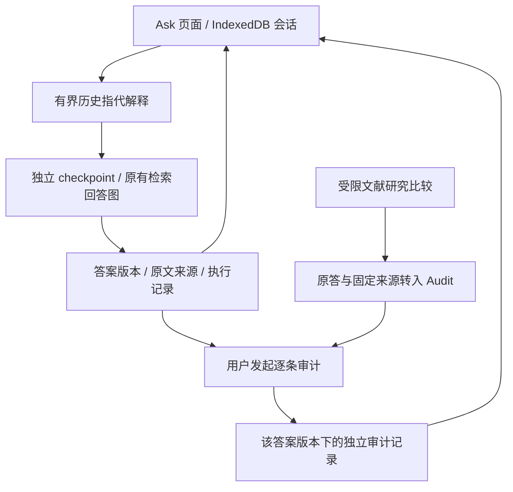
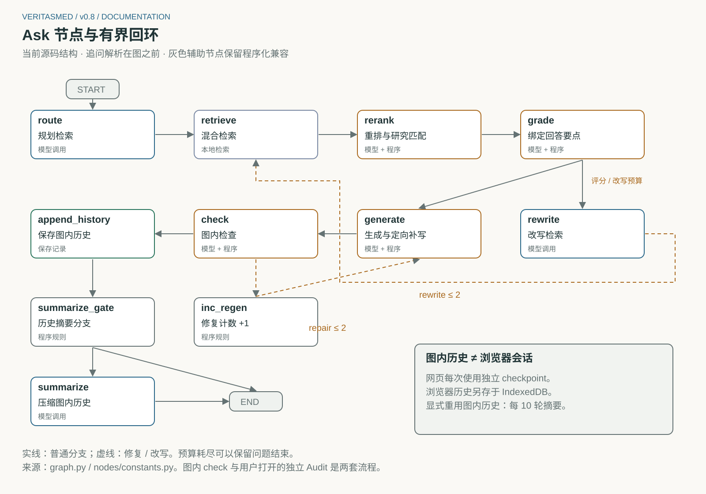

# 当前架构与维护边界

[English](en/architecture.md) | **简体中文**

适用于 v0.8 里程碑整理后的工作树。先从 [README](../README.zh-CN.md) 启动，再按本页找实现。
本页替代早期架构和原 `code-map.md`；旧设计的固定快照见 [归档说明](archive/README.md)。

[系统图与真实操作图解](showcase.md#系统如何连接起来) 先解释产品关系，本页用于查实现位置。
[系统与节点图解](system-guide.md) 解释节点内部，再把当前逻辑与真实执行记录对照。

## 产品的三条入口

| 入口 | 服务与代码 | 实际工作 |
|---|---|---|
| Ask 回放 | `run_showcase.py` → `api/replay_app.py` | 读真实保存会话与原文；禁止写请求，不启动模型或索引 |
| Live Ask | `run_demo.py --conversations` → `api/app.py` → `routes/ask.py` | 解释所选历史 → 独立图执行 → 返回答案与来源；浏览器保存会话 |
| Audit lab / Research | `run_audit_demo.py` → `api/audit_app.py` | 独立审计/研究回放；配置 Flash 后可新建审计 |

三套入口共享 [服务生命周期](../scripts/local_services.py)，各自只声明端口、模式和数据集。
默认均监听 loopback。Full Ask 有 ML 依赖；两套轻量服务避免导入检索栈。
端口和旧启动器见 [启动配置](configuration.md)。

Audit 的结果尚未接管 Live Ask 的答案修复；图内原有 `check` 与用户点开的审计是两套合同。
研究页的三臂比较也不执行整个 Ask 图。解释这三者时不要统称为同一次 Agent 评测。

### 完整节点与循环边界

此图从 `graph.py` 读取节点和连线，覆盖 11 个注册节点。网页每次图执行采用独立 checkpoint；
历史摘要节点保留给显式重用图状态的程序调用。节点图描述当前源码，真实执行图描述历史记录，
两者不互相补造缺失状态。[节点内部与失败案例](system-guide.md) 提供完整图解。

## 后端按职责定位

| 路径（相对仓库根目录） | 职责 / 维护注意 |
|---|---|
| `src/medrag/agent/conversation.py` | 最多六轮 / 12,000 Unicode 字符的指代解释；旧回答只解释意图，不是证据 |
| `src/medrag/agent/invocation.py` | Web/MCP 共用的新请求初始状态；每次还必须使用新的 checkpoint ID |
| `src/medrag/agent/graph.py`, `nodes/` | 图装配与分职责节点，详见下表及 [真实工作流](agent-workflow.md) |
| `src/medrag/agent/evidence/`, `prompts.py` | 要点与原句绑定、数值/角色等窄规则、提示；规则不能证明完整语义正确 |
| `src/medrag/agent/llms.py`, `config.py` | Flash / Ollama / 旧 MiMo 适配、配置及 Qdrant 单例；Flash 是当前研究配置，旧适配不是备用裁判 |
| `src/medrag/ingest/`, `index/`, `retrieval/` | PubMed/PMC、分块、BGE-M3 dense+sparse、RRF、reranker；HyDE/Multi-query 仍供旧 CLI 比较使用 |
| `src/medrag/verification/` | 固定证据核查、Direct/Split/Context/Quote/Atomic、定位、MiniCheck 和研究计分 |
| `src/medrag/agent/research_workflow.py` | 固定八篇摘要的三臂工具比较，独立于完整检索图 |
| `src/medrag/api/routes/` | Ask WS、检索/原文、独立审计、研究/会话回放；旧 `/history` 已标为 deprecated |
| `src/medrag/mcp_server/` | 本地 stdio 工具；令牌、限流、日志只作用于此入口，见 [MCP 实现边界](mcp_security.md) |
| `src/medrag/benchmark/`, `eval/` | v0.1–v0.4 的题集、评分与旧报告重算；不是新审计的真值来源 |

图内 additive history / summarize 节点保留程序化兼容能力。网页和 MCP 公共请求均采用独立
checkpoint；网页多轮来自显式浏览器快照。旧 `/api/history/{thread_id}` 查的是内部检查点，
不是浏览器聊天记录，也不是刷新恢复的实现。

### Ask 节点与绑定的内部边界

原 `nodes.py` / `evidence.py` 已改为同名包，公共导入路径保持 `medrag.agent.nodes` /
`medrag.agent.evidence`，内部实现不再放在同一大文件里。图调用公共节点；单元测试在实际所属模块
替换模型依赖，不靠包入口转发可变全局。没有新增一层运行时分发器。

| 模块 | 负责什么 |
|---|---|
| `nodes/planning.py` | 原问题、检索计划、查询重写；三段无生产调用的旧启发式已移除 |
| `nodes/retrieval.py` | 懒加载检索/重排资源、来源身份匹配、证据预算；保留 Windows 原生库加载顺序 |
| `nodes/grading.py` | 根据所给来源构造待回答要点及缺口 |
| `nodes/generation.py` | 生成、绑定、定向补写、返回答案 |
| `nodes/checking.py` | 审核生成结果，选择需要修复的要点 |
| `nodes/common.py`、`constants.py`、`memory.py` | 请求/JSON 与提示格式、预算、程序化历史；不互相混入业务规则 |
| `evidence/models.py` | Pydantic 数据对象、文本规范化与原句切分 |
| `evidence/binding.py` | 要点/claim 与原句的绑定、状态聚合 |
| `evidence/scope.py` | 人群角色、协议时间等窄保护规则及缺口措辞 |
| `evidence/restoration.py` | 数字遗漏、方法说明与结果上下文的原句恢复 |

本次移动保留 46 个函数/类的执行逻辑，修正文档中旧的 thinking 开关描述；
清理不代表重新验证了这些医学规则的效果。
新运行的 benchmark 快照会收集包内全部 Python 文件；旧 `runtime_code/` 不改写。

## 前端按数据流定位

| 路径（`frontend/src/` 下） | 职责 |
|---|---|
| `conversation/model.ts` | Conversation → Turn → Revision → AuditRun，指代上下文选择、输入指纹及导入/导出 |
| `conversation/storage.ts`, `store/index.ts` | IndexedDB、当前选择、按答案版本接收结果、保存队列；当前设计为单标签页编辑 |
| `hooks/useAgentStream.ts`, `api/streamConnection.js` | WS 生命周期、停止及迟到结果隔离 |
| `pages/AnswerPage.tsx` | 对话主工作区；Audit 嵌在所选答案内 |
| `pages/AuditPage.tsx` | 审计输入、执行、回放及选中状态 |
| `components/audit/` | Presentation 管状态/高亮；ClaimList 管逐项详情；SourceList 管来源导航 |
| `pages/ResearchPage.tsx` | 独立受限研究结果、trace 和原答转审计 |
| `components/AnswerPanel.tsx`, `components/answer/` | 页面组合和动作；文本引用、证据状态、建议问题分别在 AnswerText / AnswerEvidence / Suggestions |
| `components/EvidencePanel.tsx` | 检索来源与原文引用导航 |
| `types/api.gen.ts`, `types/ws.ts` | REST 自动生成类型与 WS 手工镜像；修改合同须同步 |

`openapi.json` / `api.gen.ts` 是生成物，不手改。调用 `scripts/export_openapi.py` 后运行
`npm --prefix frontend run generate-types`。会话指纹验证一致性，不证明作者身份或医学真伪。

## 保留的兼容边界与研究债务

**已经整理：** 三套启动器共用服务管理；Web/MCP 共用初始状态；后端大节点/绑定文件和前端
答案/claim 详情均按职责拆开；旧配置说明合并，报告与工作日志移入分类目录。
历史模型源码副本在 `data/benchmark/**/runtime_code/`，是当次实验的输入证据，不是第二套运行入口。
Direct、Atomic v1/v2 的不同提示/输出合同是比较对象，不能为了减少文件数合并后仍沿用旧成绩。

**仍保留的成本：** 旧 MiMo / Ollama / conda / Docker / 编号脚本有明确历史调用者，暂保兼容。
图内 check 与独立 Audit 的合同不同，目前不强行合并。`scope` / `restoration` 中的窄规则有已知
语义局限，模块拆分不能证明它们可靠；未来替换要有新的研究记录。多标签页编辑、账户同步和
公共部署不属于本地展示版。下一步聚焦漏答与澄清，见 [v0.9 计划](plans/v0.9-question-coverage.md)。

R2 的 [冻结清单](../data/verification/v08/r2/method-freeze.json) 包含 11 个推理/计分文件。
本轮未改它们。未来行为改动需要新候选和新记录；离线历史报告继续使用原合同。
旧脚本入口和大数据的保留理由见 [脚本索引](../scripts/README.md) 与 [数据目录](../data/README.md)。
