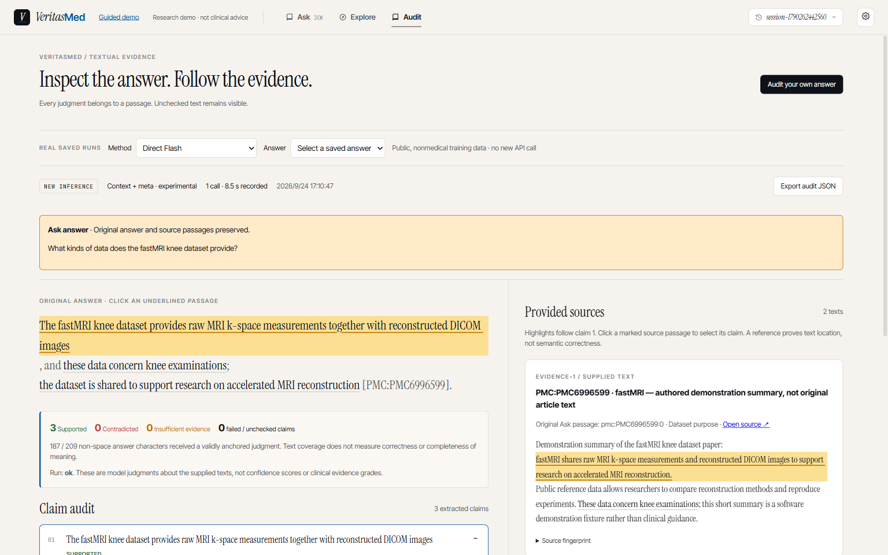
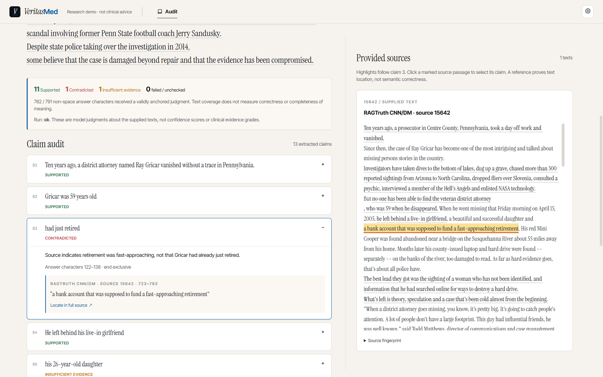
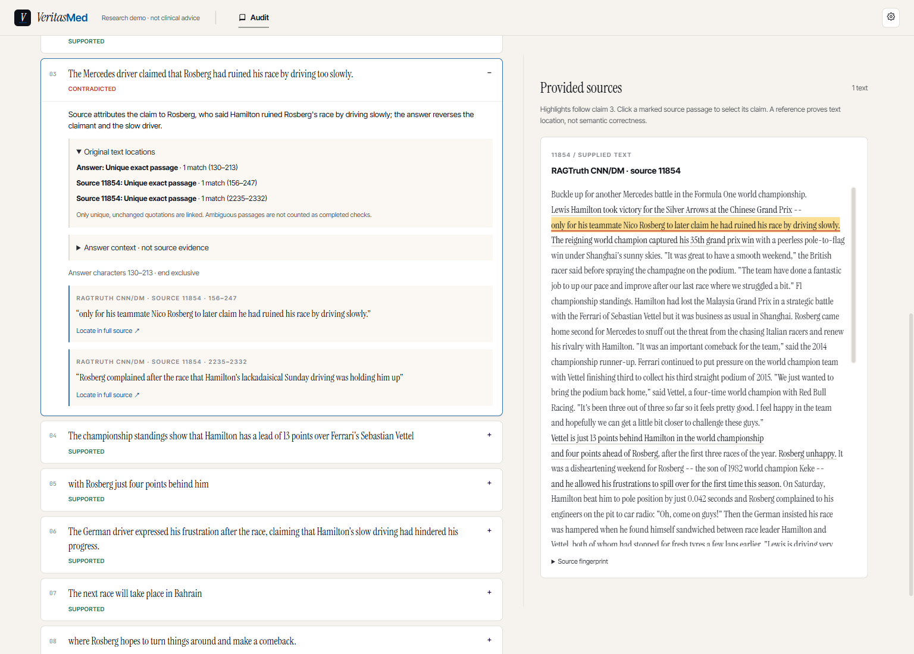
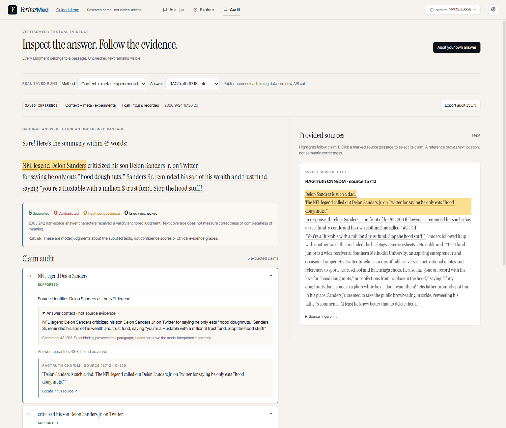

# 真实回答审计面板

当前为 v0.5 开发功能，入口 `/audit`。它接收一份完整回答和 1–40 份来源文本，
逐条展示模型判定、回答原文范围、来源原文范围和未覆盖文本。
只判断提供文本的支持关系，不自动搜索、修复回答或判定临床证据等级。

## 轻量启动

在包含本功能的开发分支运行以下命令；`v0.4.0` 标签不包含它。
需要 Python 3.12、Node.js 22.12+ 和 uv，不需要 Ollama、Qdrant 或 GPU。
已有完整项目环境可以直接使用，省略安装步骤。

```sh
uv venv --python 3.12
uv pip install -r requirements-audit.txt
uv pip install --no-deps -e .
```

激活环境：PowerShell 用 `.\.venv\Scripts\Activate.ps1`，macOS/Linux 用
`source .venv/bin/activate`。随后从仓库根目录运行：

```sh
python scripts/verification/answer_benchmark.py download
python scripts/run_audit_demo.py
```

打开 **http://127.0.0.1:5174/audit**。启动器会在缺少 `frontend/node_modules` 时执行
`npm ci`，然后开启前端与端口 8001 的轻量 API。Ctrl+C 停止两者。两个端口须空闲。
若不能激活 PowerShell 环境，用 `.\.venv\Scripts\python.exe` 替代命令中的 `python`。

下载步骤取得约 37 MB 的固定版 RAGTruth 数据，只放在忽略的 `.benchmark-runtime/ragtruth/`。
面板用这份缓存恢复来源全文；仓库保存的模型判断不是编写的演示答案。
首次下载及依赖安装需网络；此后保存记录回放无需模型密钥、模型请求或 GPU。
缺少缓存、缓存内容变化、记录与输入哈希不符时显示错误，不拼凑来源。

轻量服务只提供审计功能，因此启动器隐藏 Ask/Explore 导航。完整 FastAPI 应用也注册了
相同 `/api/audit` 路由；原本的 Ask、Explore 和 Guided demo 使用原有启动方式。
完整应用的 Ask 回答工具栏新增 **Audit**：将原回答与全部检索片段带入审计输入页，
保留会话、问题、citation → chunk 映射。此按钮只传递文本，之后点击 **Run new audit** 才会调用模型。
超过 40 个片段、单段/总字符上限时明确报错，不静默截断。没有自动修复或替换原回答。
从 Guided demo 传递的内容会显示 **Authored demo input**，不能当成真实 Agent 答案。
轻量启动器不提供 Ask；需要走完整流程时使用原有 `python scripts/run_demo.py`。

2026-09-24 已实际走通 Live Ask → Audit：问题为 “What kinds of data does the fastMRI knee dataset provide?”。
Agent 当次生成的原回答及返回的全部 2 个片段原样进入审计；手动选择 Context + meta 后，
一次 Flash 调用耗时 8.5 秒，输出 3 条 Supported，并导出
[原始 JSON](assets/v05-ask-audit.json)。其中 `handoff` 保留原回答、来源和 citation/chunk 映射，
`input_edited=false`。它使用仓库 `medrag_demo` 的**自拟摘要语料**，不是原始医学论文验证或研究评分。



## 演示流程

1. 在 **Real saved runs** 选择 RAGTruth 回答和 Direct / Extract → verify / Context + meta / Exact quotes v2 方法。
   标记 **SAVED INFERENCE** 的记录是既有真实模型调用，不是即时生成。
2. 点击回答中带下划线的陈述，展开相应 claim；点引文的 **Locate in full source**，
   在完整来源中定位。点击来源里被标记的文字也能选中对应 claim。
3. 查看 **Uncovered answer text**。灰色未绑定字符、无效引文和请求失败不能被算成通过。
4. 展开 **Run provenance & execution** 查看实际调用、耗时、模型响应标识和用量。
5. 点击 **Export audit JSON** 下载输入、原文位置、判断和执行记录。

截图是实际保存的 `RAGTruth #296 / direct` 运行：“已经退休”被判定为与原文
“即将退休”冲突。这个例子用于展示定位功能，不是可靠性证明。



## 审计自己的回答

在本地忽略的 `.env` 中配置与项目 README 相同的 Flash profile：

```dotenv
LLM_BACKEND=openhub
OPENHUB_BASE_URL=https://www.cun.ai/v1
OPENHUB_API_KEY=your-gateway-key
OPENHUB_MODEL=DeepSeek-V4.1-Flash
OPENHUB_REASONING_EFFORT=high
OPENHUB_MAX_TOKENS=32768
LLM_TIMEOUT_SECONDS=240
```

点击 **Audit your own answer**，填入回答、来源标题和原文，再点 **Run new audit**。
每个来源最多 50,000 字符、合计最多 80,000，回答最多 12,000；最多提取 24 条 claim。
达到 claim 上限会显示提示。来源只能判断你粘贴的范围，摘要不能当成全文证据。

Direct 发出一次审计调用。Split 先提取，再对每条陈述发出一次调用，可能耗时数分钟且
花费更多 token；本轮比较没有假定拆分一定更好。请求期间显示等待状态，完成后显示实际结果。
Context + meta 也是一次调用，属实验选项：claim 展开后显示所属回答段落，归因/否定/时态
可结合上下文核对；段落不是支持证据。回答自身的引导语、格式或字数说明列在 **Presentation text**，
不显示为 Supported。模型可能分流错误，因此其原文仍可点击定位，仍计入研究的参考错误分母。
展示的 whitespace-separated tokens 是完整回答按空白切分的机械计数，不冒充自然语言字数或计数要求验收。
Direct 保持默认；新增策略并不意味着可靠性已经提高。

**Exact quotes v2** 让程序计算引用位置及回答段落，不要求模型填写段落编号或出现次数。
展开 claim 的 **Original text locations** 可查看唯一匹配、重复位置不明确、引文不存在或未知来源。
只有唯一且完全一致的原文才会绑定；重复引文保留候选位置，不自动猜测其中一处。
若元文本定位失败，Presentation text 同样显示位置问题。它仍是可选实验方法。

2026-09-24 已在浏览器回放 `RAGTruth #2336 / Exact quotes v2`，点击第 3 条误归因判断、
展开位置、定位来源并完成 [真实 JSON 导出](assets/v05-quote-v2.json)。该记录来自已保存的
新 8 来源开发实验；回放没有新模型请求，不能当临床正确性证明。





截图为本轮 `RAGTruth #718 / Context + meta` 的保存输出；可展开回答段落，并在页面下方
单独查看引导语与字数说明。它展示交互功能，不是临床结论或可靠性证明。
**NEW INFERENCE** 是新模型调用；文本发送至本地配置的网关。服务不落盘保存自有文本，
需要保留时主动导出 JSON。完整错误记录也会返回，不能把失败当作“信息不足”。

2026-09-24 已实际提交一个两句操作示例：来源说明样本数为 20、未报告成功率；回答多写了
95% 成功率。新调用在 11.6 秒返回 1 条 Supported、1 条 Insufficient evidence，
并完成 [JSON 导出](assets/v05-live-audit.json)。输入是自拟功能示例，判断来自实际 Flash 调用，
不属于 RAGTruth 评测或独立质量分数。

轻量服务默认绑定本机，是个人研究工具；此 HTTP 入口未增加身份认证，不属于已有 MCP 安全层。

## 状态含义

| 显示 | 含义 |
|---|---|
| Supported | 模型认为给定来源支持所选陈述；并非专家确认 |
| Contradicted | 模型指出与所选陈述不相容的来源文字 |
| Insufficient evidence | 给定文本不足以支持；不代表全世界没有证据 |
| Unresolved quote | 模型的引文或回答范围不能精确绑定，不计为完成核查 |
| Repeated quote · location unresolved | 精确引句出现多次，展示候选位置但不任选一处，不计为完成核查 |
| Execution failed / Invalid model output | 调用或结构失败，保留原始执行状态 |
| Not checked | 已抽取但未完成核查 |
| Presentation text · not source-checked | 模型判断为回答自身的呈现说明；没有得到文献支持核查，也不代表内容正确 |

字符覆盖计数只反映多少非空白字符被有效定位的判断覆盖，不是语义完整性或正确率。
界面不提供未经校准的置信度百分比，也不自动把来源差异升级成文献冲突。

研究结果与限制见 [整段回答审计报告](verification-v0.5-answer-audit.md)；
运行与重算命令见 [工件说明](../data/verification/ragtruth_v1/README.md)。
本轮改进预先登记在 [语境与元文本计划](plans/v0.5-context-audit.md)，实验命令见
[Context 工件说明](../data/verification/context_v1/README.md)，结论与失败见
[效果报告](verification-v0.5-context-audit.md)。
最新 [具体错误诊断与 quote-v2 报告](verification-v0.5-specific-errors.md)区分位置成功和语义判断，
提供 36 次整段/固定目标调用及全部结果；离线命令见 [quote-v2 工件](../data/verification/quote_v2/README.md)。
