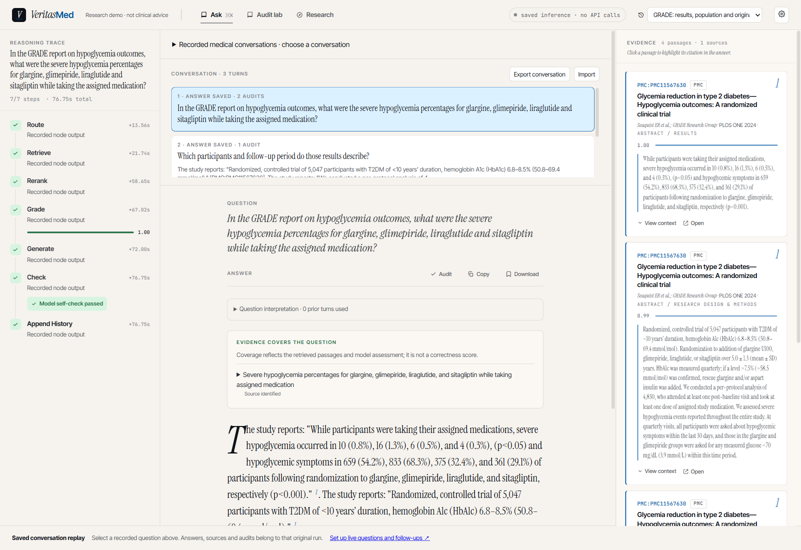
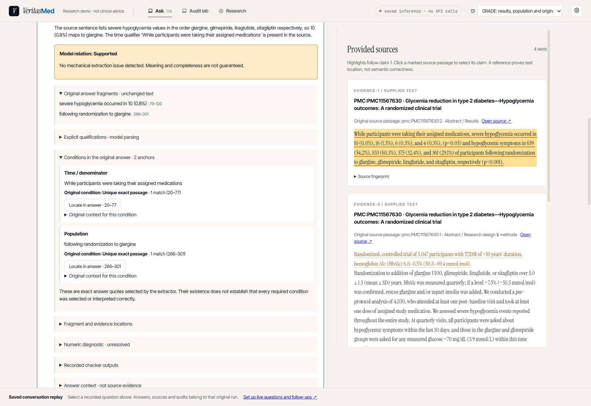
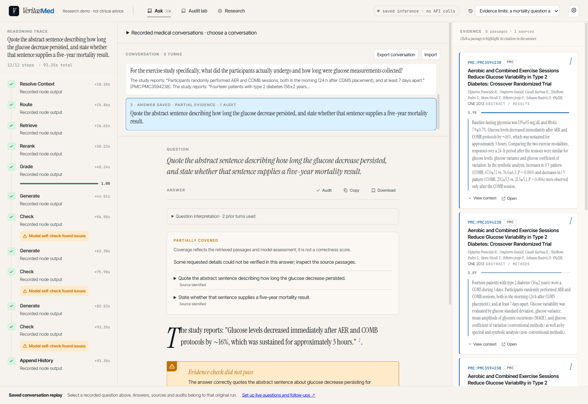

# 文献对话与逐轮审计（v0.8）

[English](en/conversation-guide.md) | **简体中文**

Ask 是主入口。每个问题保留自己的答案版本、完整来源、上下文解释和审计记录。
审计用于审阅所选答案，不取代对话，也不自动把答案改写成核查器认可的结论。

## 无密钥查看真实对话

按 [README](../README.zh-CN.md) 安装轻量依赖后运行：

```sh
python scripts/run_showcase.py
```

打开 `http://127.0.0.1:5173/`，选择 **SAVED INFERENCE** 中的一组对话。三组各三轮，
问题在推理前固定；原始论文、实际输出与未完成判断一并保留。
第二组把“不要排名”误当成待证明的问题，且歧义追问没有触发澄清；第三组最后一轮未完整
回答附加问题。这些边界均如实保留。

1. 点击一轮问题，查看这一轮的完整答案、检索来源和执行过程。
2. 点击 **Audit**，进入该答案的审计面板；**Saved runs** 切换 Direct / Atomic v2 记录。
3. 点击 claim，查看原回答片段、模型解释、来源原句。Atomic v2 还显示限定语原文锚点。
4. **Back to answer** 返回原会话，继续切换轮次。**Export conversation** 导出完整记录。

回放模式不发送新问题或新审计。这里的模型支持判断仍可能出错，保存记录不是医学标准答案。
问题和来源详见[演示说明](../data/demo/conversations/README.md)。



## 新提问与追问

停止回放服务，安装 README 中的完整检索依赖并配置 Flash，然后运行：

```sh
python scripts/run_demo.py --conversations
```

之后可加 `--skip-index` 复用索引。此模式检索三篇论文的 15 段原始摘要；证据库不足以回答任意问题。
旧的单篇 GRADE 模式仍可用 `--medical`。

1. 输入问题。中间区域保留每轮问题和答案预览；选中一轮后查看完整答案、来源与过程。
2. 保持 **Use selected history** 开启即可追问。历史来自当前选中的答案及其上下文。
   选择较早的一轮，会从该轮继续；不会带入后面的回答。
3. 独立问题可关闭历史选项，或点右上角 **+ New** 新建会话。
4. **Re-run** 给同一问题追加答案版本，用 **Answer version** 切换。旧答案及旧审计保留。
5. **Audit** 不发起模型调用；**Run audit** 发起一次新核查，**Saved runs** 切换已有记录。
   修改审计输入后运行会标为 **Edited experiment**，不代表原答案通过。
6. **Export conversation** / **Import** 用于跨浏览器或电脑保存完整会话。

IndexedDB 保存问题、完整来源、答案版本、过程和审计原始记录。刷新后恢复会话与选中答案。
页面关闭前未完成的回答，下次打开标为中止，不冒充已完成。服务端 checkpoint 不是这些记录的
持久存储，仅备份服务端数据库不能恢复浏览器中的对话。

## 上下文到底如何使用

- 最多 **6 个完整历史轮次、12,000 个 Unicode 字符**，计入问题、回答和来源标题。
  从最近的轮次往前选择；遇到超额轮次即停止，界面显示省略数量，不截掉限定语。
- 解析器只解释指代和当前研究范围。原问题逐字保留，解析出的指代说明另行附加；
  旧的人群、比较对象或时间被新问题替换时，不应再次进入检索上下文。
- 解析器被要求对不明确的“它”“那个研究”先澄清；无效格式也进入澄清路径。
  这不是可靠性保证：真实回放的两研究歧义例返回了两者时长，没有触发澄清。
- 每轮使用新 graph 状态重新检索。先前回答不能当作证据，也不会自动沿用上一轮引文。
- **Question interpretation** 展示原问题、实际送入检索流程的问题、历史轮次 ID、省略量、
  解析器原始输出、耗时和供应商返回的用量。解析器用量不是整个 Agent 的总费用。

`?demo=1` 仍是编写好的固定示例，明确标注 **Authored demo**；它可以演示历史和版本操作，
但不能测量真正追问效果，也不会作为 Live 模式的上下文。

## 保存与导入的边界

- 本地保存不跨电脑自动同步；不同端口、浏览器配置和域名有各自存储。清除网站数据会丢失历史，
  有价值的会话请导出。当前请在一个标签页内编辑同一会话。
- 存储不可用或已满时显示告警，不自动淘汰旧记录。当前标签页可继续工作并导出。
- 旧 `vm_threads` 只有 ID，迁移为明确标注的空记录，不凭空补造历史。
- 导出包含格式版本、校验和、答案与来源文字指纹。导入拒绝内容/关联不一致的记录，
  不模糊修补原文。指纹用于发现内容变化，并非作者签名或医学真实性证明。
- 当前单个导入文件上限为 25 MB；超过上限会明确拒绝，不修改原文件。
- 同 ID 的不同会话版本不会静默覆盖。可在另一个浏览器配置导入保留它们；本阶段没有自动合并。
- 审计响应丢失会保存为 `transport_error`：不知道服务器是否完成，不产生核查通过结论。

## 限定语与完成状态

Atomic v2 先定位唯一父句，再在该父句内定位片段；同一句重复出现时保留歧义，不猜位置。
限定语可以来自另一句，但必须逐字对应回答中的原文，且保留其父句。点击 **Locate in answer**
可回到原回答；来源引用另有完整原文定位。

模型解释可能丢掉原始数字、人群、时间或否定。机械规则只检查已声明的锚点和数字，
不能保证模型声明了所有条件。出现问题时仍展示原模型关系，但标为需要查看，不能计作完成核查。
没有机械警报也不等于语义保真；组别与数字出现在同一个 claim 里，也可能对应错了。



下面是没有完整回答死亡率子问题的实际记录。执行完成、找到来源和完整回答问题是三件事，
回放保留模型自检失败和部分覆盖提示。



Direct / Flash 保持默认。旧 Atomic v1、历史失败与各版本报告保留，详见
[v0.8 研究报告](reports/verification-v0.8-report.md)、[定位重放](reports/verification-v0.8-localization.md)及
[来源盘点](reports/verification-v0.8-exposure.md)。12 个上下文场景、构造题集与三组医学回放均不冒充
新的独立临床黄金集。早期 [GRADE 两轮记录](../data/verification/v08/grade-conversation-smoke.json)
作为历史功能开发示例继续保留。
