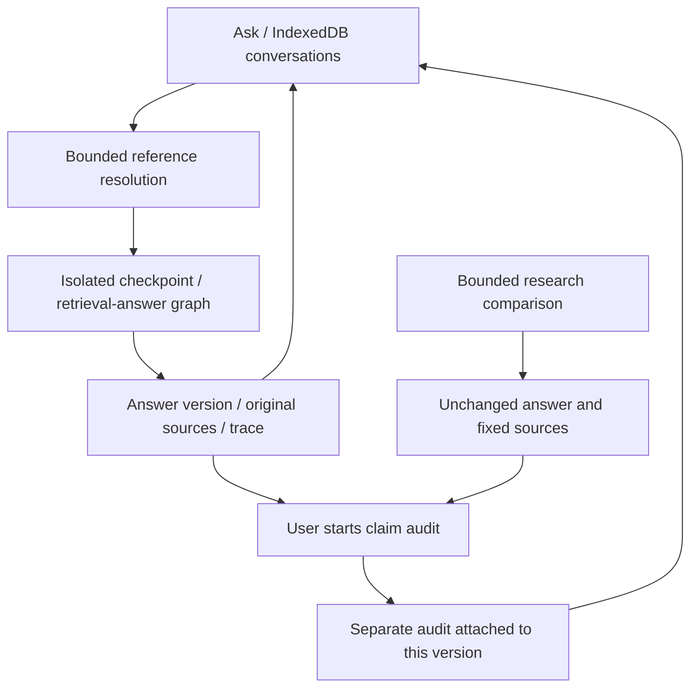

# Current architecture and maintenance boundaries

**English** | [简体中文](../architecture.md)

Applies to the working tree after v0.8 milestone maintenance. Start with [README](../../README.md),
then use this code map. This replaces the early architecture and `code-map.md`; fixed historical
designs are listed in the [archive](../archive/README.md) (original records).
[System diagram and actual operation](showcase.md) explain the product relationships first.
[System and node diagrams](system-guide.md) explain internals and compare current rules with actual records.

## Three product entries

| Entry | Service and code | Actual work |
|---|---|---|
| Ask replay | `run_showcase.py` → `api/replay_app.py` | Reads actual saved conversations/sources; rejects write requests; no model/index startup |
| Live Ask | `run_demo.py --conversations` → `api/app.py` → `routes/ask.py` | Resolve selected history → isolated graph → answer/sources; browser persists conversation |
| Audit lab / Research | `run_audit_demo.py` → `api/audit_app.py` | Independent audit/research replay; new audits after Flash configuration |

The launchers share [service lifecycle](../../scripts/local_services.py), declaring only their
ports, modes and datasets. All default to loopback. Full Ask has ML dependencies; lightweight
services avoid importing retrieval. See [startup configuration](configuration.md).

Audit does not control Live Ask repair. The graph's internal `check` and the opened audit have
different contracts. Research's three arms do not run the full Ask graph. Do not describe all three
as the same Agent evaluation.

### Complete nodes and loop boundaries

The diagram reads node registrations/connections from `graph.py`, covering all 11 registered nodes.
Web invocations use isolated checkpoints; history summaries remain for callers explicitly reusing graph
state. The node map describes current source; execution figures describe historical records, without
reconstructing missing state. [Node internals and the failure case](system-guide.md) explain the details.

## Backend responsibilities

| Repository path | Responsibility / maintenance note |
|---|---|
| `src/medrag/agent/conversation.py` | Reference resolution, six turns / 12,000 Unicode characters; prior answers clarify intent, not evidence |
| `src/medrag/agent/invocation.py` | Web/MCP initial request state; each request still needs a fresh checkpoint ID |
| `src/medrag/agent/graph.py`, `nodes/` | Graph assembly and nodes; see below and [workflow](agent-workflow.md) |
| `src/medrag/agent/evidence/`, `prompts.py` | Component/sentence binding, narrow numeric/role rules and prompts; no proof of complete semantic correctness |
| `src/medrag/agent/llms.py`, `config.py` | Flash/Ollama/legacy MiMo adapters, configuration, Qdrant singleton; historical adapters are not fallback judges |
| `src/medrag/ingest/`, `index/`, `retrieval/` | PubMed/PMC, chunking, BGE-M3 dense/sparse, RRF and reranking; HyDE/multi-query retained for historical CLI comparisons |
| `src/medrag/verification/` | Fixed-evidence verification, Direct/Split/Context/Quote/Atomic, binding, MiniCheck and scoring |
| `src/medrag/agent/research_workflow.py` | Three-arm tools over eight fixed abstracts, separate from full retrieval |
| `src/medrag/api/routes/` | Ask WS, search/text, independent audit, research/conversation replay; legacy `/history` deprecated |
| `src/medrag/mcp_server/` | Local stdio tools; token, limits and logs apply only here; [MCP boundaries](mcp_security.md) |
| `src/medrag/benchmark/`, `eval/` | v0.1–v0.4 benchmarks, scoring and report recomputation; not truth for the newer auditor |

Additive history/summarize nodes remain for programmatic compatibility. Public web/MCP requests
use isolated checkpoints; browser multi-turn context comes from explicit snapshots.
`/api/history/{thread_id}` reads internal checkpoints, not browser history or refresh recovery.

### Ask node and binding boundaries

The old `nodes.py` / `evidence.py` became packages with compatible public imports
`medrag.agent.nodes` / `medrag.agent.evidence`. The graph invokes public nodes; tests replace
model dependencies in their owning modules rather than forwarding mutable globals through the
package entry. No new runtime dispatcher was added.

| Module | Responsibility |
|---|---|
| `nodes/planning.py` | Original question, retrieval plan and rewrites; three unused production heuristics removed |
| `nodes/retrieval.py` | Lazy retrieval/rerank resources, source identity and budget; Windows native-library load order retained |
| `nodes/grading.py` | Build answer components and gaps from supplied sources |
| `nodes/generation.py` | Generate, bind, targeted additions and return answer |
| `nodes/checking.py` | Check generation and select components for repair |
| `nodes/common.py`, `constants.py`, `memory.py` | Request/JSON/prompt formatting, budgets and programmatic history; no mixed business rules |
| `evidence/models.py` | Pydantic objects, text normalization and sentence splitting |
| `evidence/binding.py` | Component/claim sentence binding and status aggregation |
| `evidence/scope.py` | Narrow population-role/protocol-time protections and gap wording |
| `evidence/restoration.py` | Restore omitted numbers, methods and result context from sentences |

The move preserves execution logic in 46 functions/classes and corrects old thinking-switch
documentation. Cleanup does not revalidate the medical rules. New benchmark snapshots collect
all package Python files; historical `runtime_code/` stays unchanged.

## Frontend data flow

| Path under `frontend/src/` | Responsibility |
|---|---|
| `conversation/model.ts` | Conversation → Turn → Revision → AuditRun; context selection, fingerprints and import/export |
| `conversation/storage.ts`, `store/index.ts` | IndexedDB, selection, version-scoped responses and save queue; single-tab editing |
| `hooks/useAgentStream.ts`, `api/streamConnection.js` | WS lifecycle, stop and late-response isolation |
| `pages/AnswerPage.tsx` | Main conversation workspace; audit inside selected answer |
| `pages/AuditPage.tsx` | Audit input, execution, replay and selection |
| `components/audit/` | Presentation: state/highlights; ClaimList: details; SourceList: navigation |
| `pages/ResearchPage.tsx` | Independent bounded results, traces and answer transfer |
| `components/AnswerPanel.tsx`, `components/answer/` | Composition/actions; AnswerText, AnswerEvidence and Suggestions own separate displays |
| `components/EvidencePanel.tsx` | Retrieved source and quote navigation |
| `types/api.gen.ts`, `types/ws.ts` | Generated REST types and manual WS mirror; update together with contracts |

Do not hand-edit `openapi.json` / `api.gen.ts`. Run `scripts/export_openapi.py`, then
`npm --prefix frontend run generate-types`. Fingerprints verify consistency, not authorship or medical truth.

## Compatibility and research debt

**Consolidated:** shared launcher management, Web/MCP initial state, cohesive backend node/binding
and frontend answer/claim components, configuration, classified reports and worklogs.
`data/benchmark/**/runtime_code/` is historical experimental evidence, not a second runtime.
Different Direct / Atomic v1/v2 prompts/contracts are comparison subjects; merging them must not
retain scores as though the experimental implementation were unchanged.

**Retained costs:** legacy MiMo/Ollama/conda/Docker/numbered scripts still have historical callers.
Internal check and independent Audit have distinct contracts. Narrow scope/restoration rules have
semantic limits; modularization cannot establish reliability. Replacements require new evidence.
Multi-tab editing, accounts and public deployment are outside this local showcase.
Next: omitted requirements and clarification in the [v0.9 plan](plans/v0.9-question-coverage.md).

The R2 [freeze](../../data/verification/v08/r2/method-freeze.json) contains 11 inference/scoring files,
unchanged by this maintenance. Behavioral changes require new candidates/records; historical reports
retain their contracts. See the [script map](script-catalogue.md) and [data catalogue](data-catalogue.md).
