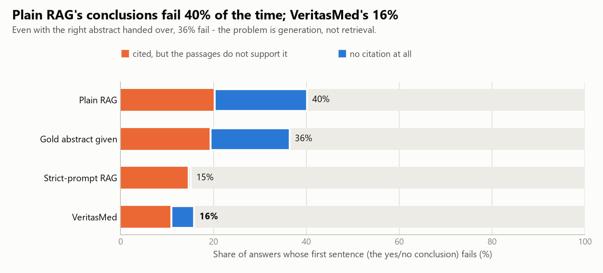
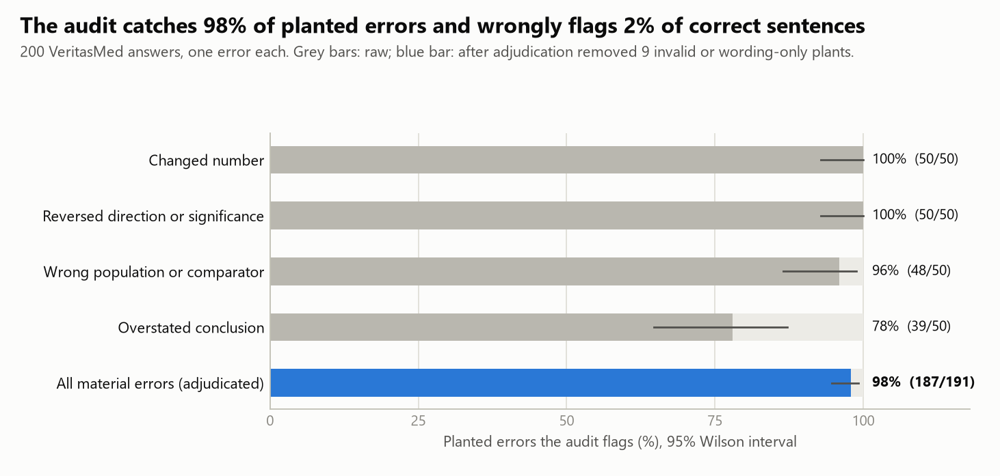
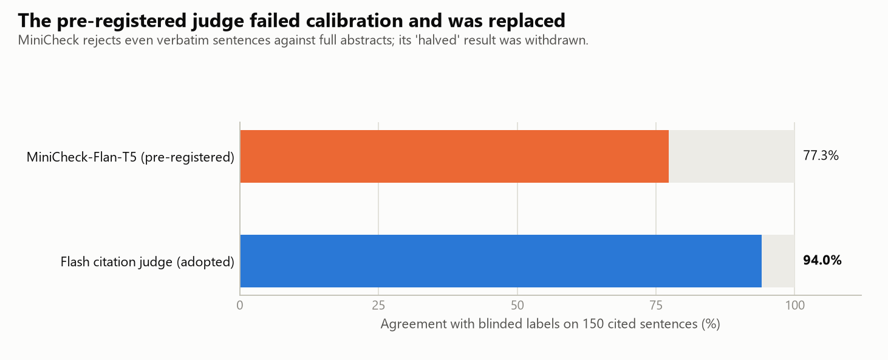
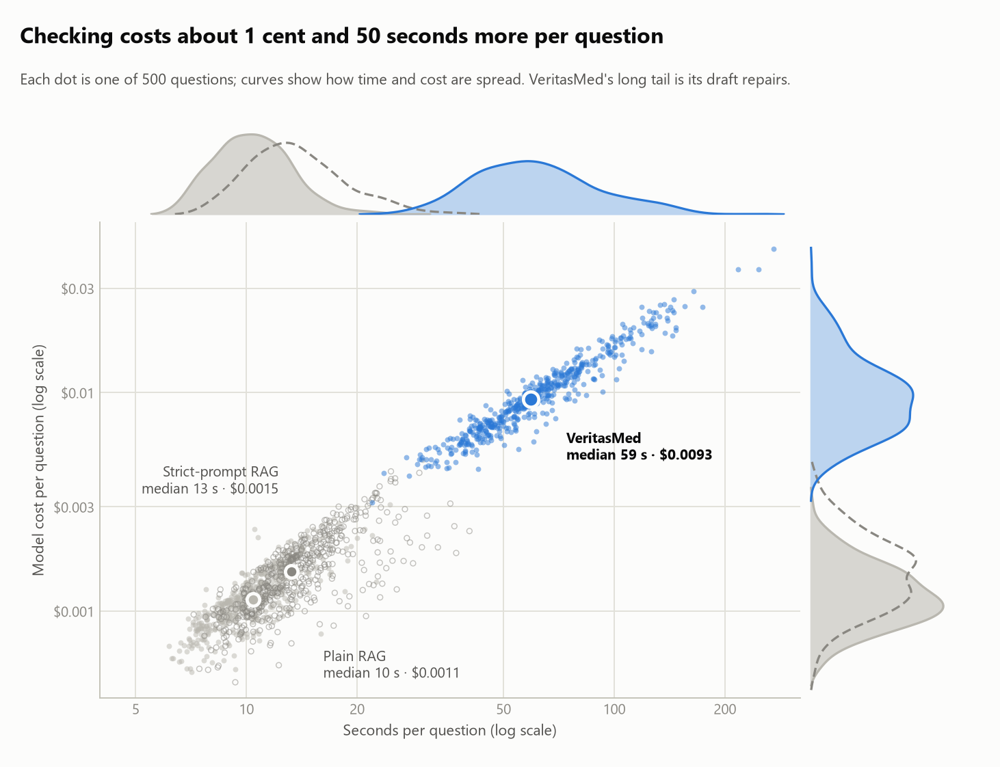

# 实验 A：PubMedQA 上的"结论是否有据"

[English](experiment-a.md) | **简体中文**

VeritasMed 回答生物医学研究问题，是否比普通的检索增强（RAG）模型更好？好在哪里，值不值这个代价？本页完整报告这次实验：设计、全部结果（包括对系统不利的结果）、一项被撤回的结论，以及复现方法。每个回答、判定和审计的原始输出都在 [`experiments/pubmedqa/runs/`](../experiments/pubmedqa/runs/)。

## 结论摘要

1. **差别在结论，不在事实。** 普通 RAG 复述研究发现的能力和 VeritasMed 相当，但它的第一句话（yes/no 结论）有 **40%** 没有引用、或不被所引原文支持；VeritasMed 是 **16%**（配对差 −21.3 个百分点，95% CI [−26.6, −16.1]）。直接把正确摘要交给模型也只降到 36%，所以问题出在生成，不在检索。
2. **只靠更严格的提示词，结论有据的代价是不再下结论。** 要求"每句引用、不得夸大"的单次调用 RAG，在结论依据性上追平了 VeritasMed，但准确率从 63.8% 跌到 **51.0%**，与闭卷持平。VeritasMed 准确率不变（63.6%），同时结论有据。在测试过的方法里，只有它两者兼得。
3. **审计确实能抓错。** 在 200 个各植入一处错误的回答上，审计检出 **97.9%** 的实质性错误（95% CI [95, 99]），误标正确句子 **2.0%**（[1, 5]）。在普通 RAG 的真实回答上，它能抓到通用大模型裁判放过的"说过头"，例如把"差异不显著"写成"没有区别"。
4. **准确率不是 VeritasMed 的优势。** 它与普通 RAG 持平（63.6% 对 63.8%）。PubMedQA 的标签来自作者的结论，而系统看不到这部分；标签奖励大胆推断，而让结论有据往往意味着回答"maybe"。
5. **代价是真实的：每题多花约 1 美分、多约 50 秒**（平均 4.7 次模型调用，中位 59 秒；普通 RAG 为 1 次、10 秒）。

此前有一项结论已撤回：自动核查模型 MiniCheck 显示"无依据句子减半"，盲标校准证明它对完整摘要判断失准，该结论由上面的数字取代（见[第 5 节](#5-测量预注册的裁判没有通过校准)）。

## 1. 实验设置

**数据。** [PubMedQA](https://github.com/pubmedqa/pubmedqa)（Jin 等，2019，MIT 许可）官方专家标注测试集的全部 500 题（yes 276、no 169、maybe 55）。每道题是把论文标题改写成的问句，标签是作者的结论。检索语料包含全部 1,000 篇有标注摘要，外加 10,000 篇无标注摘要作干扰（共 36,550 段）。摘要的结论部分从不入库。

**方法。** 所有方法使用同一个模型（DeepSeek-V4.1-Flash，同一网关）、同一语料和同一混合检索器（BGE-M3 稠密 + 稀疏，重排，补全排名第一的论文的整篇摘要）。

| 组 | 方法 | 调用次数 |
|---|---|---|
| A0 | 闭卷：模型凭自身知识回答 | 1 |
| A1 | **普通 RAG**：取前 5 段，一次生成带引用的回答 | 1 |
| A2 | **VeritasMed**：完整 Agent（评估证据、把问题的每个部分绑定到原文句子、用平实语言生成、自查、修复） | 4.7 |
| A3 | VeritasMed，但关键事实逐字粘贴原文（v0.8 的做法） | 4.4 |
| A4 | 金标准摘要：直接给出该题对应的摘要（检索的上限） | 1 |
| A5 | **强提示词 RAG**（追加实验 E1）：在 A1 基础上要求每句引用、不得夸大 | 1 |

**指标。**

- *准确率*：用同一个判定提示把回答映射为 yes/no/maybe，再与专家标签比较。
- *无依据句子*：没有引用，或所引段落不支持的句子，由 Flash 引用裁判判定（经校准选定，见[第 5 节](#5-测量预注册的裁判没有通过校准)）。
- *结论句*：回答的第一句。每组都被要求以一句 yes/no/证据不足的结论开头。只陈述"证据缺少什么"的句子不计入。
- *统计*：组间差异用按题配对的 bootstrap（10,000 次重抽样），比例用 Wilson 区间。

**流程。** 数据划分和随机种子在任何模型输出产生之前就已固定。提示词在 50 道开发题上修改过一次后冻结；测试集每组只跑一次（失败的调用重试，所有尝试都保留）。追加实验 E1、E2 在运行前已[预注册](../experiments/pubmedqa/PREREGISTRATION-followup.md)并提交。

## 2. 普通 RAG 的结论常常超出证据，VeritasMed 不会

<picture>
  <source media="(prefers-color-scheme: dark)" srcset="assets/experiment-a/bottom-lines-dark.png">
  
</picture>

| 结论句 | 普通 RAG | 金标准摘要 | 强提示词 RAG | VeritasMed |
|---|---|---|---|---|
| 有引用，但所引段落不支持 | 20.3% | 19.4% | 14.7% | 10.9% |
| 完全没有引用 | 19.8% | 17.0% | 0.4% | 4.9% |
| **不合格（两者之一）** | **40.1%** | **36.3%** | **15.1%** | **15.8%** |

回答的其余部分差别小得多：结论句之后带引用的句子，Flash 判为无依据的，普通 RAG 是 9.5%，VeritasMed 是 11.4%，两者复述事实都不错。差距集中在读者最可能据以行动的那一句话上。

这些数字**不能**被解读为：

- **未引用的结论就是错的。** 审计 100 个普通 RAG 回答时（[第 4 节](#4-审计能抓到植入错误和自然错误)），大多数未引用的结论内容其实是对的。它们在这里算作不合格，是因为读者无法核对，而这正是本项目关心的性质。因此两类问题分开报告。
- **Flash 裁判已经足够严格。** 它对一种"说过头"偏宽松：某研究的结果是"没有证据表明存在差异"（CI −4.0 到 0.9 dBA），回答写成"HFNC 不比 CPAP 吵"，Flash 判为有依据。VeritasMed 在这道题上犯了同样的错，强提示词版写的是"未显示更吵"。所以各组真实的结论错误率都会更高一些，这正是审计要兜底的部分。

## 3. 只靠更严格的提示词不够

<picture>
  <source media="(prefers-color-scheme: dark)" srcset="assets/experiment-a/tradeoff-dark.png">
  
</picture>

| | 准确率 | Macro-F1 | 回答 maybe | 下结论时的准确率 | 结论有据 | 无依据句子 | 每题成本 | 中位耗时 |
|---|---|---|---|---|---|---|---|---|
| 闭卷 | 52.2% | 0.431 | 93 | 61.2% | - | - | $0.0014 | 7 秒 |
| 普通 RAG | 63.8% | 0.580 | 160 | 85.9% | 59.9% | 21.8% | $0.0012 | 10 秒 |
| 金标准摘要 | 65.6% | 0.601 | 162 | 88.2% | 63.7% | 19.6% | $0.0009 | 7 秒 |
| 强提示词 RAG | 51.0% | 0.465 | 196 | 76.6% | 84.9% | 8.9% | $0.0016 | 13 秒 |
| **VeritasMed** | **63.6%** | 0.565 | 137 | 81.3% | **84.2%** | 14.5% | $0.0105 | 59 秒 |

配对差异（95% CI）：

- VeritasMed 对比普通 RAG：准确率 −0.2 [−4.0, +3.6]；结论不合格 −21.3 [−26.6, −16.1]；无依据句子 −7.3 [−9.6, −4.9]。
- 强提示词 RAG 对比 VeritasMed：结论不合格 −2.4 [−6.7, +2.1]；准确率 −12.6 [−16.6, −8.4]；无依据句子 −5.6 [−7.6, −3.6]。

E1 预注册时只定了一条规则：如果强提示词 RAG 的结论不合格率与 VeritasMed 相差不超过 5 个百分点，就认为多步生成没有必要。它确实落在容差内。但这条规则没有设准确率的护栏：强提示词版是靠对 500 题中的 196 题回答"maybe"、牺牲 12.6 个百分点的准确率达到的。我们如实报告规则的结果，但不照此执行：靠不下结论来让结论有据，等于没有完成任务。

强提示词版在一项指标上优于 VeritasMed：总体无依据句子更少（8.9% 对 14.5%）。VeritasMed 的回答更长（平均 4.3 句对 3.2 句），会补充研究设计方面的细节，其中一部分原文并没有写，这些正是审计在[植入错误复核](#植入错误)中标出的内容。

## 4. 审计能抓到植入错误和自然错误

<picture>
  <source media="(prefers-color-scheme: dark)" srcset="assets/experiment-a/audit-dark.png">
  
</picture>

### 植入错误

200 个 VeritasMed 回答，每类错误 50 个。每个回答中选一句 MiniCheck 判为有依据的带引用句子，由模型改写出一处错误；改写前后各审计一次。

| 错误类型 | 植入后被标出 | 同一句未改时被标出 |
|---|---|---|
| 改数字 | 50/50 | 4/50 |
| 反转方向或显著性 | 50/50 | 7/50 |
| 换人群或对照组 | 48/50 | 3/50 |
| 夸大结论 | 39/50 | 6/50 |

随后，对未改句子上的每一处标记和每一处漏检，都对照摘要逐条复核（[标签与理由](../experiments/pubmedqa/runs/planted/adjudication.json)）：

- 未改句子上的 20 处标记中，16 处是审计判对了：其中 13 处是原句写了段落里没有的内容（多为 VeritasMed 自己补充的研究设计说明），3 处是把"不显著"写成了"没有影响"。另有 2 处判错，1 处源于原文字符损坏，1 处有争议：**不当标记 4/200 = 2.0% [1, 5]**。
- 13 处漏检中，4 处植入改写后其实仍然正确，5 处只改变了措辞强度（如"显示"改成"证明"）。**实质性错误检出 187/191 = 97.9% [95, 99]。**

### 自然错误（追加实验 E2）

对 100 个普通 RAG 回答运行审计，并与 Flash 引用裁判比较：

| | 裁判认为无依据 | 裁判认为有依据 |
|---|---|---|
| 审计标出（带引用的句子） | 26/37 = 70% | 20/253 = 8% |

结论句上的 27 处分歧全部对照摘要复核（[标签](../experiments/pubmedqa/runs/audit-natural/adjudication.json)）。19 处"漏检"中，14 处是内容正确、只是缺少引用的句子（审计检查的是内容而不是格式），4 处是裁判判错，1 处有争议。8 处"多标"中，6 处审计正确（"不显著"被写成"没有区别"、原文没有给出的细节），2 处过严。在结论句上，审计是两个核查器中更严格、也更常判对的那个。

局限：复核人是搭建这套实验的 AI 助手，不是不知情的临床专家；由模型写出的植入错误比真实世界的错误更"干净"。

## 5. 测量：预注册的裁判没有通过校准

<picture>
  <source media="(prefers-color-scheme: dark)" srcset="assets/experiment-a/judges-dark.png">
  
</picture>

原计划用本地事实核查模型 MiniCheck-Flan-T5-Large 作为引用裁判。按它的判定，VeritasMed 的无依据句子"减半"（44.5% 降到 21.5%）。预先安排的第二裁判 Flash 与 MiniCheck 在 998 个句子上只有 73% 一致（Cohen's kappa 0.19），而且给出的差距小得多。

为了判断谁对，我们从三组中各抽 50 个带引用的句子，共 150 句，在看不到组别和两个裁判结论的条件下逐句标注（[题目](../experiments/pubmedqa/runs/agreement/calibration-items.jsonl)、[标签与标准](../experiments/pubmedqa/runs/agreement/calibration-labels.json)）。Flash 与标签的一致率为 94.0%，MiniCheck 为 77.3%。一旦文档是约 230 词的完整摘要，MiniCheck 连逐字照抄原文的句子都会判为无依据（同一句放在两句话的短文档里则能判对）。这使它惩罚改写，从而偏向了 VeritasMed 更贴近原文的措辞。此后 Flash 改为主裁判，MiniCheck 的结果作为被否决的指标保留在文件中，"减半"的结论撤回。

## 6. 其他发现

**逐字粘贴原文（A3）分数最好，回答最差。** v0.8 的做法准确率达到 67.6%（比 VeritasMed 高 4.0 [+0.8, +7.2]），无依据句子仅 3.4%。两者都是假象：它有 60% 的句子几乎照抄原文，引用裁判必然判为有依据；它的准确率优势几乎全部来自更少回答"maybe"（只有 A3 答对的 43 题中，有 33 题 VeritasMed 答的是"maybe"）。它的回答长这样：

> The study reports: "There was no evidence of a difference in average noise levels…"
> The study reports: "At low frequency (500 Hz), HFNC was mean 3.0 dBA quieter…" …

这是一串引文，不是回答。VeritasMed 保留平实语言的回答，而把绑定的原文句子作为证据附在每条主张旁边。这个结果印证了这一设计。

**PubMedQA 的准确率衡量的是敢不敢下结论。** 各检索方法下结论时，有 77%–88% 是对的；准确率的差别主要来自回答"maybe"的次数。即使给出金标准摘要，准确率也只有 65.6%，因为标签是作者的结论，它超出了摘要里报告的结果。

**这里的瓶颈不是检索。** 各检索组在 98% 的题目中都找到了正确摘要。

## 7. 局限

- PubMedQA 是单篇论文、检索几乎必然成功的 yes/no 题，无法检验跨研究的证据综合、证据缺失或适用范围错误，而这些正是 VeritasMed 的设计目标。要检验这些，需要另一个评测集。
- 结论句指标是在主实验的探索性分析中发现的。追加实验 E1 预注册时将其列为主指标，用的是新产生的输出，但仍是同样的 500 道题。
- 依据性由模型判定（Flash，在 150 个标注句子上一致率 94%）。所有标注和复核都由搭建实验的 AI 助手完成，不是临床医生。
- 全程只用一个模型。Flash 同时也生成 VeritasMed 的回答；在校准集上，它对 VeritasMed 的判定比标签更严而不是更松，但不能完全排除自我偏好。
- 强提示词是看过主实验结果后写的，这对它有利；而 VeritasMed 相对普通 RAG 的结论优势并不依赖这一对照。

## 8. 成本与复现

整个实验（含开发轮、追加实验和两个裁判）的模型费用合计 **$25.18**（按网关标价）。VeritasMed 回答 500 题的费用为 $5.47。

<picture>
  <source media="(prefers-color-scheme: dark)" srcset="assets/experiment-a/cost-dark.png">
  
</picture>

每道题 VeritasMed 调用模型的中位数为 4 次（4 到 11 次），普通 RAG 调用 1 次（中位数 59 秒、$0.0093，对 10 秒、$0.0011）。VeritasMed 的分布更宽：80% 的题在 39 到 105 秒之间，最慢的一题 271 秒。长尾来自草稿重写：被重写的 96 个回答，中位耗时为 92 秒（重写一次，88 个）或 144 秒（重写两次，8 个），而一次通过的 404 个回答为 55 秒。

```sh
python experiments/pubmedqa/prepare.py                  # 下载数据、冻结划分、构建语料
python experiments/pubmedqa/index.py                    # 索引 36,550 段（GPU，约 5 分钟）
python experiments/pubmedqa/run.py answer --split test_full --arms A0,A1,A2,A4,A5
python experiments/pubmedqa/run.py judge  --split test_full --arms A0,A1,A2,A4,A5
python experiments/pubmedqa/score.py --split test_full   # 切句（及 MiniCheck，留作记录）
python experiments/pubmedqa/agreement.py --n 500 --arms A1,A2,A4,A5   # Flash 引用裁判
python experiments/pubmedqa/planted.py --n 200          # 植入错误审计
python experiments/pubmedqa/audit_natural.py            # E2
python experiments/pubmedqa/report.py --run main --split test_full
python experiments/pubmedqa/figures.py
```

A3 使用同一套脚本，针对逐字版本（[`a3-verbatim.patch`](../experiments/pubmedqa/a3-verbatim.patch)）运行，`MEDRAG_SRC` 指向该版本的源码目录。每次运行按题写一行 JSON，中断后可从断点继续；费用按实际上报的 token 用量计价，并按 API key 设上限。

原始设计方案按原样保留在 [`docs/plans/experiment-a.zh-CN.md`](plans/experiment-a.zh-CN.md)。
