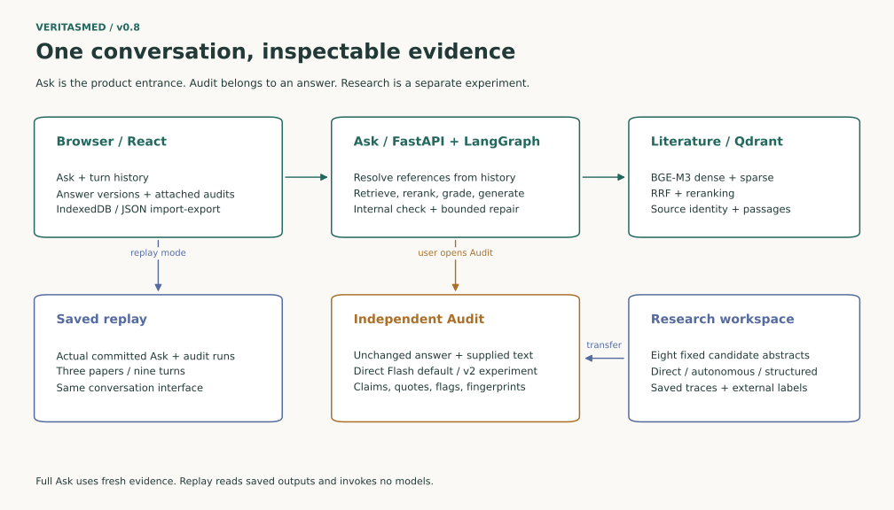
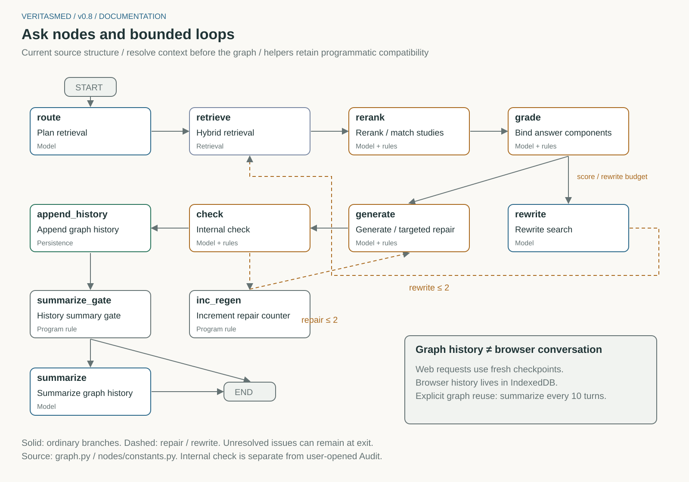
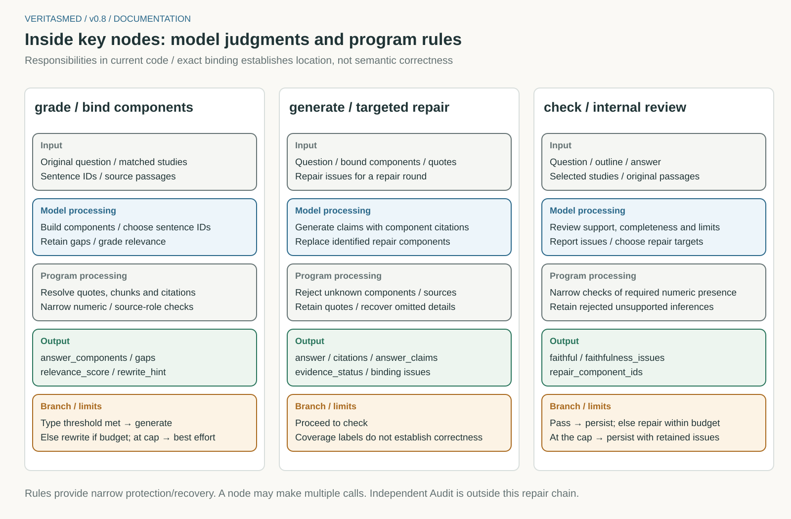
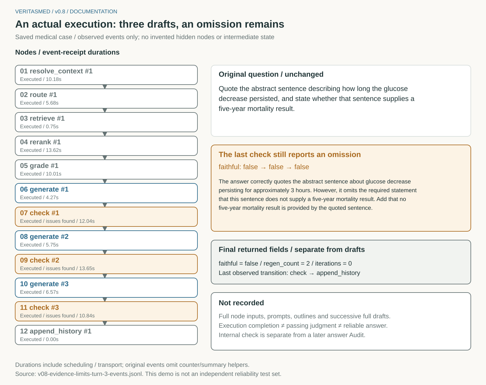
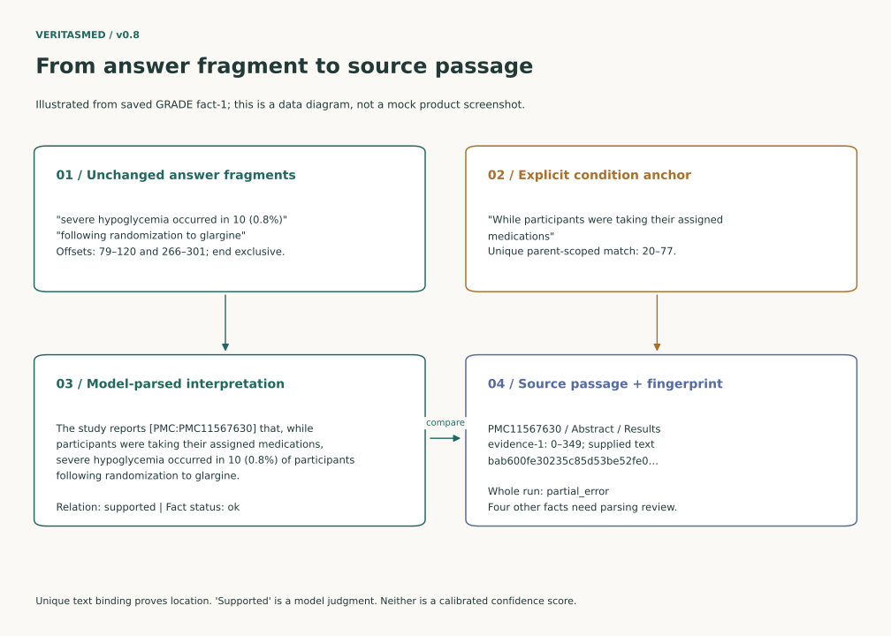

# How VeritasMed works

**English** | [简体中文](how-it-works.zh-CN.md)

## Components

| Part | Responsibility |
|---|---|
| Browser (React) | Conversations, answer versions and audits in IndexedDB; export/import as one JSON file |
| Ask API (FastAPI + LangGraph) | Resolve follow-ups, retrieve, plan, generate, self-check; streams each step over WebSocket |
| Retrieval (Qdrant) | BGE-M3 dense + sparse vectors, reciprocal rank fusion, BGE cross-encoder reranking |
| Audit API | Checks one answer revision against the passages it used; never edits the answer |
| Replay API | Serves the recorded conversations read-only; rejects every request that would call a model |

## The Ask graph

The figure is generated from [`graph.py`](../src/medrag/agent/graph.py) by
`scripts/render_system_docs.py`. Every request starts from a fresh graph state.

| Step | What happens | Code |
|---|---|---|
| route | Classify the question; propose up to three focused search questions; decide single- vs multi-study scope | [planning.py](../src/medrag/agent/nodes/planning.py) |
| retrieve | Hybrid search for the original question, the latest rewrite and the planned searches (≤4 queries × 12 candidates) | [retrieval.py](../src/medrag/agent/nodes/retrieval.py) |
| rerank | Rerank per query, let the model match the paper the question names, keep the best 5 passages | [retrieval.py](../src/medrag/agent/nodes/retrieval.py) |
| grade | Split the question into components and bind each to sentence IDs; code resolves IDs to exact quotes | [grading.py](../src/medrag/agent/nodes/grading.py) |
| rewrite | If the evidence score is below the threshold (0.6 / 0.75 / 0.8 by question type), rewrite and retrieve again (≤2 times) | [planning.py](../src/medrag/agent/nodes/planning.py) |
| generate | Write cited claims per component; key numbers and methods are shown as verbatim source sentences | [generation.py](../src/medrag/agent/nodes/generation.py) |
| check | Review support, completeness and evidence boundaries per component; request targeted repairs (≤2 times) | [checking.py](../src/medrag/agent/nodes/checking.py) |

The model makes judgments: which study, which sentences, whether a claim is supported. Code
enforces the rules: a quotation must exist in the retrieved text, a claim may only cite its
component's paper, a missing result stays a visible gap, and required numbers are restored from
the source. A narrow set of rules in [`agent/evidence/`](../src/medrag/agent/evidence/) guards
cohort roles (development, test, validation) and unreported measurement timing. These rules catch
specific failures; they do not prove that an answer is correct.

### A real run where repair did not succeed

This recorded follow-up asked for a quoted sentence and whether that sentence reported five-year
mortality. The check flagged the missing second part three times. The cause turned out to be
deterministic: both parts were bound to the same sentence, and the duplicate quotation was
removed together with the second answer. This was fixed in v0.9 (see the
[research summary](research.md#5-what-the-iterations-were-for)).

## Follow-up questions

- Context is the selected earlier turn and its own context: at most **6 whole turns /
  12,000 characters**. Turns are never cut in half; the number left out is shown.
- A resolver call explains references such as "it" or "those results". The user's question is
  sent unchanged, followed by a separately labelled note naming the referent.
- If the reference is ambiguous or the resolver's output is invalid, the reply is a clarification
  question and no retrieval runs.
- Earlier answers are never evidence. Each turn retrieves its own sources.

Code: [`agent/conversation.py`](../src/medrag/agent/conversation.py),
[`frontend/src/conversation/model.ts`](../frontend/src/conversation/model.ts).

## Auditing an answer

**Audit** opens inside the selected answer. **Run audit** sends the unchanged answer and every
retrieved passage to the checker. Each run is attached to that exact answer version, identified
by SHA-256 fingerprints of the answer and sources.

| Method | Calls | What it returns |
|---|---|---|
| Direct (default) | 1 | Up to 24 claims, each with an exact answer quote, a relation and exact source quotes |
| Atomic v2 (experimental) | ≤3 | Up to 48 parsed facts with condition anchors (population, comparison, time, negation …), batch-verified |

| Status | Meaning |
|---|---|
| Supported / Contradicted / Insufficient evidence | The checker's judgment about the supplied text only |
| Unresolved quote / Repeated quote | A quotation could not be located uniquely; not counted as checked |
| Needs review | Atomic v2 parsing is compound, duplicated or missing an exact condition |
| Not checked / Execution failed | No judgment was made |

Quotes are bound only when the exact text occurs once; the code never picks the first of
several matches. Text that no completed judgment covers is listed separately. Code:
[`verification/`](../src/medrag/verification/).

## Storage and export

Conversations, answer versions, sources, traces and audits live in browser IndexedDB. Reloading
restores them. **Export conversation** writes one JSON file with a checksum and per-answer
fingerprints. **Import** rejects any file whose quotes, positions or fingerprints do not match.
Only one tab should edit a conversation at a time.

## Running modes and configuration

| Command | Frontend / API | Needs |
|---|---|---|
| `python scripts/run_showcase.py` | 5173 / 8000 | Light install only; replay, no model calls |
| `python scripts/run_demo.py` | 5173 / 8000 | Full install, `.env`; indexes the three papers into `.demo-runtime/` on first start |

Settings are in [`.env.example`](../.env.example). `LLM_BACKEND=openhub` (default) calls any
OpenAI-compatible endpoint with reasoning enabled; `LLM_BACKEND=ollama` uses a local model for
answers. Both graph roles use the same model, and there is no automatic fallback to another model.
The whole request has a 300-second limit. A model call that is already running may finish
after **Stop** is pressed.

## API

| Endpoint | Purpose |
|---|---|
| `WS /api/ask` | Ask a question; streams node events, then the final answer with components and sources |
| `POST /api/audit` | Audit an answer against supplied sources (`direct` or `atomic_v2`) |
| `GET /api/chunk/{id}`, `GET /api/document/{citation}` | Original passages and neighbouring context |
| `GET /api/conversations/examples[/{id}]` | Recorded conversations |
| `GET /api/health`, `GET /api/corpus/stats` | Readiness |

`openapi.json` and `frontend/src/types/api.gen.ts` are generated: run
`python scripts/export_openapi.py`, then `npm --prefix frontend run generate-types`.

## MCP tools

[`mcp_server/server.py`](../src/medrag/mcp_server/server.py) exposes `search_literature`,
`ask_agent` and `evaluate_query` over local stdio, for example to Claude Desktop:
`fastmcp dev inspector src/medrag/mcp_server/server.py --with-editable .`. When
`MEDRAG_LOCAL_TOKEN` is set, every call must pass it. Calls are rate-limited per process, queries
pass through regex PII redaction and prompt-injection screening, and a JSONL log stores hashed
queries. These controls apply only to MCP, not to the web API, and are not a compliance guarantee.
