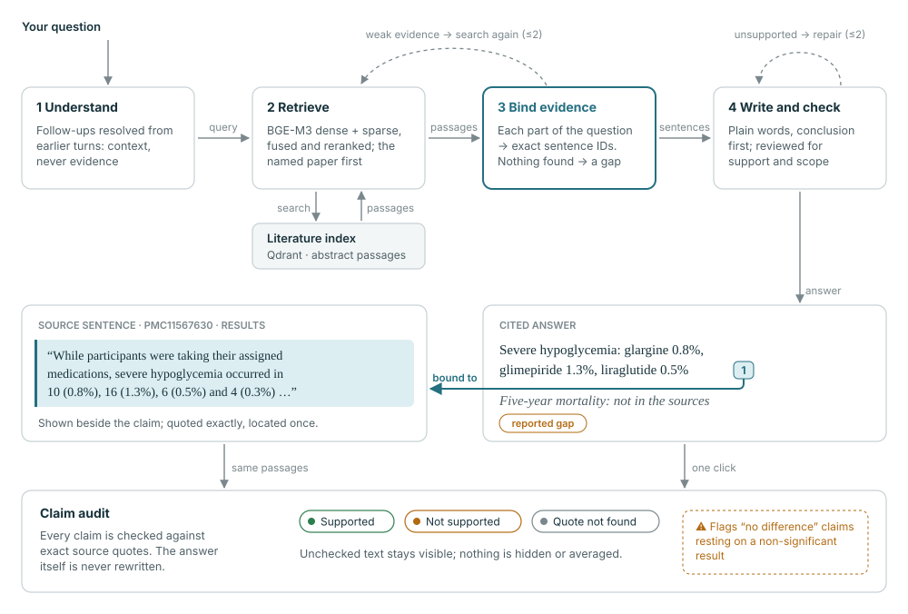
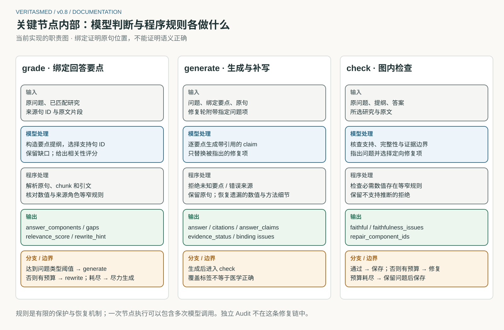
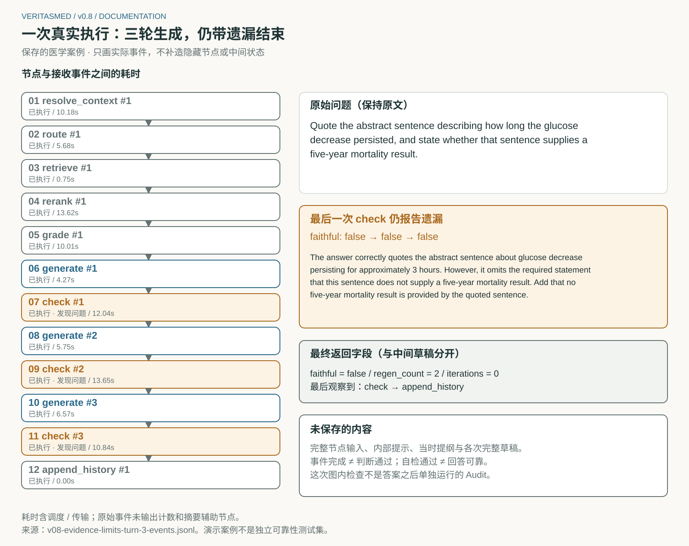

# VeritasMed 工作原理

[English](how-it-works.md) | **简体中文**

## 组成部分

<picture>
  <source media="(prefers-color-scheme: dark)" srcset="assets/showcase/flow-dark.svg">
  
</picture>

| 部分 | 职责 |
|---|---|
| 浏览器（React） | 对话、答案版本与审计存于 IndexedDB；可作为一个 JSON 文件导出、导入 |
| Ask API（FastAPI + LangGraph） | 理解追问、检索、规划、生成、自检；通过 WebSocket 逐步推送 |
| 检索（Qdrant） | BGE-M3 稠密与稀疏向量、倒数排名融合、BGE 交叉编码器重排 |
| 审计 API | 用某个答案版本所用的段落核查该答案，从不修改答案 |
| 回放构建 | `npm run replay` / `build:replay`：录制的对话与语料作为静态文件提供，无需后端 |

## Ask 图

此图由 `scripts/render_system_docs.py` 从 [`graph.py`](../src/medrag/agent/graph.py) 生成。
每个请求都从全新的图状态开始。

| 步骤 | 做什么 | 代码 |
|---|---|---|
| route | 判断问题类型；提出最多三个聚焦的检索问题；判断涉及单篇还是多篇研究 | [planning.py](../src/medrag/agent/nodes/planning.py) |
| retrieve | 对原问题、最新改写和规划出的检索问题做混合检索（≤4 个查询 × 12 个候选） | [retrieval.py](../src/medrag/agent/nodes/retrieval.py) |
| rerank | 每个查询分别重排，由模型匹配问题点名的论文，保留最好的 5 段 | [retrieval.py](../src/medrag/agent/nodes/retrieval.py) |
| grade | 把问题拆成组成项并绑定句子编号；程序把编号解析为精确原文 | [grading.py](../src/medrag/agent/nodes/grading.py) |
| rewrite | 证据评分低于阈值（按问题类型为 0.6 / 0.75 / 0.8）时改写并重新检索（≤2 次） | [planning.py](../src/medrag/agent/nodes/planning.py) |
| generate | 按组成项用平实语言写出带引用的陈述；绑定的原文句子作为证据附在每条陈述旁边 | [generation.py](../src/medrag/agent/nodes/generation.py) |
| check | 按组成项复核支持关系、完整性与证据边界；要求定向修复（≤2 次） | [checking.py](../src/medrag/agent/nodes/checking.py) |

模型负责判断：是哪篇研究、用哪些句子、陈述是否有依据。程序负责执行规则：引文必须存在于检索文本中，
陈述只能引用其组成项对应的论文，缺失的结果保持为可见缺口，遗漏的必需数字从原文恢复。
[`agent/evidence/`](../src/medrag/agent/evidence/) 中的少量窄规则用于防止队列角色（开发、测试、验证）
混淆和虚构测量时间。它们能拦住特定类型的失败，但不能证明回答正确。

### 一次修复没有成功的真实执行

这个录制的追问要求引用一句原文，并说明这句话是否报告了五年死亡率。检查三次都指出第二部分缺失。
后来查明原因是确定性的：两个部分绑定到同一句话，重复的引文被去掉时，第二部分的回答也一起被删掉了。
v0.9 已修复（见 [研究总结](research.zh-CN.md#5-这些迭代的意义)）。

## 追问

- 上下文是选中的那一轮及其自身的上下文：最多 **6 个完整轮次 / 12,000 个字符**。不会截掉半轮，
  界面会显示省略了多少轮。
- 一次解析调用负责解释“它”“这些结果”等指代。用户的问题原样发送，后面附上一段单独标注的说明，写明指代对象。
- 指代有歧义或解析输出无效时，回复为澄清问题，不运行检索。
- 旧回答从不作为证据，每一轮都重新检索来源。

代码：[`agent/conversation.py`](../src/medrag/agent/conversation.py)、
[`frontend/src/conversation/model.ts`](../frontend/src/conversation/model.ts)。

## 审计回答

**Audit** 在所选回答内打开。**Run audit** 把未经修改的回答和全部检索段落发给核查器。每次运行都挂在那个确切的答案版本上，
以回答和来源的 SHA-256 指纹标识。

| 方法 | 调用次数 | 返回内容 |
|---|---|---|
| Direct（默认） | 1 | 最多 24 条陈述，每条带精确的回答引文、关系判断和精确的来源引文 |
| Atomic v2（实验） | ≤3 | 最多 48 个拆分事实，带限定条件锚点（人群、对照、时间、否定等），分批核查 |

| 状态 | 含义 |
|---|---|
| Supported / Contradicted / Insufficient evidence | 核查器仅针对所给文本作出的判断 |
| Unresolved quote / Repeated quote | 引文无法唯一定位，不计为已核查 |
| Needs review | Atomic v2 的拆分仍是复合、重复，或缺少精确的条件锚点 |
| Not checked / Execution failed | 没有作出判断 |

**"不显著"不等于"没有区别"。** 如果一条陈述断言没有区别或没有作用（"did not differ"、"was not better"、"equivalent"），而它引用的原文证据报告的是不显著的结果（`p = 0.33`、"no significant difference"、"no evidence of a difference"），这条陈述会被加上警示，汇总中也会计数。这是一条文本规则，从不改变核查模型给出的判定。实验 A 中，这是审计抓到、而通用大模型裁判放过的最常见的"说过头"（[报告](experiment-a.zh-CN.md#4-审计能抓到植入错误和自然错误)）；在该实验记录的 500 次审计中，这条规则在 5,573 条陈述里标出了 23 条，全部属于这一类。

只有当原文恰好出现一次时才绑定引文，程序从不在多处匹配中挑第一处。没有被任何已完成判断覆盖的文字会单独列出。
代码：[`verification/`](../src/medrag/verification/)。

## 保存与导出

对话、答案版本、来源、执行过程和审计都保存在浏览器 IndexedDB 中，刷新后恢复。**Export conversation**
导出一个带校验和与逐答案指纹的 JSON 文件。**Import** 会拒绝引文、位置或指纹不匹配的文件。
同一段对话请只在一个标签页中编辑。

## 运行方式与配置

| 命令 | 前端 / API | 需要 |
|---|---|---|
| `npm --prefix frontend run replay` | 5173 / 无 | 只需 Node；只读回放，不调用模型 |
| `python scripts/run_demo.py` | 5173 / 8000 | 完整安装与 `.env`；首次启动把三篇论文索引到 `.demo-runtime/` |

配置项见 [`.env.example`](../.env.example)。`LLM_BACKEND=openhub`（默认）调用任意 OpenAI 兼容端点并开启推理；
`LLM_BACKEND=ollama` 用本地模型生成回答。图中两个角色使用同一个模型，不会自动切换到其他模型。
整个请求限时 300 秒；按下 **Stop** 时已在运行的模型调用可能仍会执行完。

## API

| 端点 | 用途 |
|---|---|
| `WS /api/ask` | 提问；先推送节点事件，再返回带组成项和来源的最终回答 |
| `POST /api/audit` | 用所给来源审计回答（`direct` 或 `atomic_v2`） |
| `GET /api/chunk/{id}`、`GET /api/document/{citation}` | 原文段落及其上下文 |
| `GET /api/conversations/examples[/{id}]` | 录制的对话 |
| `GET /api/health`、`GET /api/corpus/stats` | 就绪状态 |

`openapi.json` 和 `frontend/src/types/api.gen.ts` 是生成文件：先运行 `python scripts/export_openapi.py`，
再运行 `npm --prefix frontend run generate-types`。

## 设计决策

| 决策 | 理由 |
|---|---|
| 所有角色使用同一个模型（Flash），不自动切换 | 比较过更强的 Pro 模型，但 token 成本过高而放弃；混用模型也会让每个结果测的是什么变得模糊 |
| Ask 是入口，审计在回答内打开 | 早期版本把审计做成独立工作台，产品被拆成了两个工具 |
| 审计默认用 Direct | 它完成的审计远多于细粒度方法（47/48 对 26/48）。在小规模构造集上细粒度方法多发现了少量植入错误，但优势不明确，且留下大量未完成项（[研究](research.zh-CN.md#4-细粒度审计信息更细未完成的也更多)） |
| 不显示可信度百分比 | 校准实验没有找到能把错误接受率控制在 5% 以内的分数阈值（[研究](research.zh-CN.md#2-模型作为陈述核查器有多可靠)） |
| 审计从不改写回答 | 核查器出错会把正确回答改错；原回答与审计结果并排保留 |
| 用平实语言回答，原文句子附在旁边 | 把原文句子直接粘贴进回答（v0.8 做法）得分更高，只是因为引文必然通过引用核查；它产出的是一串引文而不是回答（[实验 A](experiment-a.zh-CN.md#6-其他发现)） |
| 旧回答是上下文，不是证据 | 引用自己之前的回答等于自我引用；每一轮都重新检索来源 |

## MCP 工具

[`mcp_server/server.py`](../src/medrag/mcp_server/server.py) 通过本地 stdio 提供 `search_literature`、
`ask_agent` 和 `evaluate_query`，例如供 Claude Desktop 使用：
`fastmcp dev inspector src/medrag/mcp_server/server.py --with-editable .`。设置了 `MEDRAG_LOCAL_TOKEN`
时，每次调用都必须带上它。调用按进程限流，查询会经过正则 PII 脱敏和提示注入筛查，JSONL 日志只记录查询的哈希。
这些控制只作用于 MCP，不保护网页 API，也不构成合规保证。
