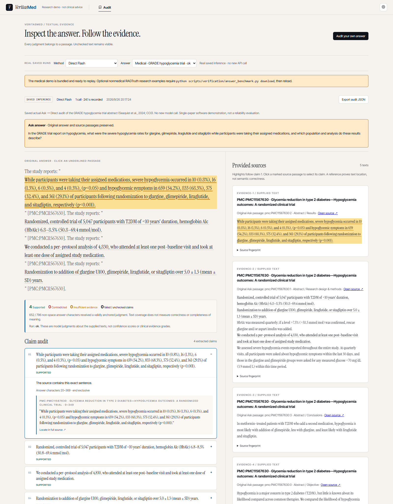

# 真实医学论文：Ask → Audit

v0.8 的三篇原文、三组各三轮真实对话见[对话指南](conversation-guide.md)。本页保留较早的单篇演示。

本例使用 Seaquist 等（2024）报告的 GRADE 低血糖结局，展示检索、实际回答、逐条审计、
原文定位和导出。它是一篇论文上的软件演示，不计入评测分数，也不是用药建议。

这里保留 v0.5 当次完整 Ask 与审计记录。v0.7 在不改写该原答的基础上新增 Direct / Atomic
核查，并另列组别数值交换、证据移除两个明确构造的输入，见 [三类医学演示](research-demo.md)。

[PLOS 原文](https://doi.org/10.1371/journal.pone.0309907) ·
[PMC11567630](https://pmc.ncbi.nlm.nih.gov/articles/PMC11567630/) ·
[来源快照、许可、提取方式](../data/demo/medical/README.md)

论文采用 CC0，仓库保留出版社原始 XML 与完整的五段摘要。索引只使用摘要；没有把自拟摘要
冒充论文原文，也没有暗示审计阅读了未输入的全文。程序只去除 XML 标签并规范空白。

## 无密钥观看实际记录

按 [README](../README.md#start-with-ask-real-recorded-conversations-no-key) 安装轻量环境，运行：

```sh
python scripts/run_audit_demo.py
```

打开 **http://127.0.0.1:5174/audit**，默认显示 **Medical · GRADE hypoglycemia trial**。
此记录已经包含来源，不需要下载 RAGTruth，不需要密钥或 GPU。

1. 看清 **SAVED INFERENCE**：这是保存的真实调用，不是现场再次生成。
2. 点击第一条 claim，阅读判断理由与出处。点 **Locate in full source** 定位到摘要结果段。
3. 点击第三条 claim，核对 per-protocol 分析的 4,830 人，区分随机入组的 5,047 人。
4. 右侧 **Open source** 打开原论文；**Source fingerprint** 显示文字指纹。
5. 展开 **Uncovered answer text**，查看未被有效判断覆盖的文本。
6. 点击 **Export audit JSON**，保存回答、全部来源、字符范围、模型判断、执行记录和 Ask 映射。



## 重跑完整链路

按 README 安装完整 Python 依赖和 Flash 配置后：

```sh
python scripts/run_demo.py --medical
```

打开 **http://127.0.0.1:5173**，点击 GRADE 示例问题：

> In the GRADE trial report on hypoglycemia, what were the severe hypoglycemia rates for glargine,
> glimepiride, liraglutide and sitagliptin while participants were taking their assigned medications,
> and which population and analysis do these results describe?

等实际回答结束，点击答案工具栏的 **Audit**，在当前问答页查看原回答与全部来源，
保留 **Direct Flash**，点击 **Run audit**。**Back to answer** 返回原答，底部仍可继续提问。
检索、回答和新审计都是真实执行，需要可用密钥；可能返回不同内容。
后续启动可用 `python scripts/run_demo.py --medical --skip-index`。


## 2026-09-26 的实际运行

| 项目 | 保存结果 |
|---|---|
| Agent | 1 次完整 Ask，90.19 秒（包含本地模型初次加载） |
| 检索 | 返回全部 5 个原始摘要片段，1 篇论文 |
| 回答 | 保留用药期间的严重低血糖数据、研究人群和分析范围；0 次改写、0 次再生成 |
| 独立审计 | Direct，1 次 Flash 调用，24.093 秒，网关报告 7,453 tokens |
| 审计输出 | 4 Supported，0 Contradicted，0 Insufficient，0 failed / unchecked claims |
| 输入传递 | `input_edited=false`；原回答和全部返回片段与 Ask 完全一致 |
| 调用身份 | 当前配置为 Flash；审计响应报告 `deepseek-v4.1-flash`，属于网关元数据 |

[完整 Ask 事件](../data/demo/medical/ask-events.json) ·
[实际浏览器审计导出](../data/demo/medical/audit.json)

只运行了一次 Ask 和一次审计，没有反复选出成功答案。首次完整栈加载耗时不代表稳定推理速度。
Ask 的完整分角色 usage 不在这个浏览器导出里，因此 7,453 不是整条链路的总 token。

当次回答以论文原句为主，比较长，属于容易核对的案例。审计器把包含四组数字、两类结局的
长结果句作为一个 compound claim，未逐个拆成独立原子事实；4 个绿色标签不能解释为四项
独立医学正确性验证。未覆盖的引导语、引用标记等仍可查看，不能据覆盖率断言语义完整性。
它也没有测量跨论文冲突、证据等级或患者适用范围。

无密钥回放会将展示模式改为 saved，并附医学演示说明；原始下载文件保留 live 模式和原始
provenance。模型输出、判定及原文范围不修改。非医学公开数据上的误报、漏报和重复不稳定
仍在 [v0.5 研究报告](reports/verification-v0.5-specific-errors.md) 中，不能被这个容易的示例抵消。
