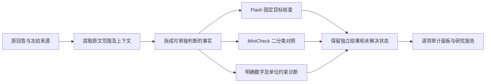

# v0.6 详细计划：测清核查可靠性，改进复合陈述审计

制定：2026-09-26。起点：已发布 `v0.5.0` / `a1c77a3`。
状态：**本轮必交项目已完成，随 v0.7.0 合并交付（2026-09-27）**。
原子审计、独立核查器、冻结最终评估、校准、消融、重复和真实回放均已交付；
新方法未满足默认升级条件，Direct 保留默认。见 [实际结果](../verification-v0.6-report.md)。
本文保留预定目标，实际数量、范围调整与负结果见 [实施记录](../research-v0.6-v0.7-worklog.md)。
Flash 继续作为研究基线，Direct 保持当前默认；不加入 Pro 自动回退。

## 1. 版本目标

**用实测结果说明：系统检查了哪些事实、哪些错误容易放过、何时应保留判断，以及增加审计结构是否比直接问同一个模型有价值。**

v0.5 已把判断展示得可追溯；v0.6 要测清判断能力，并针对可重复观察的缺陷改进。
可靠性限定为“给定文本是否支持陈述”，不等于论文结论真实、临床证据等级高、适用于患者或研究问题已完整回答。

| 目标 | 产品变化 | 研究交付 |
|---|---|---|
| G1 复合陈述拆分 | 人数、组别、结局、时间分别核查，仍能返回原句 | 遗漏、限定词丢失、解析新增含义的诊断 |
| G2 效果测量可信 | 结果入口说明误放行、误报、漏审和失败 | 固定目标/整段任务分开，人工标签/构造诊断/应用观察分开 |
| G3 核查模块有对照 | Direct Flash 与专用核查器的实际差异 | 同输入、同标签口径、固定划分的比较 |
| G4 不确定性有含义 | 信息不足、模型分歧、未完成分别展示 | 风险—覆盖率、分数校准和重复稳定性报告 |
| G5 改进能够解释 | 看清拆分、上下文、数字检查分别贡献什么 | 有限消融与计算量对照，无收益则保留简单默认 |

**软件交付可以完成而研究假设被否定。** 新结构不优于 Direct，就公开结果并保留 Direct，不修改题目和评分去证明预设结论。

## 2. 从 v0.5 的实际缺陷出发

1. [医学演示](../medical-demo.md)中，四个治疗组、两类结局的长句被当成一条 claim。定位整句不代表每个组别和数字都被分别检查。
2. [quote-v2 实验](../verification-v0.5-specific-errors.md)中，两种整段方法均提取全部 5 处错误文字，却只警报命中 3/5。问题不能全部归因于提取。
3. 整段扫描与固定目标核查会改变同一问题的判断，但提示词、目标长度和任务同时变化，尚不能定位增益机制。
4. 位置处理已有改善证据，语义优势尚未建立；重复运行仍会增加或撤销警报。
5. RAGTruth 未标错回答不能自动当作全部事实正确；现有 33 处具体错误的 AI 开发审阅也不是独立语义 gold。

v0.4 的 35 道医学保留题已暴露，只作回归；v0.5 标签、失败和运行记录不改写。

## 3. 技术路线与审计契约

候选策略命名 `atomic_v1`，单独版本化，不覆盖历史 Direct / Context / quote-v2。
MiniCheck 首先作为研究对照，是否进入日常路径由结果决定，不默认串联更多模型。

### 3.1 拆分不等于改写原回答

每项事实保留以下信息：

- `parent_claim_id`、`answer_spans`、完整回答语境与来源指纹。
- `normalized_claim`：供核查的独立表达，明确标为模型解析，不能伪装成原文引用。
- 原文明示的主体/人群、干预或暴露、比较对象、结局、数值/单位、时间、否定/归因/条件。缺失槽位留空，不以医学常识补齐。
- `decomposition_status`：可单独判断、仍为复合事实、语义转换未确定、执行失败。
- 各核查器的原始判断、依据、执行设置与错误，不能只剩一个聚合标签。

GRADE 示例的期望拆分包括“用药期间 glargine 严重低血糖 10 人 / 0.8%”、
“同范围 glimepiride 16 人 / 1.3%”等，另留症状结局、随机入组与分析人群。
这是设计示例，不是新实验的独立专家标签；正式构造须记录来源和每项变换依据。

并列句可能在不同文字位置表达主体和数字，因此允许多个精确范围共享上下文。
不能要求模型拼出原文不存在的完整引句；重复位置继续未解决，不模糊匹配、不选第一处。
解析是否忠实另测：字符串匹配不证明没有丢失限定词或添加含义。
`per-protocol` 等只记录原文范围，不顺带评定研究质量。

### 3.2 状态必须区分

| 状态 | 含义 |
|---|---|
| Supported | 提供文本支持完整陈述，仍是模型判断 |
| Contradicted | 同一主体、范围和条件下存在相反文本依据 |
| Insufficient | 已核查，但提供文本不足以建立或否定陈述 |
| Needs review | 解析、核查器分歧或接受策略触发保留，不是医学证据不足 |
| Unchecked | 尚未核查或已达到提取/调用上限 |
| Execution / binding failure | 请求、格式、原文定位失败，不算正确判断或合理拒答 |

父句只概括“已提取子项”的结果。子项全 Supported 不能证明语义已穷尽；显示子项数、仍复合的部分和未覆盖范围。
mixed 可作展示摘要，不能变成第四种 gold 关系。

### 3.3 数字模块的有限职责

先覆盖整数/小数、百分数、组别对应、明确单位换算与等价书写。标记的是同一组别、结局、时间下的失配，
不是“全文没出现这个数，所以错误”。四舍五入、不同分母、区间、其他队列或上下文支持不清楚时保留未确定。
暂不从显著性、HR/RR、置信区间自动推导因果或临床意义。
规则先作为可开关诊断，不覆盖关系判断；通过正确等价表达和错误变体的配对诊断后，再评估能否影响接受策略。

## 4. 数据方案：不依赖新增专家团队

三类材料分开存储、评分和报告，新建材料不统称“黄金题集”。

### A. SciFact：固定 claim 的公开人工标签

沿用固定版数据和现有适配口径，输入完整摘要，不给核查器 gold 关系或依据句。
支持/反驳使用官方标签；引用文献未标依据只表示该摘要下的信息不足。
不把随机未标检索结果当负例，不把公开 dev 成绩称官方 test 成绩。

2026-09-26 已做元数据可行性清点，未跑新模型或读取最终评估成绩：

| 数据池 | 初筛规模 | 用途 |
|---|---|---|
| 官方 train 排除现有 SciFact 试跑/构造来源及与 dev 关联的组 | 283 组、452 claims、505 配对 | 开发、分数拟合、阈值选择 |
| 官方 dev 按关联文献分组 | 247 组、300 claims、339 配对 | 冻结后的最终评估 |

计数基于 pilot / controlled-v1；正式名单还要跨 v0.4 与医学演示核对 DOI、标题、规范文本指纹及相关变体。
**这些是可行性计数，不是已经冻结的实验名单。**

以 claim 与全部关联文献构成的连通分组为单位，先保留 dev 涉及组，再将可用 train 组按固定 seed
分为约 50% 开发、25% 分数拟合、25% 阈值选择。同论文、相关 claim 和其变体不跨区。
已用材料只进开发；报告实际组数、类别分布和排除原因，不拆组凑数。

开发试跑先用不超过 60 个新配对，最多两轮预定提示调整；正式运行前固定最终名单。
最终使用清点后全部合格 dev 配对，执行一次已选方法比较。若样本不足，缩小声明范围。
公开数据可能进入模型预训练或方法开发，必须披露；来源隔离不等于完全无模型训练污染。

### B. 医学构造诊断：测拆分和限定词

目标 **24 个文献事实组 × 4 变体，约 96 条短回答**，分成 16 组开发和 8 组一次性转移诊断。
同组变体同区，同一论文的不同事实组也必须同区；独立来源不足时报告实际有效组数。
没有合格材料则少做并列缺口，不降低确定性标准。

四种变体：原义表达、非逐字等价改写、一个明确槽位错误、移去全部相关证据后的不足。
每组包含 2–4 项事实，覆盖组别—数字、分母/人群、时间、否定、归因和条件。
改过不等于错；删除一句也不等于证据不存在。需核对其余给定文本能否支持或推导。
难以确定的因果、临床外推、跨文献可比性不进入确定构造标签。

我负责制作来源、变换和逐项事实清单，注明 **source-anchored developer/AI construction**。
其他模型只能提示疑点，不能通过投票把不确定项变成 gold；8 组转移诊断不称独立临床验证。
标签在看候选输出前固定。保留改写正例，防止只会逐字复制或把复杂表达一律判不足。

### C. 自然回答和真实产品观察

- 现有 56 个 RAGTruth 开发回答（24 + 24 + 8）只作回归和解释，不算新证据。
- 新增目标 **36 个未用 train 来源，每来源 1 个回答**；18 个有公开错误，18 个无标错。按 seed 和排除表选，不看方法表现挑题。
- 原有 **60 个官方 test 来源继续保留**。仅在整段协议、候选、评分与预算冻结后，按原来源名单做一次最终比较。未满足条件不消耗，也不阻碍限定范围的 v0.6 发布。
- 医学演示至少 3 类：真实未改写 Agent 输出、明确标注的数字/组别修改、明确标注的证据删减。后两类不冒充自然错误，不估计自然发生率。

RAGTruth 错误范围用于提取覆盖和定位；无标错警报不能全部算假阳性。
具体错误理由审阅单列 AI 开发诊断，不借它给最终方法独立打分。
新增真实医学答案无独立标签时只给来源审阅和案例，不生成医学总体准确率。

## 5. 专用核查器与任务对齐

首选 **`lytang/MiniCheck-Flan-T5-Large`**：句子级支持/非支持判断及原始分数，作为不同于 Flash 的对照。
本机 RTX 4060 Laptop / 8 GB 是选择较小模型的依据，不是已实测速度或显存保证。
先在隔离研究环境固定包与模型 revision，轻量演示不增加强制模型下载。

- 主公平表统一 Supported vs Non-supported；Flash 的 Contradicted / Insufficient 只在该表合并。
- 三分类和依据质量另报，不能替 MiniCheck 编造第三类或事后用另一个模型补解释当原结果。
- 相同完整摘要、相同固定目标。超长输入保留实际范围，不静默截断仍称同输入；若分块，提前固定分块/聚合，另报共同可处理子集及全量结果。
- 分数称 `raw_support_score`，不是事实为真的概率；校准也只针对特定分布的文本支持关系。
- 官方模型卡标示 MIT、代码库标示 Apache-2.0；实施时固定 revision、保留许可归属，不改标第三方材料。

本版不同时接很多模型、不微调自己的医学模型。先测专用核查是否有互补、效率优势或新误报。

## 6. 实验矩阵

| 实验 | 对照 | 回答的问题 |
|---|---|---|
| E1 固定 claim | 冻结 Flash 固定证据核查 vs MiniCheck | 排除提取后，谁更容易放行非支持内容？ |
| E2 同一原子事实表 | 相同目标、语境/来源送入两种核查器 | 分歧是否有稳定模式？ |
| E3 完整回答 | 原 Direct、原 Split、atomic-v1 | 拆分能否改善关键事实核查、遗漏和误报？ |
| E4 限定词机制 | atomic-v1 vs 不提供显式限定词槽位的版本 | 范围结构是否有额外帮助？ |
| E5 数字规则 | 同一保存输出，规则开/关 | 明确失配能发现什么、误伤什么？ |
| E6 重复 | 预选 12 个来源，Direct/候选各共 3 次 | 判断、提取和警报集合有多稳定？ |

顺序：E1 小试 → 构造诊断和 E3/E4 → E2/E5 → E6 → 冻结 → 校准和最终评估。
E4 只做有解释作用的开发比较，不扩成所有设置的全排列；E5 可离线运行。
E4 保留相同原回答/来源，只去掉显式槽位辅助，不能靠移走证据来制造劣化。

E2 共同目标表先冻结，核查器不能反向修改它；结论以该解析为条件。
E3 包含提取损失，保留原 Direct/Split；既比较候选系统，也避免把整个方案的变化归因于单一字段。

**同模型不代表同计算量。** Direct 通常 1 次调用，拆分是提取 + 多次核查。报告端到端调用、token、耗时和质量。
若候选在开发集出现优势，再增加预定预算控制：Direct 最多 3 次调用，用固定的保留规则处理分歧，
不加模型裁判；候选也最多 3 次，没查完的项显示 Unchecked，同时保留其正常预算结果。
同调用数不等于同 token，两者都报；不事后挑选有利预算。多次同意不能充当正确标签。

本版回答“结构化审计是否值得”；**强模型自行调用全部工具的完整对照仍在 v0.7**，
届时固定模型、语料、工具权限和预算比较自主流程与本 Agent，不提前宣称已证明 Agent 优越性。

## 7. 评分与校准

### 7.1 固定目标主表

首要指标：**错误接受率 = gold Non-supported 却输出 Supported 的数量 / 全部 gold Non-supported。**
同时报告 Supported precision、Supported recall、balanced accuracy；三分类矩阵仅用于适用方法。
失败/未完成不是正确分类。公共成功子集和全量完成率/端到端有用判断率并报，避免靠失败或全部保留降低误放行。
Needs review 不悄悄当正确 Non-supported。

按关联来源组做配对 bootstrap，固定 seed，给 95% 区间和有效组数。
零观察错误、稀有类别或很少组不能变成“100%可靠”；区间退化要说明不足，同文献变体不是独立样本。

### 7.2 整段回答的四张表

1. 提取/拆分：目标遗漏、限定词丢失、未表达含义的新增。确定计数主要来自构造事实清单；语义匹配未确定项及 AI 复核另列。
2. 判断：已提取目标的错误接受、警报和保留；不与固定目标任务混算。
3. 端到端：已知错误未被提取也进入漏检分母，不能只给成功拆出来的容易事实评分。
4. 定位/运行：唯一绑定、重复、无效、失败、达到上限、延迟和用量，与语义正确率分开。

RAGTruth 延续原字符指标以便回溯，但不将 overlap 当主语义结论。
原子事实、子句与原宽 claim 的匹配规则在调用前固定；更长 warning 不等于更懂错误。

### 7.3 校准与保留判断

先研究 MiniCheck 二分类分数：一个预定的简单 logistic 映射只在分数拟合区拟合。
模型/提示/分块此前已在开发区选定，校准区不再调方法。
独立阈值选择区使用固定网格，经验错误接受风险目标 **5%**，在满足目标的选项中取覆盖最多者。
这里风险指“接受为支持的项里有多少实际非支持”，与上面的错误接受率分母不同。
这是经验选择目标，**不是统计保证**；无合格阈值或样本不足就报告没有可用规则。

最终只评估已固定映射与阈值：Brier score、可靠性图、接受风险、接受覆盖率及分母。
除全配对结果外，按 seed 提前每组选择一个代表配对，报告组间代表样本的二项风险区间，
避免相关变体造成虚假精确。不能看最终结果后重新选阈值。平衡构造集不用于估计实际部署概率。

Flash 没有与此等价的已验证概率；自报置信度、投票比例、理由长度和来源数量不能代替它。
模型分歧只作候选保留信号，测收益和覆盖损失，不直接融合成一个置信度。
**v0.6 默认面板仍不展示逐条“可信度百分比”**：显示策略、未解决原因和对应验证报告。
校准结果先用于研究，达到充分且匹配的证据条件后再决定产品表达。

## 8. 实施顺序与产物

| 阶段 | 具体工作 | 产物及收敛条件 |
|---|---|---|
| P0 契约/数据 | 定义原子事实、状态、分母，清点暴露来源、分组 | 协议、split manifest、标签来源卡；不发新模型请求 |
| P1 固定目标 | 隔离接入 MiniCheck、Flash adapter、最多 60 对小试 | 同输入逐项输出、超长策略、故障与成本记录 |
| P2 复合审计 | 原子契约、24 组目标诊断、有限消融 | atomic-v1、事实清单、遗漏/限定词/数字报告；未知不强判 |
| P3 比较/选择 | 36 个自然回答、预定重复、必要预算控制 | 选一个候选或继续 Direct；冻结提示、指标、规则和调用清单 |
| P4 校准/评估 | 两个 train 校准区、一次 SciFact dev；符合条件再开 60 来源 | 风险曲线、区间、失败全集、默认策略决定；不在保留集反复调参 |
| P5 产品/发布 | 原句—子事实联动、分歧提示、至少 3 类医学演示 | 真实截图/导出、研究报告、README 与版本说明 |

不做无关压测、复杂权限平台或大规模前端重做。必要验证保护输入/标签隔离、原文位置、评分分母和实际演示，并跑已有检查。

拟新增/修改位置（设计路径，不表示已实现）：

- `src/medrag/verification/atomic_audit.py`、`atomic_schema.py`：候选流程与可回溯契约。
- `src/medrag/verification/minicheck_adapter.py`、`numeric_checks.py`：独立对照与有限规则。
- `scripts/verification/v06_*.py`：准备、比较、校准、只读重算；研究环境与轻量演示依赖分开。
- `data/verification/v06/`：协议、名单、标签来源和完整输出；模型权重/大数据仍放本地缓存。
- `src/medrag/api/routes/audit.py`、`frontend/src/pages/AuditPage.tsx`：新策略显式接入，旧记录仍可回放。
- `docs/verification-v0.6-report.md`、`docs/releases/v0.7.0.md`：实施后形成，不预写成功结论；本轮合并交付，不另发 v0.6.0。

## 9. 完成标准和默认升级标准

### 版本必须交付

- [x] 可回溯子事实审计；限定词、解析未确定、未提取/未检查边界可见。
- [x] 一个专用核查器的任务对齐比较；不能用同模型自评替代对照。
- [x] 独立划分和冻结后的固定目标评估，可复算原始输出与全部失败。
- [x] 构造、自然回答和固定目标各自报告，至少一次预定重复稳定性比较。
- [x] 分数校准与风险—覆盖率研究；无可用阈值也如实交付结论。
- [x] 分歧/未完成展示、3 类有出处的医学演示和完整启动/导出文档。

实际医学构造为 23 来源组、92 回答；一组在推理前因来源年份冲突/截断被排除。
医学演示是同一 GRADE 原答及两类明确构造，不冒充三篇独立论文。
60 个 RAGTruth test 来源仍未使用；整段语义评分未充分建立，不以发布为由提前曝光。

### 新方案替换默认另需证据

不是多几个字段、单个 demo 通过或简单控制全对就升级。预先指定适用任务上需同时满足：

1. 错误接受率相对 Direct 降低，按来源组配对的 95% 差值区间支持改善。
2. 正确支持召回的允许下降界限预设为 **3 个百分点**；报告区间，不凭接近的点估计宣布满足。完成率、保留率和遗漏同时比较。
3. 自然回答没有已知系统性限定词丢失或大幅漏审，收益不能只来自更长警报或更多调用。
4. token、时间与依赖增加有相应收益；无收益模块留作研究选项或移除。

3 个百分点是研究决策容忍度，不是临床安全标准。统计证据不足则“不足以升级默认”，不降低门槛。
只有固定 claim 证据充分，就只升级该子任务，不能顺带升级整段审计。
没开 60 来源储备时不宣称完整自然回答最终评估已完成。

## 10. 资源、停止规则和明确后移的内容

制定计划不发收费推理、不下载模型。实施沿用最多 3 个 API 请求同时运行；本地模型按显存决定串行。
固定目标每配对约 1 次 Flash + 1 次本地评分；整段方案另计提取和逐项调用。
每轮以冻结的实际清单记录预算，不能把一个问题当作一次模型调用。

保留输入、提示、设置、返回模型标识、usage 与失败。访问/余额故障停止新派发；重试另留记录，
不覆盖首次结果或只保留最好一次。最多两轮预定开发提示调整后收敛，没有改善也进入分析与发布。

不在本版交付临床证据分级、跨文献冲突裁决、自动修复主问答、医学模型微调、完整自主工具对照或临床应用。
这些工作需要本版测得的边界，不能因前端存在占位字段而宣称实现。

## 11. 原始资料与维护入口

以下资料于 2026-09-26 核对，实施时固定版本：

- [SciFact 官方数据与划分](https://github.com/allenai/scifact)：公开 train/dev 标签，test 标签不公开。
- [SciFact 数据格式](https://github.com/allenai/scifact/blob/master/doc/data.md)：claim、引用文献与依据集合。
- [MiniCheck 模型卡](https://huggingface.co/lytang/MiniCheck-Flan-T5-Large)：句子级二分类及用途。
- [MiniCheck 官方实现](https://github.com/Liyan06/MiniCheck)：接口与 raw score；不借作者跨基准成绩声明本项目效果。
- [RAGTruth 官方数据](https://github.com/ParticleMedia/RAGTruth)：原始错误标注与任务范围。

[总体路线](../verification-roadmap.md) · [v0.5 交付](../releases/v0.5.0.md) ·
[具体错误诊断](../verification-v0.5-specific-errors.md) · [文档索引](../README.md)
