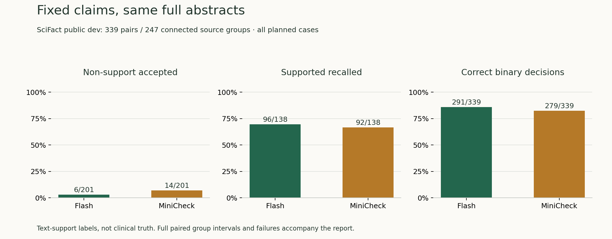
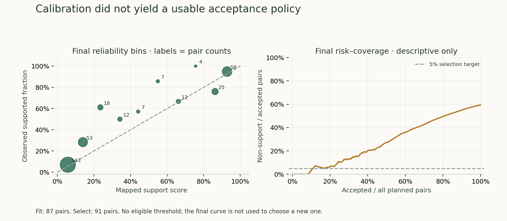

# v0.6 审计可靠性研究报告（随 v0.7.0 交付）

[English](../en/reports/verification-v0.6-report.md) | **简体中文**

本报告将固定目标、医学构造和自然回答分开。公开人工标签提供外部参照；构造事实与 AI 开发复核不是独立医学 gold。所有计划样本及失败均保留。

**决定：Direct 保持默认，atomic-v1 与 MiniCheck 保留研究选项。校准未得到满足预设条件的接受阈值，不发布逐条可信度百分比。**

## 数据与冻结

| 用途 | 来源组 / 配对或回答 | 性质 |
| --- | --- | --- |
| 固定目标开发试跑 | 60 配对 | 未用于最终成绩 |
| 分数拟合 | 50 组 / 87 对 | SciFact train |
| 独立阈值选择 | 50 组 / 91 对 | SciFact train |
| 固定目标最终 | 247 组 / 339 对 | 官方 dev，一次冻结后运行；不是官方 test |
| 医学开发 | 15 组 / 60 回答 | 原义、改写、单错误、移证据 |
| 医学转移 | 8 组 / 32 回答 | 同样为构造诊断，不是临床泛化 |
| 自然回答开发 | 36 来源 / 36 回答 | 18 有公开错误，18 无标错 |
| 预定重复 | 12 来源 / 每方法共 3 次 | 原次 + 两次独立调用 |
| 自然回答最终储备 | 60 来源 | 未启用；整段语义评分与默认升级证据不足 |

P0 以 claim 与全部关联文献构成连通组隔离，同时排除旧试跑、构造与医学语料暴露。v0.7 的 20/40 组先另留。医学计划的 24 组减为 23：文献 42291761 摘要年份矛盾且截断，未勉强标注。公开数据可能进入模型训练，来源隔离不等于无预训练污染。

协议、标签来源、逐次设置与精确推理代码见 [v06 工件](../../data/verification/v06/README.md)。本次没有提示调优后覆盖首轮记录。

## E1：固定 claim 与完整摘要

Flash 固定核查器与 pinned MiniCheck-Flan-T5-Large 接收相同目标和完整摘要，不给 gold 关系或依据句。MiniCheck 只做二分类；超出 2048 token 显式失败，不静默截断。本表合并 Contradicted / Insufficient 为 Non-supported。

公开关系标签可能依赖领域别名或隐含推理，而 Flash 提示限制仅凭提供文本；相同输入不等于两种方法学到了相同判断政策。标签仍保留，不按输出重标；不能把所有分歧简单归为模型医学能力高低。

| 方法 | 完成 | 二分类正确 | 非支持被接受 | 支持召回 | 支持精度 | Balanced accuracy |
| --- | --- | --- | --- | --- | --- | --- |
| flash | 339/339 | 291/339 | 6/201 | 96/138 | 94.1% | 83.3% |
| minicheck | 339/339 | 279/339 | 14/201 | 92/138 | 86.8% | 79.9% |

失败/未完成不会成为正确非支持。主表分母包含全部计划配对。共同成功子集另存 JSON，不能替代主表。

Flash 还需要合法依据句编号才算完成，MiniCheck 只输出二分类，没有等价的引用合同。因此主表包含额外输出合同的影响，不能把所有无效引用都解释成语义分类错误。

另列事后标签诊断：仅忽略 Flash 的无效依据引用、保留其已解析关系标签时，完成 339/339，二分类正确 291/339。此补充在 E2 发现引用失败后、固定最终运行过程中登记，未用于选择方法、阈值或默认；原始主表和失败不被替换。完整分母与明细在 JSON。

| MiniCheck − Flash | 配对差值及 95% 来源组 bootstrap 区间 |
| --- | --- |
| 错误接受率（越低越好） | +4.0 pp [+0.5, +8.1] |
| 支持召回（越高越好） | -2.9 pp [-12.2, +6.0] |

247 个连通组、2,000 次配对重采样，seed 260926。零观察错误或退化区间不等于零风险。预定升级要求错误接受改善且支持召回下降不超过 3 个百分点，不能只比较总准确率。

### Flash 的三分类与依据

| 公开标签 | 输出 | 数量 |
| --- | --- | --- |
| contradicted | insufficient | 15 |
| insufficient | insufficient | 118 |
| supported | supported | 96 |
| supported | insufficient | 36 |
| insufficient | supported | 5 |
| contradicted | contradicted | 55 |
| supported | contradicted | 6 |
| insufficient | contradicted | 7 |
| contradicted | supported | 1 |

依据句对照：`{"annotated_pairs": 209, "exact_one_annotation": 85, "covers_one_annotation": 145, "correct_relation_and_covers": 141}`。这里只比较是否命中公开依据集合；替代有效依据可能未被标注。文字位置有效不等于判断正确。

| 方法 | 每对中位秒数 | 累计秒数 | 已报告 API tokens | 无 token 用量记录数 |
| --- | --- | --- | --- | --- |
| flash | 3.945 | 2334.5 | 569,216 | 0 |
| minicheck | 0.155 | 59.0 | 0 | 339 |

MiniCheck 使用本机 RTX 4060 Laptop / FP32；时间不含权重加载。其无 API usage 不代表没有计算成本。Flash 的模型名是网关返回字段，不能独立认证底层权重身份。模型版本、环境和响应字段在原始工件中保留。

## 校准：没有可发布的接受规则

仅在 87 对拟合一个 logistic 映射，在另 91 对按预定网格选择阈值：接受项经验错误率 ≤5%，至少 20 对且涉及 10 来源组。**没有合格阈值**。最终仍评估冻结映射，Brier raw=0.1395，映射后=0.1306，完成 339/339。

最终曲线用于描述分布，不用于重新挑阈值。阈值为 null 时，接受风险为不可估计，不能把零接受写成零风险。每组预选代表样本和风险区间另存 `calibration-final.json`。此分数针对文本支持关系，不是医学事实为真的概率。

## E3：完整回答与构造事实

**下面主表按原冻结构造标签重算，其中 medical-15 存在已记录的来源范围疑点；紧随主表给出统一去掉该组的敏感性结果。保留原记录不等于继续把已知疑点当作无误标签。**

医学每条回答有两个预先写定的事实单元。以下通过原回答字符位置关联提取结果：至少覆盖一个目标一半的非空白字符才关联；关联判断分歧则不作确定决定。宽 claim 可能混入相邻事实；忠实的规范化也可能少覆盖原文字符。因此这些是**位置关联诊断，不是语义准确率**。

### 开发 15 组

| 方法 | 回答完成 | 事实原文全覆盖 | 位置关联错误放行 | 位置关联正确支持 | 位置关联错误警报 |
| --- | --- | --- | --- | --- | --- |
| direct | 55/60 | 115/120 | 3/45 | 70/75 | 38/45 |
| split | 58/60 | 119/120 | 0/45 | 71/75 | 44/45 |
| atomic_v1 | 54/60 | 94/120 | 1/45 | 71/75 | 43/45 |

### 转移 8 组

| 方法 | 回答完成 | 事实原文全覆盖 | 位置关联错误放行 | 位置关联正确支持 | 位置关联错误警报 |
| --- | --- | --- | --- | --- | --- |
| direct | 23/32 | 60/64 | 1/24 | 34/40 | 18/24 |
| split | 26/32 | 63/64 | 0/24 | 33/40 | 23/24 |
| atomic_v1 | 23/32 | 47/64 | 0/24 | 35/40 | 18/24 |

未提取、未完成与无法关联仍留在原分母。不给只成功拆出的简单项单独充当总成绩。

### 构造标签勘误与敏感性

在开发输出已经存在后的全 23 组来源文本复看中，发现 medical-15 的 Natsal-3 编号没有出现在给定标题/选定原句中。人数本身有依据，但完整命名事实的 Supported 标签需要限定。原标签、输入、推理和主表均未改写。以下对所有方法统一去掉该组四个变体，只是事后敏感性分析，不是独立专家复核或新确认性成绩。其余组亦未获无误认证。

| 方法 | 来源 / 回答 / 事实 | 位置关联错误放行 | 位置关联正确支持 |
| --- | --- | --- | --- |
| direct | 14 / 56 / 112 | 3/42 | 65/70 |
| split | 14 / 56 / 112 | 0/42 | 68/70 |
| atomic_v1 | 14 / 56 / 112 | 1/42 | 68/70 |

[勘误记录](../../data/verification/v06/medical-label-review.json)与 [完整敏感性明细](../../data/verification/v06/medical-label-sensitivity.json)保留发现时间、来源和限制。若未来修订题集，应另建版本并重新冻结，不覆盖本轮输入。

### 自然回答：公开错误范围

| 方法 | 回答完成 | 错误任意重叠 | 错误至少半覆盖 | 无标错回答上有警报 |
| --- | --- | --- | --- | --- |
| direct | 34/36 | 19/22 | 16/22 | 13/18 |
| split | 35/36 | 19/22 | 18/22 | 12/18 |
| atomic_v1 | 11/36 | 18/22 | 17/22 | 13/18 |

沿用旧计分字段以便重算，其中 false_positive 命名仅指无标错回答上的警报，不是已确认误报。重叠不能证明抓到了具体错误，更长警报也会提升重叠。自然回答不是医学诊断集。

### 实际计算量

| 数据区 | 方法 | 调用 | 已报告 tokens | 每回答均秒数 | 无 usage 调用 |
| --- | --- | --- | --- | --- | --- |
| medical_development | direct | 60 | 174,783 | 12.1 | 0 |
| medical_development | split | 228 | 328,040 | 24.5 | 0 |
| medical_development | atomic_v1 | 120 | 350,910 | 22.1 | 0 |
| medical_transfer | direct | 32 | 100,370 | 12.8 | 0 |
| medical_transfer | split | 121 | 191,559 | 26.7 | 0 |
| medical_transfer | atomic_v1 | 64 | 249,344 | 29.3 | 0 |
| natural | direct | 36 | 577,725 | 58.6 | 0 |
| natural | split | 425 | 1,481,342 | 140.3 | 0 |
| natural | atomic_v1 | 74 | 1,033,432 | 97.1 | 0 |

这是逐回答延迟，不是并行批次墙钟时间。Direct 通常 1 调用；原 Split 逐项核查，最多 25；atomic-v1 一次提取后分批核查，最多 3。不能把额外计算带来的变化全归因于结构。

## E2 / E4 / E5：机制诊断

按 seed 预选 3 来源全部 4 变体，共 12 回答。E2 两核查器在同一个冻结独立事实表上共 30 个目标，双方完成 27，二分类分歧 3。相同输入哈希逐项保留；不把原回答拼进证据来让它自证。解析本身无独立语义 gold，分歧不决定谁正确。

E2 执行状态：Flash {"ok": 27, "invalid_evidence_reference": 3}；MiniCheck {"ok": 30}。Flash 三项未完成来自无效依据引用，不能被算成正确非支持；MiniCheck 没有这一引用输出合同。

这三项都位于 medical-06：源视图中的多句文字合成一个输入证据单元（编号 0），Flash 输出编号 1，触发 SentenceOutOfRange，同时保留了原 supported 标签和解释。输入包装与引用合同也是待改进环节；本轮未补写编号、重跑或抹掉失败。

E4 去掉显式槽位但保留同一提取表、原回答、来源：{"planned_facts": 30, "both_completed": 29, "relation_changed": 0, "status_changed": 0}。一次开发消融的变化可能包含模型随机性；不能据增加警报宣布槽位有效。

E5 数字规则为建议性诊断：{"not_applicable": 22, "unresolved": 8}；关闭时无规则提示，改变语义决定 0。多数字、缺单位、区间或语境不确定保持 unresolved。没有把数字碰巧相同当作事实支持。

### 拆分保真度的实质缺口

[12 条预选输入的 AI 开发复核](verification-v0.6-extraction-review.md)发现：季度分母在某规范化子事实中未显式保留；数值槽位有时只写单位；重复/复合事实被自报 atomic。原文定位使问题可见，但不能修复语义。该复核不冒充独立标注，也不声称全量保真度已经验证。

另一个瓶颈是过短片段在回答中重复，虽然父段可能唯一，当前冻结定位规则仍要求片段在全文唯一；未绑定的事实不进入核查。自然 Atomic 的绑定状态计数：`{"parent": {"unique": 505, "not_found": 5}, "answer_fragment": {"unique": 834, "not_found": 3, "ambiguous": 30}, "evidence": {"unique": 619, "not_found": 2, "ambiguous": 1}}`。父段约束下的定位可作为后续受控改进，但本轮没有补跑后覆盖这些未检查项。

## E6：重复与调用预算控制

| 方法 | 来源数 | 三次之间警报有无改变 | 警报位置集合改变 |
| --- | --- | --- | --- |
| direct | 12 | 2 | 7 |
| atomic_v1 | 12 | 4 | 10 |

这些变化来自相同冻结输入的真实独立重复；没有挑最好一次。三次同意不是正确标签。

| 保守答案级控制 | 明确警报 | 无警报 | 需复核 | 有标错回答上的警报 | 调用总数 |
| --- | --- | --- | --- | --- | --- |
| direct_three | 7 | 2 | 3 | 4/6 | 36 |
| atomic_first | 3 | 1 | 8 | 3/6 | 25 |

医疗开发位置指标出现小幅收益后、重复输出生成前，预定利用同一 12 来源追加此分析。Direct 的三次都完成且警报有无一致才保留信号，其他情况需复核；atomic 取第一次、最多三调用。只比较答案级警报，不汇合原文范围、不用多数票当正确，也不以保留率掩盖失败。见 `budget-protocol.json` 与全部明细。

## 产品与发布决定

原子拆分、限定词槽位、原文多片段绑定、数字建议和单独 MiniCheck 结果已接入真实记录面板。Direct 仍为默认；模型分歧只提示审阅。三类 GRADE 演示明确区分真实 Agent 原答、构造组别互换和构造删证据。

没有获得覆盖整段语义、提取保真度和支持召回非劣的足够证据，故不升级默认、不自动修复答案、不使用 60 来源自然回答保留集。证据分级、临床适用性和跨研究冲突裁决继续单列研究。v0.6 的交付随 v0.7.0 合并发布，不伪造独立 v0.6.0 发布。

[实施协议](../plans/v0.6-audit-reliability.md) · [复现](../research-reproduction.md) · [MiniCheck 环境与上游](../minicheck-research.md) · [v0.7 工作流对照](verification-v0.7-report.md)
