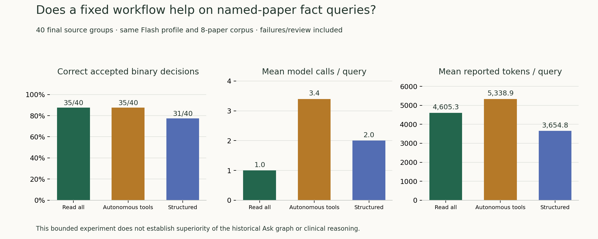

# v0.7 工作流比较：结构是否值得？

本次完成固定文献事实查询的三臂比较：读全部摘要一次回答、Flash 自主调工具、规定检索—读取—草稿—核查流程。**这是受限新研究模块，不能据此宣称历史完整 Ask graph、开放医学研究或临床结论已验证。**

**结论：这批最终 40 题没有证明规定流程改善判断。直接阅读与自主工具均 35/40 二分类正确，规定流程最终接受且正确 31/40；三臂错误接受均 2/19。保留简单对照，不据这版结果启用自动答案修复。**

## 设计与可比范围

20 个独立 train 来源组用于开发，40 个另留组用于一次冻结后最终比较；每组按 seed 一题。每题给目标论文标题与待核查 claim，候选库为目标 + 7 篇固定干扰摘要。模型看不到标签和正确依据。公开 SciFact 标签只评指定论文关系，不评答案中每个解释句的正确性。

相同 Flash 网关配置、输入语料、公共 search/read/verify 工具和调用上限。两工具臂最多 6 次模型调用、8 次非模型工具调用；verify 消耗同一模型预算。自主臂用应用层 JSON action 协议，不是 provider 原生 tool_calls。结构化臂选择精确标题匹配的论文；题目已命名目标，其搜索难度较低。不能外推到未知论文的开放检索。

Direct reader 一次读取八篇摘要；其计算量和上下文量与工具臂不同，这是明确保留的更简单方案。报告实际 token、耗时与调用，不能只凭相同上限称计算预算完全相等。

首轮开发后修正自主动作协议，三臂在相同 20 道开发题上完整重跑一次，再冻结最终方法；首轮记录保留，未排除表现不好的基线。结构化臂保留原始草稿与核查意见，发生分歧或核查失败则保留判断，不自动改成核查器的答案；核查器不充当 gold。

## 一次最终比较

| 方法 | 可接受完成 | 二分类正确 / 全题 | 非支持被接受 | 支持召回 | 支持精度 | 三分类正确 / 全题 |
| --- | --- | --- | --- | --- | --- | --- |
| direct_reader | 40/40 | 35/40 | 2/19 | 18/21 | 90.0% | 34/40 |
| autonomous_tools | 40/40 | 35/40 | 2/19 | 18/21 | 90.0% | 34/40 |
| structured_workflow | 36/40 | 31/40 | 2/19 | 15/21 | 88.2% | 31/40 |

失败、未检查、分歧、预算耗尽和错文献均进入全题分母，不算正确拒答。二分类将 contradicted/insufficient 合并；三分类不合并。

### 执行与协议限制

| 方法 | 流程状态 | 初次解析/调用错误类型 | 动作格式归一化 | 含 DSML 标记回复 |
| --- | --- | --- | --- | --- |
| direct_reader | {"ok": 40} | {} | {} | 0 |
| autonomous_tools | {"ok": 40} | {"JSONDecodeError": 18} | {"ignored_dsml_suffix": 18} | 18 |
| structured_workflow | {"ok": 36, "needs_review": 4} | {} | {} | 0 |

首轮开发暴露两项协议问题：自主提示中 finish 包装与裸答案格式要求冲突；收到的 JSON action 后混入 DSML 标记。最终题保持未运行，先保留首轮全部记录，再修正提示，并在第二轮开发中增加明确格式归一化：只取开头完整 JSON 对象、丢弃且不执行 DSML 后缀；完整裸答案包装为 finish，仍检查已读文献与真实引用。不会把模拟工具输出作为证据。

第二轮仍记录完整原回复、最初解析错误和归一化说明，因此初始 JSONDecodeError 不必然等于最终流程失败；请结合状态和动作适配次数。第一轮失败未被覆盖，第二轮三臂完整重跑后才冻结最终方法。收到的 DSML 文本不能判定问题来自底层模型还是网关转换，也不等于医学推理错误。

三臂分数同时反映输出合同/适配、完成率和关系判断；原生工具调用的其他实现未在本轮比较。因此规定流程若领先，不能把全部差距归因于 Agent 推理结构，也不能外推为强模型自主工具能力的上限。

| 结构化 − 对照 | 错误接受率差值 95% CI | 支持召回差值 95% CI |
| --- | --- | --- |
| structured_minus_direct_reader | +0.0 pp [+0.0, +0.0] | -14.3 pp [-31.6, +0.0] |
| structured_minus_autonomous_tools | +0.0 pp [+0.0, +0.0] | -14.3 pp [-31.6, +0.0] |

按 40 来源组配对 bootstrap，2,000 次，seed 260926。区间退化和小类分母均需保留；点估计领先不等于证实结构有效。

### 实际成本与保留的原答

| 方法 | 目标论文读到 | 原草稿二分类正确 | 需复核 | 调用 / 题 | 已报告 tokens / 题 | 均秒 / 题 |
| --- | --- | --- | --- | --- | --- | --- |
| direct_reader | 40/40 | 35/40 | 0 | 1.0 | 4605 | 6.3 |
| autonomous_tools | 40/40 | 35/40 | 0 | 3.4 | 5339 | 14.0 |
| structured_workflow | 40/40 | 35/40 | 4 | 2.0 | 3655 | 15.6 |

原草稿表保留被核查器拒绝的答案；它和最终可接受结果不是同一指标。逐调用输出、证据句 ID、工具参数、返回内容和模型标识均在原始记录。耗时为端到端逐题时间，不能用 API token 数推算本地 GPU 或货币成本。

规定流程比直接读取使用更少已报告 tokens，但逐题延迟更长，支持召回也更低；这些是不同维度，不能只按调用次数或 token 单项宣布更便宜、更好。直接阅读与自主工具二分类分数相同，三分类逐题输出并非完全相同。

### 四个需复核项究竟是什么

| 最终 case | 公开关系 | 原草稿 | 核查器 | 含义 |
| --- | --- | --- | --- | --- |
| scifact-train-788-4740447 | supported | supported | insufficient | 已正确支持的原答被保留 |
| scifact-train-296-4398832 | supported | supported | insufficient | 已正确支持的原答被保留 |
| scifact-train-1229-1676568 | supported | supported | insufficient | 已正确支持的原答被保留 |
| scifact-train-790-15493354 | contradicted | insufficient | contradicted | 核查器指出三分类差异；二分类原答已属非支持 |

四条原答在合并非支持的二分类中均正确，但只有前三条精确匹配公开三分类标签。不能把第四条核查一概叫误报，也不能把弃权计为已纠正答案。它保留了原答等待审阅，没有自动修改。完整原答与来源见 [40 题逐题记录](verification-v0.7-cases.md)。

## 开发集另列：第二轮协议

| 方法 | 二分类正确 / 全题 | 完成 | 非支持被接受 | 支持召回 |
| --- | --- | --- | --- | --- |
| direct_reader | 19/20 | 20/20 | 0/11 | 8/9 |
| autonomous_tools | 19/20 | 20/20 | 1/11 | 9/9 |
| structured_workflow | 15/20 | 15/20 | 0/11 | 6/9 |

这些题用于观察实现及冻结决定，不与最终 40 题合并提升样本量。展示页的三道回放在运行前按 seed 选自开发题；不代表三道最佳案例。

### 保留的首轮开发：协议问题

| 方法 | 完成 / 20 | 二分类正确 / 20 | 含 DSML 回复 |
| --- | --- | --- | --- |
| direct_reader | 20 | 19 | 0 |
| autonomous_tools | 0 | 0 | 14 |
| structured_workflow | 18 | 17 | 0 |

首轮自主臂 0/20 完成暴露的是当前提示/适配缺陷，不能作为强模型自主工具能力的有效上限。第二轮未增加论文、标签、工具权限或调用上限；不是按题挑选两轮最好结果。原始清单、完整回复与首次分数见 [development-original](../../data/verification/v07/development-original/metrics.json)。所有开发观察已曝光，仅最终 40 来源承担冻结后的独立比较。

## 如何解释及继续研究

本实验能回答：在已知目标论文、固定小候选库和固定 Flash 配置下，规定流程如何改变支持关系判断、保留率与成本。它不能单独回答：完整医学 Agent 是否胜过强模型自由使用全部生产工具。

仍保留 Direct 审计默认。自动答案修复与审计驱动的开放补检索没有作为已证明有效的功能上线：v0.6 暴露了核查误报与限定词损失，强行把核查器输出作为修复目标可能损害正确内容。后续先扩展未指定论文、需要补找证据的独立任务，再测每一步的作用；本次最终集合已曝光，只能做回归。

## 复现、原始记录与演示

[全部原始输出和冻结清单](../../data/verification/v07/README.md) · [离线重算与另存新运行](../research-reproduction.md) · [产品演示](../research-demo.md) · [实施协议](../plans/v0.7-agent-comparison.md)。

标签来源为 [SciFact 官方数据格式](https://github.com/allenai/scifact/blob/master/doc/data.md)。引用文献无标注依据仅作该摘要信息不足，不是全球无证据。公共数据训练污染、标题提示、固定干扰、单模型和小组数均限制泛化。
