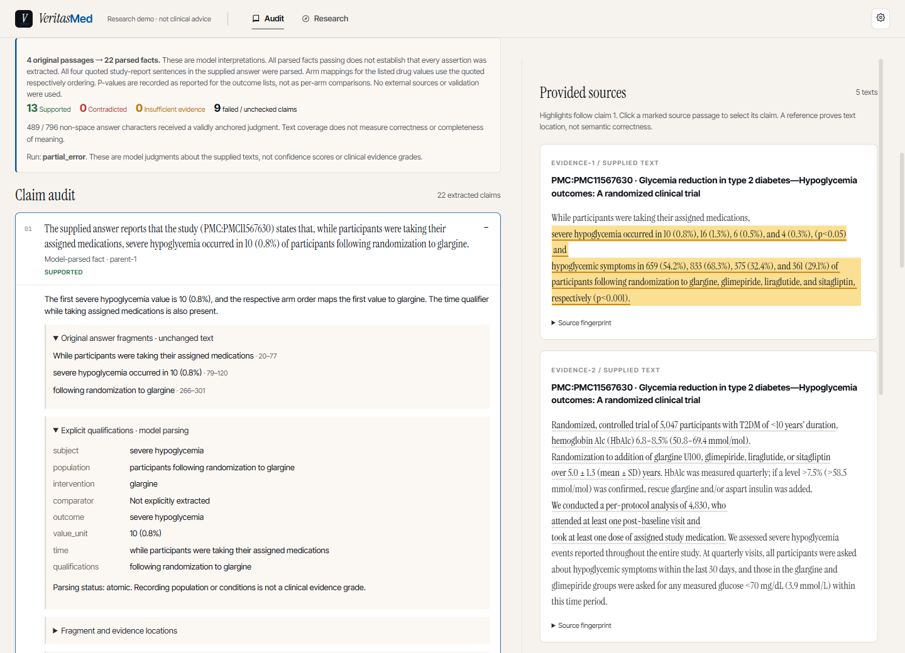
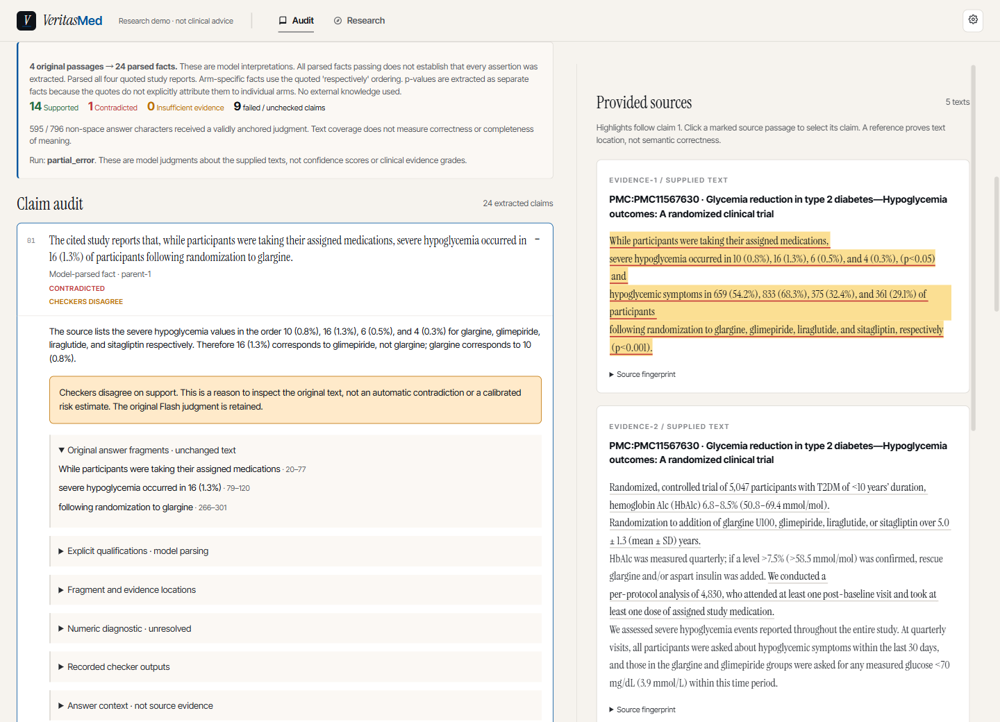
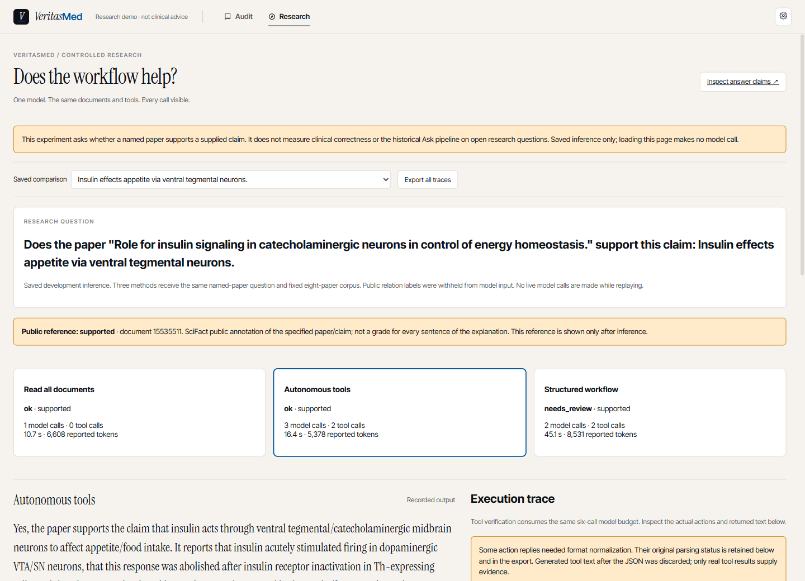
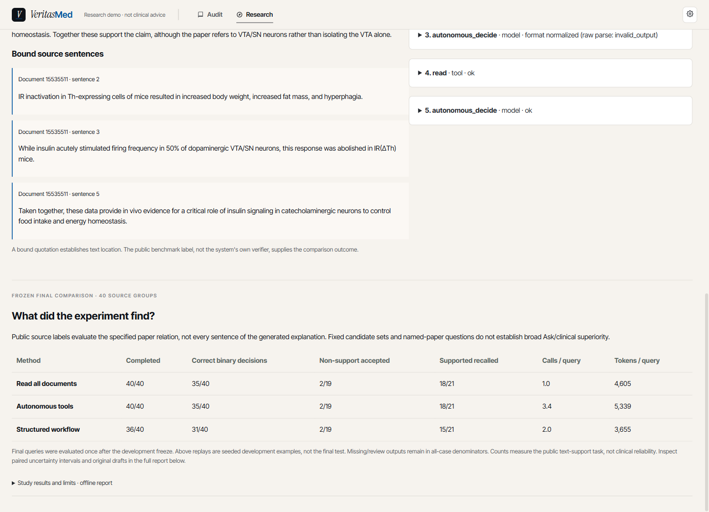

# v0.7 演示：原子审计与工作流对照

安装和启动沿用 [README](../README.md) 的轻量环境：

```sh
python scripts/run_audit_demo.py
```

同一服务提供 `/audit` 与 `/research`。依赖安装完成后，保存记录的回放、定位和导出均无需
密钥、模型下载、Qdrant 或 GPU。页面显示 **SAVED INFERENCE**，不会在加载时重跑模型。

## 三类有原文出处的医学审计

在 `http://127.0.0.1:5174/audit` 选择 **Atomic facts · experimental**，再选 GRADE 示例。
来源仍是 Seaquist 等人的 [CC0 原论文](https://pmc.ncbi.nlm.nih.gov/articles/PMC11567630/)，
从原 XML 提取的原始摘要和当时真实 Ask 输出见 [来源卡](../data/demo/medical/README.md)。

| 示例 | 输入究竟是什么 | 应该观察什么 |
|---|---|---|
| GRADE · unchanged real Agent answer | v0.5 当次 Agent 原答与来源不改写，本次重新审计 | 一句复合陈述如何展开为多个可点击事实；是否仍有遗漏或未解决项 |
| GRADE · deliberately swapped arm values | 明确构造：交换 glargine / glimepiride 两组严重低血糖人数和比例，其余不变 | 能否发现“数字确实存在，但配错组别”；未检出也如实保留 |
| GRADE · result evidence deliberately removed | 同一回答，只保留原背景段落 | 区分 Insufficient、执行失败和尚未检查；缺少给定证据不等于全球无证据 |

后两个是构造输入，不是自然发生的 Agent 错误，不能据此计算实际错误率。每类保存 Direct 与
atomic-v1 的一次真实运行，不挑重试里最好看的结果。

| 实际保存结果 | Direct | Atomic |
|---|---|---|
| 原始 Agent 回答 | 4 supported | 13 supported、9 未检查或未解决 |
| 构造组别交换 | 4 supported、1 contradicted | 14 supported、1 contradicted、9 未检查或未解决 |
| 构造证据移除 | 3 supported、9 insufficient | 12 insufficient、11 未检查或未解决 |

方法的提取粒度不同，不能拿绿色条数直接比较效果。三个 Atomic 记录分别保存了 22、24、23
条 MiniCheck GPU 核查，69 条均完成；组别交换和证据移除各有两条核查器分歧。





1. 点击模型拆出的事实；查看 **Original answer fragments**。这些片段保持原答文字不变。
2. 查看 **Explicit qualifications**，对照人群、组别、数值、时间和限定语。槽位是模型解释，
   空槽不证明原回答没有信息，填了槽也不证明临床适用范围正确。
3. 查看 **Fragment and evidence locations** 和 **Answer context**。原句、片段、证据任一不能
   唯一绑定时，保留未解决状态；程序不猜第一处重复引文。
4. 点击 **Locate in full source** 进入原文位置；点击 **Open original paper** 查看出处。
5. 出现 **Checkers disagree** 时，展开 **Recorded checker outputs**：保留原 Flash 结论，
   MiniCheck 是另一次独立模型的支持/非支持结果。它核查独立规范化事实，Flash 还使用原答语境，
   因而这是产品观察，不是严格同输入比较（严格比较在 E2）。不投票、不合成可信度百分比。
6. **Export audit JSON** 导出原始输入、位置、Flash 调用和 MiniCheck 补充记录。

MiniCheck 结果由一次单独 GPU 评分产生，存储在 sidecar 文件里；回放时按原记录和事实哈希合并。
原 Flash 记录不被覆盖。未完成和需复核项不会被绿色 Supported 数量吸收。

要逐条查看本轮 36 个自然回答的完整结果，可选下载一次固定 RAGTruth 文本：
`python scripts/verification/answer_benchmark.py download`，重启轻量服务后在同一面板选择
对应 RAGTruth ID 和 Direct / Split / Atomic 方法。原文缓存通过固定指纹核对，数据不匹配时
报错；不会用近似来源拼出能展示的页面。重复实验仍保留在研究原始输出中，不挑选最佳次替换回放。

## 三种流程的真实对照

打开 `http://127.0.0.1:5174/research`，或点击导航 **Research**。

1. 选择一条保存的文献事实查询。三个演示题在推理前从开发区按 seed 选定，选择规则和题目
   ID 在 [`selection.json`](../data/demo/research/selection.json)，不按结果好坏挑选。
2. 切换 **Read all documents / Autonomous tools / Structured workflow**，比较原答、关系判断、
   实际调用、时间和 token；公开参考标签显示在问题下方，但没有发送给推理模型。
3. 展开 **Execution trace**，查看实际 search/read/verify 与模型返回。verify 也算模型调用。
   自主臂是应用层 JSON 工具协议，不能冒充 provider 原生工具调用。
4. 原答与核查分歧时保持需复核，原答不会被自动替换。位置有效只说明引句来自哪里。
5. 点击 **Audit this answer with the candidate sources**，将原答和全部八篇候选摘要送入审计
   输入表单。此步骤不触发推理；随后点击 **Run new audit** 才使用自己的 Flash 配置。
6. **Export all traces** 导出三臂记录。页面下方的最终结果表来自另留的 40 题，不是这三道
   开发演示题的成绩。展开完整报告可查看配对区间和被保留的原草稿分数。

这里的研究范围是“指定论文是否支持这条陈述”。没有提供开放互联网搜索，也没有把历史 Ask
图里的所有检索/改写/修复步骤搬进比较。不能据本页声称临床研究问题上 Agent 必然胜过强模型。





回放使用修正动作协议后的第二轮开发结果；第一轮 60 条和全部协议失败也完整保留。
格式归一化在 trace 中有说明，丢弃的 DSML 后缀仅留作原始输出，未被执行或当作来源证据。

## 新运行与导出边界

新审计需要在忽略的 `.env` 配置 Flash。原子方法最多 48 个事实、3 次模型调用；复杂回答可能
达上限或保留未检查项。其他输入上限见 [审计指南](audit-demo.md)。MiniCheck 是研究环境的
可选依赖，实时 Flash 审计不会自动在访问者电脑下载或运行它。

新工作流也有 `/api/research` POST 接口，输入字段见本地 API 文档
`http://127.0.0.1:8001/docs`。界面主要用于比较已保存的真实流程。批量付费复现实验及另存运行
见 [复现指南](research-reproduction.md)，不要把重新运行已经曝光的题当作新的未见测试。

证据分级、跨文献可比性和文献冲突裁决不由这些标签自动给出。当前显示的是可追溯的文本判断、
明确的未解决项，以及与特定实验分布相对应的研究结果。
