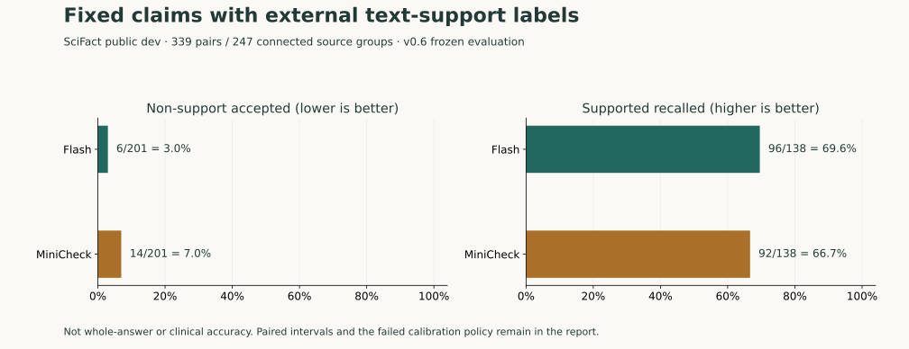
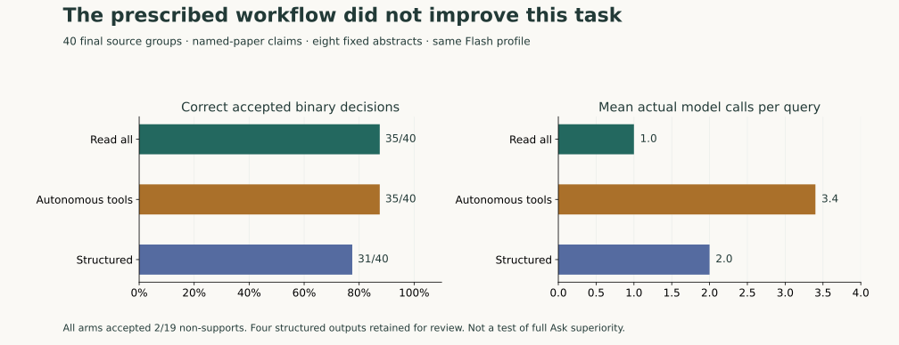

# Research summary

**English** | [简体中文](research.zh-CN.md)

VeritasMed was built alongside a series of experiments. Each one was frozen before it ran, and
failures and unfavourable results were kept. This page summarizes what was learned. All
datasets, raw model outputs and full reports are archived at
[commit 81a1519](https://github.com/lijingshan-6/VeritasMed/tree/81a1519) (`data/` and `docs/reports/`).

The experiments answer different questions with different labels, so their numbers should not be
added together into one "accuracy".

## 1. Answer quality: from 5/15 to 31/35 held out

A 50-question benchmark was built from 44 papers: 15 development and 35 held-out questions, with
no shared papers between the two. Every required fact has an exact evidence span. A *strict pass*
means every required claim is present and supported, and no unsupported material is added.

| Version | Main change | Result |
|---|---|---|
| v0.2 | Benchmark and first full-agent baseline (local Qwen 3.5 9B) | 5/15 strict passes |
| v0.3 | Plan searches per requested study; keep exact statistical qualifiers | 10/15 |
| v0.4 | Bind each answer component to source sentences; targeted repair; switch to Flash | 15/15 development, 10/10 repeat |
| v0.4 | Held-out set, run **once** after the code was frozen | **31/35** |

All 32 answerable held-out questions retrieved their required evidence. The four failures came from
omitting a required result or boundary, not from inventing facts. The agent's own self-check passed
all 35, including the four failures, so a self-check is not an independent judgment. The scores
come from AI-assisted adjudication against source spans, not clinician review. The held-out
questions are now exposed and serve only as regression tests.

## 2. How reliable is a model as a claim checker?

An audit is only useful if the checker rarely accepts a claim the source does not support. On the
public SciFact development set (339 claim–abstract pairs in 247 independent source groups, labels
written by the dataset authors), two checkers saw identical inputs:

| Checker | Unsupported claims wrongly accepted | Supported claims recalled |
|---|---|---|
| Flash (LLM, one call) | **6/201** | 96/138 |
| MiniCheck-Flan-T5-Large (local) | 14/201 | 92/138 |

MiniCheck's false-acceptance rate is 4.0 percentage points higher, with a paired 95% interval of
+0.5 to +8.1. Recall did not differ clearly (−2.9, interval −12.2 to +6.0). **Flash became the
default checker.** A separately pre-registered calibration search found no score threshold with
an acceptance error of 5% or less, so the interface does not show confidence percentages.

## 3. Does a prescribed workflow beat a strong model on its own?

Three approaches used the same model, the same eight candidate abstracts and the same tools, on 40
held-out queries ("does the named paper support this claim?"):

| Approach | Correct accepted decisions | Unsupported accepted | Model calls / query |
|---|---|---|---|
| Read all abstracts at once | 35/40 | 2/19 | 1.0 |
| Model chooses its own tools | 35/40 | 2/19 | 3.4 |
| Prescribed search → read → verify | 31/40 | 2/19 | 2.0 |

The extra structure did not help on this task, so the simpler design was kept and automatic
"audit-then-rewrite" loops were not added. An early run exposed a bug in the tool-call protocol
(0/20 completions); it was fixed on development data and logged before the final run.

## 4. Fine-grained audits: more detail, more unfinished work

Atomic auditing splits an answer into small facts, each anchored to the exact wording of its
conditions (population, comparison group, time, negation). On 48 answers built from 12 held-out
papers, with deliberate errors planted:

| Method | Audits fully completed | Target conditions kept together | Numbers and conditions kept |
|---|---|---|---|
| Direct | **47/48** | 91/104 | 83/96 |
| Atomic v1 | 26/48 | 81/104 | 71/96 |
| Atomic v2 | 26/48 | **101/104** | **93/96** |

Atomic v2 keeps more conditions, but leaves many more items needing human review, and the paired
intervals for its gains include zero. These are mechanical checks on constructed answers, not
semantic accuracy. **Direct stays the default; Atomic v2 is offered as an experimental option.**
A replay of 167 earlier audits showed that locating quotes within their parent sentence recovers
82 previously unresolvable positions with no regressions. That rule is now built into Atomic v2.

## 5. What the iterations were for

The negative results all concern one question: *should more structure be added?* Measuring first
kept the default system simple: one-call Direct audits, no confidence percentages, no prescribed
tool pipeline. Answer quality itself improved substantially between v0.2 and v0.4.

The v0.9 review traced two failures in the recorded demo conversations back to the code:

- A follow-up asked for a quoted sentence *and* whether it reported five-year mortality. Both parts
  were bound to the same sentence. The program displayed that sentence for each part, then
  removed the duplicate, which deleted the second part's answer every time it was regenerated. Fixed.
- "Do not rank their effectiveness" was treated as a question needing evidence and reported as
  missing. Writing instructions are now excluded from the evidence outline. Fixed.

All nine questions were then re-recorded with the real model (one attempt each). Both answers
were now correct on the first attempt, and the other seven answers were unchanged in substance.
In that run the model happened to mark the mortality part as a gap rather than binding it to the
shared sentence, so the first fix is covered by the offline regression test built from the
original records.

## 6. Experiment A: grounded conclusions on PubMedQA

The first comparison against simple baselines on a public benchmark (500 PubMedQA test questions,
same model and retriever for every method). VeritasMed is not more accurate than plain RAG
(63.6% vs 63.8%), but its yes/no conclusion is uncited or unsupported in 16% of answers against
40% for plain RAG; a stricter single prompt matches that only by dropping to closed-book accuracy
(51.0%). The audit flags 187 of 191 planted material errors with 2.0% unwarranted flags. A
MiniCheck-based "halved" claim was withdrawn after a blinded calibration. Full report:
[experiment-a.md](experiment-a.md).

## Open problems

- No clinician-labelled data for whole answers. Public labels cover single claims or non-medical text.
- PubMedQA tests single-paper yes/no questions. Synthesis across studies, missing evidence and scope
  errors - what the pipeline was designed for - still need a benchmark.
- The demo index covers three papers; a larger open-access corpus is the next product step.
- Question coverage (did the answer address every part of the question?) is checked only by the
  agent's own review, which is itself a model judgment.

## References

- **SciFact** — Wadden et al., *Fact or Fiction: Verifying Scientific Claims*, EMNLP 2020.
  [Paper](https://arxiv.org/abs/2004.14974) · [data](https://github.com/allenai/scifact)
  (claims/labels CC BY 4.0, abstracts ODC-By 1.0).
- **RAGTruth** — Niu et al., *RAGTruth: A Hallucination Corpus for Developing Trustworthy
  Retrieval-Augmented Language Models*, ACL 2024. [Data](https://github.com/ParticleMedia/RAGTruth).
- **MiniCheck** — Tang, Laban and Durrett, *MiniCheck: Efficient Fact-Checking of LLMs on Grounding
  Documents*, EMNLP 2024. [Paper](https://arxiv.org/abs/2404.10774) ·
  [model](https://huggingface.co/lytang/MiniCheck-Flan-T5-Large), run with full inputs and no truncation; in Experiment A this setting misjudged full abstracts (77.3% agreement with blinded labels) and MiniCheck was replaced as citation judge.
- **BGE-M3** — Chen et al., *BGE M3-Embedding*, 2024. [Paper](https://arxiv.org/abs/2402.03216) ·
  [model](https://huggingface.co/BAAI/bge-m3). Reranker: [BAAI/bge-reranker-v2-m3](https://huggingface.co/BAAI/bge-reranker-v2-m3).
- **Demo papers** — Seaquist et al. 2024 (GRADE, CC0), Lee et al. 2016 (CC BY 4.0), Figueira et al.
  2013 (CC BY). Full citations and licences: [source card](../data/demo/conversations/README.md).

Code is Apache-2.0; this does not relicense any dataset, paper or model weights.
