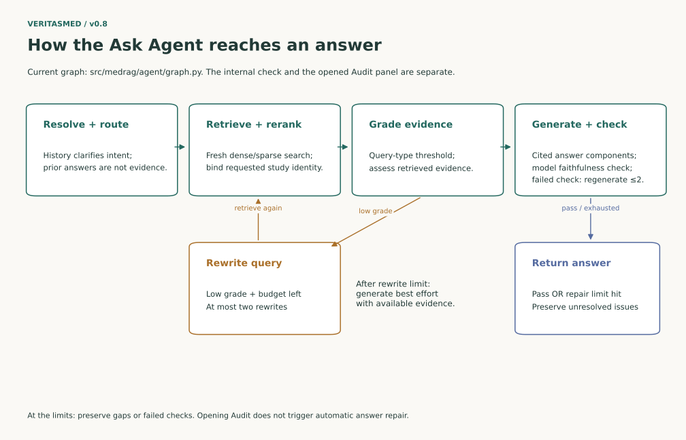
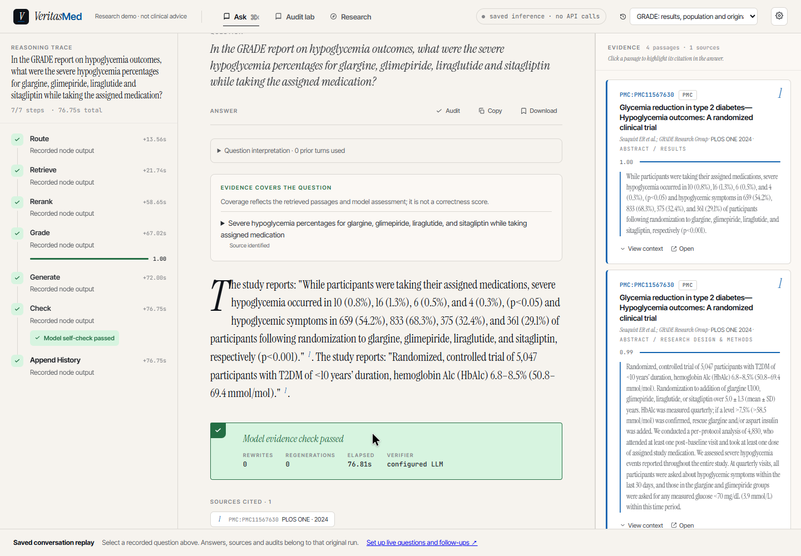
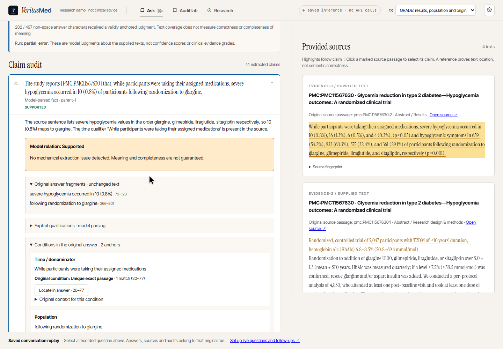
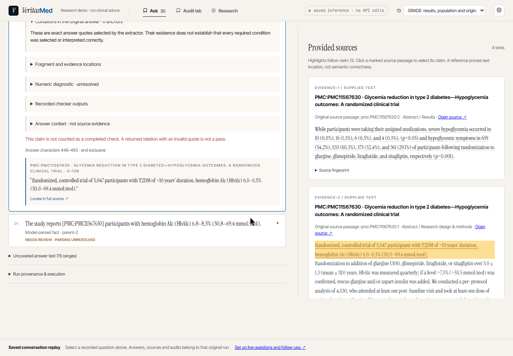
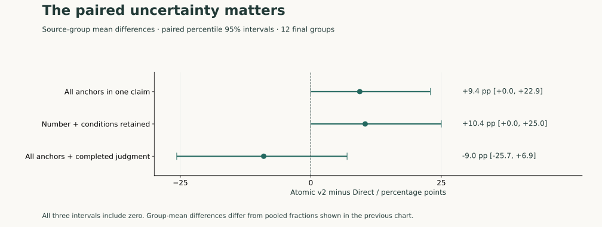

# VeritasMed v0.8：从一段回答走到可检查的证据

[English](en/showcase.md) | **简体中文**

v0.8 可以作为**产品链路与研究记录的里程碑**：对话、文献来源、回答版本、逐条审计、
实验比较和原始记录已经连接起来。当前研究尚未证明整段医学审计可靠，
也没有证明规定的 Agent 流程优于同模型自主调工具。展示这两点，才能解释下一步为何要继续研究。

本页是五分钟图解入口。只想启动，读 [README](../README.zh-CN.md)；
想核对实现，读 [架构](architecture.md) 与 [Ask 工作流](agent-workflow.md)；
想核对结果，读 [研究总览](research-overview.md) 与 [复现指南](research-reproduction.md)。
想看节点内部逻辑与实际执行，读 [系统与节点图解](system-guide.md)。

## 先看一次真实操作

[观看 / 下载操作录像（MP4）](assets/showcase/walkthrough.mp4)


2026-09-30 在本地回放服务录制。画面展示 2026-09-27 保存的实际 Ask 与 Flash 审计输出，
本次录屏没有新推理、没有 API 调用，也没有改写旧答案。视频无配音，操作顺序如下：

1. 打开 GRADE 第一轮，查看回答、来源和三轮历史。
2. 从回答中的 **Audit** 进入 Direct 审计；点击证据，定位右侧原文。
3. 切换同一回答的 Atomic v2 保存结果，展开用药期间与药物条件。
4. 定位原回答片段，再查看真实的 **Needs review / partial_error**。
5. 导出审计，回到对话，选第二轮并导出完整会话。

视频记录的是操作回放，画面里的耗时是旧推理的记录值。GIF 是录像摘选，用于 GitHub 预览；
读细节请播放 MP4 或查看下方原尺寸截图。其他两组真实案例还保留了拒答、歧义未澄清、
错误声明缺口和死亡率子问题遗漏，见 [会话数据说明](../data/demo/conversations/README.md)。

## 系统如何连接起来


产品入口始终是 Ask。浏览器把对话、每轮问题、回答版本和审计结果保存成有关联的记录；
导出时连同来源快照、过程记录一并带走。完整 Ask 服务运行检索和 Agent；
轻量回放服务读取同一套保存格式，让访客无需模型密钥也能演示。

独立 Audit 接收某一版本的**原回答与提供的来源文本**。它不会悄悄改答案，也不负责新检索。
Research 展示的是另一个受限实验：八篇候选摘要中的指定论文核查，不能代表整个 Ask 系统的效果。
Research 可以把未经修改的答案和候选来源转入 Audit。

对应实现：[API](../src/medrag/api/)、[Agent](../src/medrag/agent/)、
[核查器](../src/medrag/verification/)、[会话记录](../frontend/src/conversation/)。

## Agent 为什么不只是一段长提示



历史上下文用于理解“这些结果”“它”等指代，不会把上一轮答案当成新证据。
每轮重新检索，融合稠密/稀疏结果、重排并保留来源身份。模型评估来源后，
不足时可改写检索请求；生成的回答包含引文与缺口，再做内部忠实性检查。

这两个循环有上限：最多两次检索改写、两次回答再生成。达到上限仍可能返回带缺口或
未通过内部检查的回答，**不是到达某个“可信度”就保证正确**。详细边界与源码：
[工作流](agent-workflow.md)、[图的分支](../src/medrag/agent/graph.py)。



左边是保存的过程，中间是对话与回答，右边是原文。来源卡的检索分数、证据覆盖和内部
模型检查各有自己的含义，都不能读成临床可信度百分比。

## 一条 claim 到底审什么


上图来自 GRADE 第一轮 Atomic v2 的 `fact-1`，不是重新编造的医学答案。
它把 `10 (0.8%)`、`glargine` 和 `While participants were taking their assigned medications`
连在一起。数字、药物和观察条件不能脱离原句中的 `respectively` 被任意配对。
记录同时保存原回答片段、模型解释、条件锚点、来源引句、位置和指纹。



读审计面板时，先分清三件事：

| 面板信息 | 回答的问题 | 不代表什么 |
|---|---|---|
| 唯一原文绑定与 offsets | 引句在提供的文本哪里？ | 不证明模型理解正确 |
| Supported / Contradicted / Insufficient | 模型认为这段文本与 claim 是什么关系？ | 不是临床证据等级或校准置信度 |
| 条件/数字诊断、Needs review、覆盖范围 | 抽取与绑定哪些地方仍需检查？ | 没有警告不证明没有遗漏 |

Direct 默认按原文 claim 核查；Atomic v2 是单独的两阶段实验，先拆解、再核查，
增加条件锚点和机械诊断。模型解释和逐条引用保留在原始记录中：
[实际审计输入与输出](../data/demo/conversations/run01/v08-grade-follow-up-turn-1-atomic_v2.json)。



这次运行中，一些事实仍需要解析复核，整个运行为 `partial_error`。原文能找到，
并不意味着拆解后的解释已经完成核查。因此需要同时看整体状态、单条状态和语义标签。
目前没有实现专业证据分级或可靠的跨文献冲突裁决；模型分歧不能标成“文献冲突”。

## 研究到底支持了哪些判断

图表来自随库保存的指标文件。本轮只改变表达，没有重跑模型或修改冻结预测。
每张图标注任务、分母与边界；完整的失败、成本和实验协议仍由报告维护。

### 给定 claim 和原文时，核查器怎样？


在 SciFact 公开开发集的固定证据任务上，Flash 的错误接受少于 MiniCheck；
但支持召回也没有达到可以忽略漏报的程度。这不等于整段医学回答准确率。
独立选择阶段没有合格的接受阈值，因此面板不显示一个伪装成可靠性的百分比。
原始 [指标](../data/verification/v06/fixed-final-metrics.json)、
[成对区间与校准报告](reports/verification-v0.6-report.md)、
[历史校准图](assets/v07-calibration.svg)。

### 为什么不直接让模型调工具？


这次受限任务中，直接阅读与自主工具都是 35/40 正确接受，规定流程为 31/40。
三者都错误接受了 2/19 的非支持样本。结构化步骤减少了部分调用/输入开销，
但没有改善这个比较，不能用它宣称 Agent 架构有效。该实验采用应用层 JSON 动作协议，
也不代表原生工具调用的能力上限。
原始 [指标](../data/verification/v07/final-metrics.json)、
[全部案例与成本](reports/verification-v0.7-report.md)。

### 条件保留更多，审计就更可靠吗？


Atomic v2 把更多目标条件放在同一 claim 中，也保留了更多数字；
但它的完成条件更严格，48 个最终构造回答中仅 26 个完整完成，Direct 为 47 个。
后两项包含部分运行中仍成功抽取的片段；若要求同时完成判断，目标为 Direct 91/104、v2 80/104。
这些指标诊断机械保留，不诊断语义正确。



三项成对来源组差值的 95% 区间均包含零。这里用来源组均值，不能直接拿上一张图的
汇总比例相减来替换。另有 12 个自然开发回答，Direct/v2 完整完成 12/12、3/12；
二者警告都与 8/12 标注错误范围有重叠，范围重叠也不是正确识别特定错误。
因此 **Direct / Flash 继续默认**，v2 保留为可检查的实验。
原始 [R2 指标与区间](../data/verification/v08/r2/summary.json)、
[报告](reports/verification-v0.8-report.md)。

## 从理想流程走到真实失败


流程图说明设计；真实事件说明实际发生了什么。Evidence limits 第三轮连续生成、检查三次，
最后仍报告遗漏死亡率子问题，然后保存答案。记录保留失败；旧事件没有完整中间状态，图也
不能恢复这些状态。[系统与节点图解](system-guide.md) 还提供完整节点图、内部逻辑卡和源码链接。

这些是可以直接在仓库 Markdown 阅读的图解；图表来自当前源码与原始事件，没有新推理或新研究分数。

## 六项交付物与维护方法

| 交付物 | 入口 / 文件 |
|---|---|
| README 展示顺序 | [README](../README.zh-CN.md)：产品 → 演示 → 结构 → 研究 → 启动 |
| 系统总览 | [SVG](assets/showcase/system-overview.svg) |
| Agent 工作流 | [SVG](assets/showcase/agent-workflow.svg) |
| Claim 审计图解 | 本页 claim 章节、[SVG](assets/showcase/claim-evidence.svg)、真实截图 |
| 研究结果图 | 本页四张图、[数据指纹](assets/showcase/figure-sources.json) |
| 实际操作演示 | [MP4](assets/showcase/walkthrough.mp4)、GIF、[复录脚本](../scripts/record_showcase.mjs) |

所有图解/研究图均提供 SVG 与同名 PNG。SVG 保留文本，可编辑；
[渲染脚本](../scripts/render_showcase.py) 从原始保存文件读取数值，写出输入 SHA256。
在独立可视化环境安装 `matplotlib` 后，运行 `python scripts/render_showcase.py` 即可重建。
这些依赖不是启动产品的前置条件。

复录录像：先启动 `python scripts/run_showcase.py`，再建立专用 Playwright CLI 会话：

```sh
npx --yes --package @playwright/cli playwright-cli -s=showcase-v08 open http://127.0.0.1:5173/
npx --yes --package @playwright/cli playwright-cli -s=showcase-v08 resize 1440 1000
npx --yes --package @playwright/cli playwright-cli -s=showcase-v08 snapshot
```

按快照中的实际按钮选择 GRADE 保存会话。再执行：

```sh
npx --yes --package @playwright/cli playwright-cli -s=showcase-v08 video-start output/playwright/v08-walkthrough-hd.webm --size=1440x1000 --fps=12 --cursor
npx --yes --package @playwright/cli playwright-cli -s=showcase-v08 run-code --filename scripts/record_showcase.mjs
npx --yes --package @playwright/cli playwright-cli -s=showcase-v08 video-stop
```

首次录制可能需 `npx --yes --package playwright playwright install ffmpeg`。
录屏结束后，在安装了可选 `imageio-ffmpeg` 的环境中运行
`python scripts/render_showcase_media.py --seconds 46`。复录时按实际完成时间调整秒数，
仅去掉尾部空等，不能剪去失败。最终 MP4 是原录屏转码，GIF 为摘选；截图没有修改实际结果。
媒体来源、尺寸和处理方式见 [媒体记录](assets/showcase/media.json)。
该展示整理位于发布后的 main，不改写固定的 `v0.8.0` tag，也没有启动 v0.9 实验。
