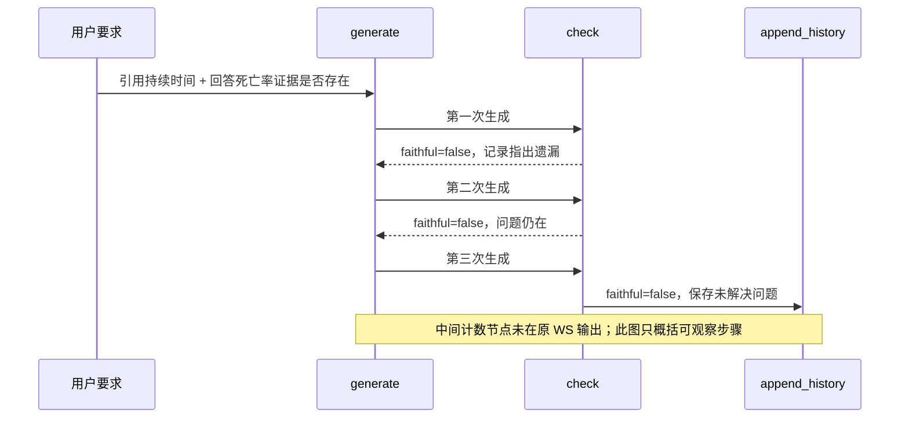

# 系统与节点图解

[English](en/system-guide.md) | **简体中文**

这是一份可以直接在 GitHub 阅读的文档：从模块构成走到节点内部，再对照一次真实执行。
图解解释当前实现与已保存记录；产品入口、Agent 行为和研究分数保持原样。

## 1. 先分清三个流程


| 流程 | 输入与职责 | 与其他流程的关系 |
|---|---|---|
| Ask | 问题 + 明确选择的历史；重新检索文献、生成回答、有限次内部检查与修复 | 产品的对话入口，产生答案版本与来源 |
| 独立 Audit | 一个版本的原答案 + 提供的来源；逐条核查、原文定位、保留未完成判断 | 用户从答案内打开；目前不接管 Ask 的修复 |
| Research | 同一模型、八篇候选摘要与指定论文问题；比较三种工具使用流程 | 独立受限实验，可以把原答和来源转入 Audit；不执行完整 Ask 图 |

模型、本地检索和程序规则分别承担不同职责。浏览器保存对话与答案版本；图内 checkpoint
保存的兼容历史是另一套记录。模块位置见 [架构](architecture.md)，审计定位见 [claim 图解](showcase.md#一条-claim-到底审什么)。

## 2. 节点怎样连接


图包含 `graph.py` 注册的全部 11 个节点和分支，以及 START / END。API 在进入图之前解析追问，
需要澄清时不运行检索图。框的颜色表示职责；一次混合节点执行可能包含多个模型或程序步骤。

主路径先规划、检索、重排，再绑定回答要点；右侧是检索改写，左下方是定向修复与历史辅助节点。
两个回环都有预算。节点连线、阈值、预算和源码位置由 AST 读取，解释文字人工维护。

### 两个决策点

| 决策点 | 当前程序条件 | 后果 |
|---|---|---|
| `grade` | `relevance_score` 达到问题类型阈值：factual 0.6 / synthesis 0.75 / multihop 0.8；未知类型默认 0.75 | 进入 `generate` |
| `grade` | 未达到阈值，`iterations < 2` | `rewrite → retrieve`；否则尽力生成 |
| `check` | `faithful = true` | 进入 `append_history` |
| `check` | `faithful = false` 且 `regen_count < 2` | `inc_regen → generate` |
| `check` | 检查未通过且修复预算耗尽 | 保留问题，进入 `append_history`，然后结束或经过历史摘要分支 |

相关性分数与自检标签来自模型和窄规则，不能解读为经过校准的医学可信度。规则见
[实际分支源码](../src/medrag/agent/graph.py)、[预算常量](../src/medrag/agent/nodes/constants.py)。

## 3. 关键节点内部做什么


这三个节点是“检索出一些文章”到“带出处的回答”之间的关键连接：

- `grade` 把用户要求拆成回答组成项，由模型选原句 ID，程序解析成原文引用，保留证据缺口。
- `generate` 根据组成项生成带引用的陈述；程序限制来源与组成项对应，使用窄规则保留或恢复关键细节。
- `check` 对照原问题、提纲、答案和来源检查支持、完整性与边界；程序再执行有限的数值等检查，并选择修复项。

精确绑定证明“这句话来自哪里”，不证明“它足以支持该结论”。同一模型参与多个环节时，
自检也不能被当作独立专家验证。更细的生成限制和已知失败见 [Ask 工作流](agent-workflow.md)。

### 节点与状态字段速查

| 节点 | 主要产物 / 职责 | 所属源码 |
|---|---|---|
| `route` | `query_type`、`search_queries`、研究范围；保持原问题 | [planning.py](../src/medrag/agent/nodes/planning.py) |
| `retrieve` | `retrieved_chunks`、`retrieval_groups`；混合检索候选 | [retrieval.py](../src/medrag/agent/nodes/retrieval.py) |
| `rerank` | 已重排候选、`selected_sources`、未匹配来源问题 | [retrieval.py](../src/medrag/agent/nodes/retrieval.py) |
| `grade` | `answer_components`、`relevance_score`、缺口与改写提示 | [grading.py](../src/medrag/agent/nodes/grading.py) |
| `rewrite` | 新查询、`iterations` 与累计改写记录 | [planning.py](../src/medrag/agent/nodes/planning.py) |
| `generate` | `answer`、`citations`、`answer_claims`、覆盖状态与绑定问题 | [generation.py](../src/medrag/agent/nodes/generation.py) |
| `check` | `faithful`、`faithfulness_issues`、`repair_component_ids` | [checking.py](../src/medrag/agent/nodes/checking.py) |
| `inc_regen` | 增加 `regen_count`，无模型调用 | [checking.py](../src/medrag/agent/nodes/checking.py) |
| `append_history` | 将本轮原问题与答案加入图内历史 | [memory.py](../src/medrag/agent/nodes/memory.py) |
| `summarize_gate` | 空操作后按历史长度选分支 | [graph.py](../src/medrag/agent/graph.py) |
| `summarize` | 更新图内滚动摘要 | [memory.py](../src/medrag/agent/nodes/memory.py) |

字段定义在 [AgentState](../src/medrag/agent/state.py)。网页请求每次用新的 checkpoint；网页多轮
使用明确选择的浏览器历史快照。图内历史摘要供显式重用 checkpoint 的程序调用兼容。

## 4. 一次真实执行，比理想流程更有说明力


图来自 Evidence limits 第三轮的原始 WS 事件，保留实际执行顺序、重复次数、接收事件之间的
耗时和检查字段。原问题要求两件事：引用血糖下降持续时间的摘要原句；说明它是否提供五年
死亡率结果。记录包含三次生成、三次检查，最后一次仍报告第二项遗漏，然后保存答案。



这个例子说明：**修复链存在，仍可能没有修好。** 检查器报告的是模型判断，图并不重新裁定
其医学语义。最终返回 `faithful=false`、`regen_count=2`；这两个最终字段不回填为前面步骤的完整状态。

原始 [事件文件](../data/demo/conversations/run01/v08-evidence-limits-turn-3-events.jsonl)、
[可导入的保存对话](../data/demo/conversations/v08-evidence-limits.json)、
[案例与已知失败](../data/demo/conversations/README.md)。可按 README 的无密钥路线，在既有 Ask 中查看这轮原答案。

### 记录缺什么

原事件没有完整节点输入、内部提示、历次完整提纲和完整草稿；部分 route 字段为空。
无法据此重建完整内部推理，也不能在缺少问题类型时推断当时的 grade 阈值。计数与摘要辅助
节点没有作为历史事件输出；完整节点图说明当前源码，执行图说明当次可观察记录，两者身份不同。
候选事件的来源摘录最多 200 字符，完整来源保存在最终结果。耗时包含调度与传输。

## 5. 怎样继续阅读与维护

结构说明接 [架构](architecture.md) 与 [Ask 工作流](agent-workflow.md)；产品与逐条审计接
[图解展示](showcase.md)；效果判断接 [研究总览](research-overview.md)。演示案例与节点图不能
证明 Agent 优于强模型自己调工具，这一问题仍由单独的比较实验回答。

三张新增图各有中英文 SVG，可以直接嵌入 Markdown；节点图使用源码结构，执行图使用原始
记录，关键节点的解释文字由脚本维护。图和 [来源记录](assets/system-guide/source-records.json) 的重建命令：

```sh
python scripts/render_system_docs.py
```

只需 Python 标准库。修改节点、常量或说明文字后同步重建两版；有新增布局时同时调整图的位置。
这是文档资产生成，不需要启动产品、下载模型或重跑实验。来源指纹中的源码使用 UTF-8 / LF
规范化文本 SHA256；原始事件使用文件字节 SHA256。固定 `v0.8.0` tag 与原始研究结果保持不变。
