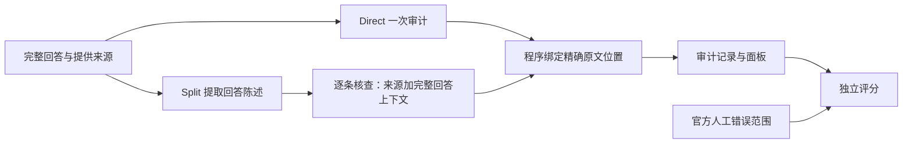

# v0.5 整段回答审计：自然回答开发实验与真实面板

2026-09-24。分支 `feature/veritasmed-audit-v0.5`；不代表 v0.5 已发布。

本轮把研究对象从“给定一个 claim 判断对错”扩展到“拿到完整回答，自己找出需要核查的陈述”。
产品已经能回放实际模型判断、双向定位回答与来源、显示漏审范围，并接受自有文本。
这建立了可观察、可测量的审计链路；它还不是经过校准的可靠核查器。

## 实验问题和边界

对同一份完整回答、同一份来源全文，比较：

- **Direct**：一次 Flash 调用提取并判定所有陈述。
- **Split**：先在完整回答中提取原文陈述，再逐条交给 Flash 核查；每次仍提供回答上下文和来源全文。

这轮只比较是否需要分开提取与核查。不是完整 Agent 与模型自主工具调用的比较，
也不是同等 token 预算实验。Split 的额外调用、重复来源输入和耗时全部计入成本。
没有接入检索、补充证据、回答修复、专用判别模型或 Pro。
每题每种策略只运行一次，尚无独立重复；本轮差异只作开发诊断，不作为稳定优劣的统计结论。

Split 的提取阶段只看回答；人工标签只进入评分。可精确定位的错误引文也可能丢失
语义限定，所以位置绑定与判定可靠性仍须分别测量。

## 数据与计分

复用 [RAGTruth 官方人工标注](https://github.com/ParticleMedia/RAGTruth)，固定其提交与两个文件哈希。
从 4,755 个合格的官方 train / Summary 候选中，按预定哈希规则抽取 24 份回答，
来自 24 个不同来源：12 份有标注错误、12 份无标注错误。与官方 test 共享来源的候选排除。
共 **15 处人工标注错误范围**，其中 **3 处 implicit_true** 仍按“提供文本未支持”计分。
选择规则、代码、提示词和顺序在调用前固定，见 [执行协议](plans/v0.5-answer-audit.md)。

核查器不读取人工标签。金标准错误范围仅用于独立评分：
无论错误有没有被提取、调用有没有成功，都保留在这 15 处的分母里。
另登记 60 个官方 test 的来源/回答 ID，本轮未执行，也未根据这些答案调优。

完整数表由保存输出重算：[测量结果与逐题表](verification-v0.5-answer-audit-results.md)。
原始工件及运行方式：[ragtruth_v1](../data/verification/ragtruth_v1/README.md)。

读分数时须区分三件事：

1. 回答级检出：在确实含参考错误的回答中，是否发出了任何警报；不说明位置正确。
2. 错误范围检出：与每处原始标注至少相交，或覆盖至少一半非空白错误字符；不证明解释正确。
3. 字符 precision/recall：报警范围是否过宽。参考标注常只有几个词，而完整 claim 可能更长，
   所以字符精度是定位粒度指标，不能直接解释成“核查器只有这个正确率”。

对于无标注错误的回答，警报计为相对参考标注的误报。但它也可能反映未标出的细节、
任务口径差异或模型过度苛刻，需要逐项分析；不能只凭任何一方就改动原始标签。

## 完整结果与本轮决定

两组各 24 份回答全部完成，共 307 次逻辑模型调用，没有执行、输出结构或原文绑定失败。
307 次均取得 usage，响应标识均为 `deepseek-v4.1-flash`；这不是底层权重身份认证。
Direct 返回 234 条 claim，Split 返回 259 条，均未触及单答 24 条上限。

| 指标 | Direct | Split |
|---|---:|---:|
| 原始错误范围命中，任意字符交集 | 14/15 | 14/15 |
| 无标注错误回答被报警 | 9/12 | 7/12 |
| 逻辑调用 | 24 | 283 |
| API 报告总 token | 361,632 | 920,586 |
| 单答耗时中位数 | 54.1 秒 | 135.4 秒 |

Split 减少了两份无标错回答上的警报，但错误范围召回没有提高，token 为 Direct 的 **2.55 倍**；
字符 F1 从 38.9% 变为 35.9%，受报警范围粒度影响，不能把它当成语义正确率下降 3 个百分点。
当前证据不足以确认拆分的净收益，继续保留 Direct 为默认、Split 为研究选项。
两者的参考误报都偏多，因此还不足以让核查器自动裁决、再驱动答案修复。

尤其不能用 Split 的“12/12 有错误回答被报警”声称全部错误均检出：**两组都未命中回答 4990
的原始错误范围**。Split 只是对该回答开头的“90 词摘要”元文本报警，误打误撞使回答级标签
符合参考标签。错误位置指标保留了这次漏检。该参考标注将剧情预告与回答中的事实化措辞列为冲突；
本轮保存原标签和模型判断，没有因分歧重标。

两组对 15 处错误均有抽取字符交集，但这不等于没有抽取问题：3758 的限定语丢失已经说明
词面覆盖与语义完整性之间的差异。60 个预留 test 来源本轮没有进入模型评测。

## 已观察到的失败机制

以下为开发者的文本分析，不是新增独立专家标注；它们不改写指标。

**限定语丢失（回答 3758，Split claim 4）。** 完整回答明确把某项陈述放在“指控”框架下，
提取器却只选中内部命题，未包含指控限定。后续判别虽有完整回答上下文，仍把抽出的短语
当作事实断言，因来源只有指控而标成信息不足。精确字符串定位没有阻止这种语义范围改变。
这直接说明“原文引文合法”不等于“claim 抽取正确”。

**过度严格的时间措辞（回答 341，Direct claim 7）。** 来源写某年识别出五名人员，回答写
从该年以来已识别五名。直接审计将此标为信息不足，Split 没有报错；官方也未标错。
这反映措辞等价和语境解释的不稳定，不能靠增加链路步骤预先假定会解决。

**与无错误标注不一致（回答 4253）。** 两种策略都指出一个原文没有明说的比赛规则；
Split 还对事件发生时序报警。参考标注没有这些错误范围。保留完整分歧，后续按预先定义的
显式支持/语境推断边界分析；本轮不删掉它来获得更漂亮的误报率。

**宽 claim 掩盖定位粒度（回答 296）。** 两种策略都能覆盖两处参考错误，但提取的报警范围
长度不同。因此需要同时看错误检出和字符定位，不能只看“这题发现问题了”。

**元文本被误送去查来源（回答 4624，Split claim 1）。** 核查器把“以下是 107 词摘要”也当作
需要原文证实的内容，再因为文章没说这句话而报警。字数应由程序对回答计数，不能用文献未提到
来推断不支持。这是“什么应该作为来源事实来核查”的任务划分问题。

**参考范围比实际错误大（回答 5175，Direct）。** 参考标注包含整段人群描述，Direct 只标出了
错误的数量词。它指出了实际人数差异，但报警范围不足参考范围的一半。这会表现为“任意交集
检出，半范围未检出”，不应据此写成“模型没发现人数错误”。保留预定分数，同时说明粒度限制。

**检出正确不保证理由合规（回答 1119，Direct）。** 模型对参考错误发出了警报，但其地理区域
解释依赖来源未明说的地理知识，且输出了 contradicted。RAGTruth 的二元错误检出会计为命中，
却不能证明三分类判定和理由满足本项目的“仅依据提供文本”边界。因此不能把错误召回率
当成关系分类或解释可靠率；三分类与理由需要有相应标签的另一个评估任务。

## 产品交付

- `/api/audit` 接收完整回答和来源；`/api/audit/examples` 回放真实保存记录。
- `/audit` 提供陈述列表、原文上下文、双向选择、未覆盖文本和 JSON 导出。
- Supported / Contradicted / Insufficient 是模型判断；无效引文和执行失败单独显示。
- 不显示未经校准的可信百分比，不给整份回答一个“全部可信”的绿色结论。
- 轻量启动不加载 Qdrant、嵌入模型或 GPU。完整后端也挂载相同审计路由。

实际演示和启动命令见 [面板指南](audit-demo.md)。这不是 v0.4 的固定编写示例，
但也尚未接入 Ask 的自动修复循环。研究用耗时与调用记录来自实际运行，不是演示动画。

功能走查完成：保存记录切换、原文双向定位、展开/收起、JSON 导出及 390 像素窄屏；
另用两句自拟文本实际提交一次新审计，11.6 秒返回 1 条支持和 1 条信息不足。
这次 UI 调用不计入上方基准，原始导出见 [操作示例](assets/v05-live-audit.json)。
22 个相关离线用例、前端现有 2 个用例及构建通过；在新建轻量环境中成功读取真实保存记录，
未导入 torch、Qdrant 或 sentence-transformers。Windows 路径已实际运行，其他系统尚未实机验证。

## 下一步的依据

先解决已经观测到的“抽取改变限定语”和“支持边界过严”，再考虑增加模型与工具。
保留 Direct 主基线及当前所有输出；修订后的方案另建运行目录，使用同样的开发样本作回归，
明确其开发性质。不得把回归提升包装成新的独立评估。

进一步比较前，要针对归属、否定、可能性、时间边界设计成对诊断，并保持原文和全部变体同组；
同时分析自然回答中的漏检与误报。修复有效后再冻结方法，制定预算与验收口径，运行预留数据。
预留公开数据仍不能证明医学可靠性；临床证据分级和跨文献可比性需另设任务与标签来源。
